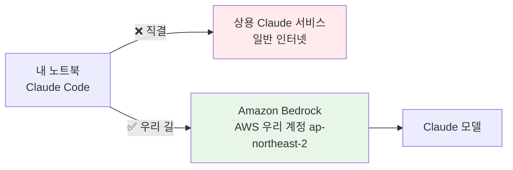

# Lab 0 · 환경 확인

[🏠 목차](README.md) · [다음: Lab 0.5 스킬·플러그인 설치 →](00b-skills-plugins.md)

이번 단계에서는 내 노트북에서 Claude Code가 실제로 실행되고, AWS(Amazon Bedrock)에 올바르게 연결돼 있는지를 확인합니다. 자동차로 출발하기 전 시동을 걸어보는 것과 같습니다. 오늘 하루 우리는 Claude Code로 실제 차지백 케이스를 처리하므로, 도구가 켜지고 회사 AWS 경유로 연결됐는지를 먼저 점검합니다.

**예상 소요시간:** 약 20분 (워크숍 시작 직후, 10:00–10:20 · 강사와 화면을 함께 보며 진행)

> ℹ️ **참고:** 오늘은 설치하는 날이 아닙니다. 설치(Claude Code + Amazon Bedrock 연결)는 D-1 사전과제에서 이미 끝났다는 전제로, 오늘은 **점검만** 합니다. 만약 설치가 안 돼 있다면 강사에게 손을 들어 알려주세요 — 헬프데스크가 별도로 돕습니다.

## 시작하기 전에

다음을 먼저 확인하세요.

- [ ] 노트북 전원·충전기가 연결돼 있다
- [ ] D-1 사전과제(브로셔를 따라 Claude Code 설치 + Amazon Bedrock 연결)를 **이미 완료**했다
- [ ] 현장 WiFi에 접속할 준비가 됐다 (1단계에서 안내)

## 이 단계에서 할 일

이번 단계를 마치면 다음을 직접 할 수 있습니다.

1. 내 노트북에서 **Claude Code(`claude`)를 실행**하고, 환영 화면과 입력 커서를 띄운다.
2. `/status`로 이 도구가 **Amazon Bedrock을 경유**해(상용 모델 직결이 아님) **리전 `ap-northeast-2`** 에 연결돼 있음을 눈으로 확인한다.
3. 간단한 한국어 프롬프트로 **AI가 실제로 응답**하는지 확인하고, 안 될 때 어디를 봐야 하는지 안다.

전체 흐름은 다섯 단계입니다: ① WiFi 연결 → ② `claude` 실행 → ③ `/status` 확인 → ④ 버전 확인 → ⑤ 첫 인사. 이 중 **③ `/status`** 가 오늘의 핵심이고, 나머지는 그 앞뒤를 받쳐줍니다.

> 💡 **팁:** 막히면 혼자 3분 이상 헤매지 말고 옆 페어나 강사에게 손을 드세요. 환경 점검은 빨리 통과하고 본 실습으로 넘어가는 게 목표입니다.

### 왜 Amazon Bedrock 경유인가

Claude Code는 인터넷 너머의 AI(Claude)에게 일을 시키는 창구입니다. 그 창구가 AI에 연결되는 길은 두 가지입니다.



우리는 반드시 **Amazon Bedrock을 경유하는 길(초록색)** 로만 다닙니다. Bedrock 경유는 우리 회사 AWS 계정 안에서, 우리가 통제하는 리전(서울 `ap-northeast-2`)에서 AI를 호출하는 것 — 즉 데이터가 외부 상용 서비스로 새지 않고 회사 통제 안에 머무는, 금융권 컴플라이언스를 위한 길입니다.

> ℹ️ **참고(핵심 한 줄):** 차지백 케이스에는 카드번호·고객정보 같은 민감정보가 섞일 수 있습니다. 그래서 AI를 상용 서비스 직결이 아니라 회사 AWS(Bedrock) 경유로만 쓰는 것이 금융권의 기본 컴플라이언스입니다. 환경 점검은 "그 길로 잘 연결됐나"를 확인하는 절차입니다.

---

## 1. 현장 WiFi 연결

가장 먼저 인터넷부터 연결합니다. Bedrock은 인터넷 너머 AWS에 있으므로, WiFi가 안 되면 그 뒤가 전부 막힙니다.

1. 화면 우측 상단(맥북은 메뉴바, 윈도우는 작업표시줄)의 와이파이 아이콘을 누릅니다.
2. 아래 네트워크를 선택해 비밀번호를 입력합니다.

| 항목 | 값 |
|------|-----|
| 네트워크(SSID) | **`guest`** |
| 비밀번호 | **`〔현장에서 공지〕`** |

**예상 결과**

> 와이파이 아이콘이 **연결됨(부채꼴이 꽉 찬 모양)** 으로 바뀌고, 브라우저로 아무 사이트나 열면 정상적으로 페이지가 뜹니다.

연결만 되고 인터넷이 실제로 안 되는 경우가 있으니, 브라우저로 **아무 사이트나 실제로 열리는지**까지 확인하세요. 다음 단계부터 Bedrock 연결이 안 되면 십중팔구 네트워크 문제입니다.

> 📸 (스크린샷: guest 네트워크에 연결되어 와이파이 아이콘이 채워진 화면)

---

## 2. 작업 폴더로 이동 후 Claude Code 실행

이제 터미널에서 오늘 작업할 폴더로 들어가 Claude Code를 켭니다.

1. 터미널을 열고 아래 **두 줄**을 한 줄씩 입력합니다(각 줄 끝에서 Enter).

```bash
cd workshop/mvp
claude
```

**예상 결과**

> Claude Code **환영 화면**이 뜨고, 맨 아래에 **입력 커서**가 깜빡입니다(예시 — 실제 문구·버전은 다를 수 있음).

```text
 ▐▛███▜▌   Claude Code
▝▜█████▛▘  
  ▘▘ ▝▝    /help 로 도움말 · 한국어로 그냥 질문하세요

 cwd: ~/workshop/mvp

> █
```

`cd workshop/mvp`로 **오늘 케이스가 들어 있는 작업 폴더**에 먼저 들어간 뒤 `claude`를 실행해야, AI가 이 폴더의 업무 맥락(차지백)을 인식합니다. 다른 폴더에서 켜면 뒤 단계의 답변이 엉뚱해집니다.

> ℹ️ **참고:** `claude`는 슬래시(`/`) 없이 그냥 입력하는 **터미널 명령**입니다. `claude: command not found`가 뜨면 아래 [문제 해결](#문제-해결)을 참고하세요.

> 📸 (스크린샷: claude 환영 화면과 입력 커서가 표시된 터미널)

---

## 3. `/status`로 Amazon Bedrock 연결 확인 ⭐

**오늘 환경 점검의 핵심**입니다. AI가 상용 서비스 직결이 아니라 회사 AWS(Bedrock)를 경유하는지, 그리고 서울 리전인지 확인합니다.

1. 방금 뜬 입력 커서에 아래를 그대로 입력하고 Enter.

```text
/status
```

**예상 결과**

> 익명·예시입니다. 실제 모델 ID나 줄 순서는 환경마다 다를 수 있습니다. **굵게 표시한 두 가지**(`Amazon Bedrock`, `ap-northeast-2`)가 보이면 됩니다.

```text
Claude Code Status

  Version:   2.1.187 (Claude Code)
  Account:   AWS (Amazon Bedrock)
  Provider:  Amazon Bedrock              ← ★ 이 줄이 핵심
  Region:    ap-northeast-2 (Seoul)      ← ★ 서울 리전
  Model:     us.anthropic.claude-sonnet-4-6
  Workdir:   ~/workshop/mvp
```

`Provider: Amazon Bedrock`은 "이 AI 호출이 상용 Claude 서비스 직결이 아니라 우리 회사 AWS 계정을 경유한다"는 증거입니다. 차지백 케이스에는 민감정보가 섞일 수 있으므로, **Bedrock 경유 + 서울 리전(`ap-northeast-2`)** 이 금융권 컴플라이언스의 기본선입니다. 다음을 함께 눈으로 확인하세요.

- **`Amazon Bedrock`** 글자가 보이는가? (안 보이면 → [문제 해결](#문제-해결): `/setup-bedrock`)
- 리전이 **`ap-northeast-2`** (서울)인가?
- 모델 줄에 Claude 계열 모델이 보이는가? (값 자체는 환경마다 다를 수 있음 — 비어 있지만 않으면 OK)

> 📸 (스크린샷: /status 출력에서 Amazon Bedrock과 ap-northeast-2가 표시된 화면)

> ℹ️ **참고 — `Amazon Bedrock`이 안 보이거나 환경변수가 안 잡혀 있다면:** 권장은 세션에서 **`/setup-bedrock`** 재실행입니다. 직접 설정하려면 아래 환경변수를 쓰세요(자세한 절차는 [`PREWORK.md`](./PREWORK.md) (d) 참고).
> ```bash
> export CLAUDE_CODE_USE_BEDROCK=1
> export AWS_REGION=ap-northeast-2
> export AWS_BEARER_TOKEN_BEDROCK=<발급받은 Bedrock API 키>
> export ANTHROPIC_MODEL='global.anthropic.claude-sonnet-4-5-20250929-v1:0'   # 본인 계정 프로파일 ID로 교체
> ```

---

## 4. 버전 확인

도구 버전을 한 번 찍어 둡니다. 강사가 전원이 같은 버전인지 확인하고, 문제 발생 시 헬프데스크가 참고합니다.

1. 터미널에서 아래를 실행합니다.

```bash
claude --version
```

**예상 결과**

```text
2.1.187 (Claude Code)
```

전원이 같은 버전을 쓰면 화면·동작이 일치해 강사가 진행을 맞추기 쉽습니다. 숫자가 정확히 `2.1.187`일 필요는 없고 **`2.x`대면 충분**합니다. 버전이 크게 다르면(예: 1.x) D-1 설치가 옛 버전이라는 뜻이니 헬프데스크가 업데이트를 돕습니다.

> ⚠️ **주의:** `--version`은 `claude` **세션 안**이 아니라 **터미널**에서 실행하는 명령입니다. 새 터미널 탭을 열거나, 실행 중인 세션은 그대로 두고 확인하면 됩니다.

> 📸 (스크린샷: claude --version 실행 결과가 2.1.187로 표시된 터미널)

---

## 5. 첫 인사 — 응답 확인

마지막으로 AI가 실제로 응답하는지, 그리고 이 폴더의 업무 맥락을 아는지 가볍게 확인합니다.

1. 2단계에서 켜둔 `claude` 세션의 입력 커서에 아래를 그대로 붙여넣고 Enter. 슬래시 없이 **한국어 문장 그대로**입니다.

```text
안녕! 한 줄로 인사하고, 지금 이 폴더가 어떤 업무를 위한 폴더인지
CLAUDE.md를 읽고 한국어로 한 문장으로 알려줘.
```

**예상 결과**

```text
안녕하세요! 오늘 잘 부탁드립니다.
이 폴더는 인바운드 차지백(하나카드=매입사) 분쟁처리를 돕기 위한
작업 폴더로, 서류 분석·사유코드 매칭·재반박서 작성을 지원합니다.
```

응답이 돌아온다는 것은 **WiFi → Bedrock → 모델**까지 길이 끝까지 뚫렸다는 뜻입니다. 게다가 답변이 우리 차지백 업무를 정확히 말하면, `claude`를 올바른 폴더(`workshop/mvp/`)에서 켰다는 확인까지 동시에 됩니다. 답변이 엉뚱하면 폴더를 잘못 잡은 것이니 `cd workshop/mvp`를 다시 확인하고 `claude`를 재실행하세요.

> 📸 (스크린샷: hello 프롬프트에 AI가 차지백 업무 맥락으로 한국어 응답한 화면)

---

## 문제 해결

환경이 막힐 때 아래 표에서 증상을 찾아 대응하세요.

| 증상 | 원인 | 해결 |
|------|------|------|
| `/status`에 **Amazon Bedrock**이 안 보임 | Bedrock 연결 설정이 빠짐/풀림 | `claude` 세션에서 **`/setup-bedrock`** 재실행 → **3rd-party platform → Amazon Bedrock** 선택 후 안내대로 진행 |
| 인증/자격증명 에러, `token expired`, `ExpiredToken` | AWS 자격증명(토큰) 만료 | 자격증명을 다시 로그인한 뒤 재시도. SSO 환경이면 `aws sso login`, 그 외엔 강사·헬프데스크 안내대로 갱신 |
| `AccessDenied` / 모델 응답이 안 옴 | 계정에 **모델 액세스 미허용** | Bedrock 콘솔에서 Anthropic 모델 액세스가 켜져 있어야 함 → 헬프데스크에 알리기(개인이 임의로 손대지 않음) |
| `claude: command not found` | 설치 또는 PATH 문제 | 오늘은 설치하지 않음 — **헬프데스크/강사에게 손 들기** (D-1 설치 누락 가능성) |
| 인터넷이 아예 안 됨 | WiFi 미연결 | 1단계로 복귀 — `guest` / `〔현장에서 공지〕` 재접속, 브라우저로 실제 접속 확인 |
| 5단계 답변이 엉뚱함 | `mvp/`가 아닌 다른 폴더에서 실행 | `cd workshop/mvp` 다시 확인 후 `claude` 재실행 |

### 자주 헷갈리는 것

| 헷갈리는 것 | 어떻게 나타나나 | 바로잡는 법 |
|---|---|---|
| **`/status`와 `--version`을 같은 곳에서 실행** | `--version`을 세션 안에 치면 인식 안 됨 | `/status`는 **세션 안**, `claude --version`은 **터미널**에서 |
| **Bedrock vs 상용 직결 혼동** | `/status`에 Bedrock이 안 보이는데 그냥 넘어감 | 반드시 **`Amazon Bedrock`** 글자를 확인 — 안 보이면 `/setup-bedrock` |
| **리전 무시** | 응답은 오는데 리전이 서울이 아님 | 컴플라이언스상 **`ap-northeast-2`** 확인 — 다르면 강사에게 알리기 |
| **설치하려고 시도** | 오늘 단계에서 `npm install`을 새로 돌림 | 오늘은 **점검만** — 설치는 D-1에 끝남. 안 돼 있으면 헬프데스크 |

> 💡 **팁:** 환경 점검은 "내가 고치는 단계"가 아니라 "되는지 확인하고, 안 되면 손 드는 단계"입니다. 빨리 통과하고 본 실습으로 넘어가는 게 목표입니다.

---

## ✅ 완료 확인

다음이 모두 충족되면 이 단계는 성공입니다.

- [ ] 현장 WiFi(`guest`)에 연결돼 **인터넷이 실제로 된다**
- [ ] `cd workshop/mvp` 후 `claude`로 **환영 화면 + 입력 커서**가 떴다
- [ ] `/status`에 **`Amazon Bedrock`** 과 리전 **`ap-northeast-2`** 가 보인다 ⭐
- [ ] `claude --version`이 **`2.x`대 (Claude Code)** 로 찍혔다
- [ ] hello 프롬프트에 AI가 **한국어로, 차지백 업무 맥락**으로 응답했다

핵심만 다시 짚으면 — 환경 점검은 출발 전 시동 걸기입니다. 오늘의 핵심은 `/status`의 **`Amazon Bedrock` + `ap-northeast-2`** 로, 상용 직결이 아니라 회사 AWS 경유여야 하는 게 금융권 컴플라이언스입니다.

> 강사 노트:
>
> **진행 팁**
> - 시작하자마자 전원이 같은 화면(환영 화면 → `/status` → 같은 Provider/Region)을 보고 있는지 빠르게 스캔하세요. 한 명이라도 `/status`에 **Amazon Bedrock**이 안 보이면 그 페어를 먼저 잡습니다 — 이게 오늘 가장 흔한 막힘입니다.
> - **D-1 헬프데스크**를 명시적으로 언급하세요: "설치·Bedrock 연결은 어제 끝났어야 합니다. 안 돼 있으면 지금 손 드세요 — 헬프데스크가 옆에서 돕고, 나머지는 그대로 진행합니다." 환경 문제로 전체를 세우지 않습니다.
> - `/status`의 **모델 ID 값**은 사람마다 다를 수 있습니다(`us.` / `apac.` / `global.` 프리픽스 등). 값 자체를 통일시키려 하지 말고, **Provider=Amazon Bedrock + Region=ap-northeast-2** 두 가지만 확인시키세요.
> - 5단계 답변이 "차지백 업무"를 정확히 말하는지로 **폴더가 맞는지**까지 한 번에 검증됩니다 — 별도 폴더 점검 단계를 줄일 수 있습니다.
>
> **시간 관리 (강사 기준)**
> - 전체 **20분 안**에 끝내는 게 목표입니다. 개념 설명은 4분 이내로(왜 Bedrock 경유인가만), 핸즈온에 집중하세요. 권장 배분: 소개+개념 10:00–10:04, WiFi 10:04–10:07, `claude` 실행 10:07–10:11, `/status` 10:11–10:15, 버전·첫 인사 10:15–10:18, 마무리·완료 점검 10:18–10:20.
> - 막히는 페어는 헬프데스크에 넘기고 **진도를 세우지 마세요.** 환경 점검은 본 실습이 아니라 준비운동입니다.
>
> **예상 질문 Q&A**
> - **Q. `/status`에 Bedrock이 안 보여요.** A. `/setup-bedrock`을 다시 실행하고 **3rd-party platform → Amazon Bedrock**을 고르세요. 그래도 안 되면 자격증명 만료(`token expired`)일 수 있으니 헬프데스크에.
> - **Q. 모델 이름이 옆 사람과 달라요. 틀린 건가요?** A. 아니요. 계정·리전에 따라 모델 프리픽스가 다릅니다. **Bedrock 경유**와 **서울 리전**만 맞으면 정상입니다.
> - **Q. 어제 설치를 못 했어요.** A. 지금 손 드세요. 헬프데스크가 옆에서 설치를 돕고, 나머지 분들은 그대로 진행합니다.
> - **Q. 상용 Claude 앱을 쓰면 안 되나요?** A. 안 됩니다. 차지백 케이스에는 민감정보가 섞일 수 있어, 회사 AWS(Bedrock) 경유로만 사용합니다 — 그게 오늘 점검하는 이유입니다.

## 다음 단계

이제 도구가 켜지고 Bedrock에 연결된 것을 확인했습니다. Lab 0.5에서는 오늘 실습을 더 빠르게 해줄 **스킬과 플러그인**을 살펴보고, 본격적인 차지백 실습으로 들어갈 준비를 마칩니다.

[🏠 목차](README.md) · [다음: Lab 0.5 스킬·플러그인 설치 →](00b-skills-plugins.md)
