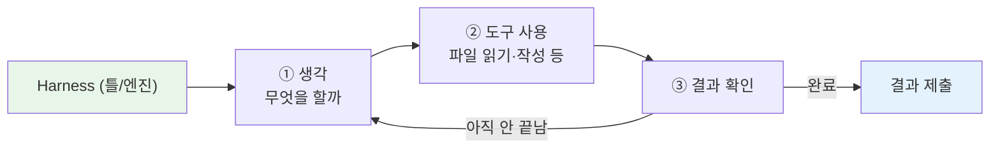
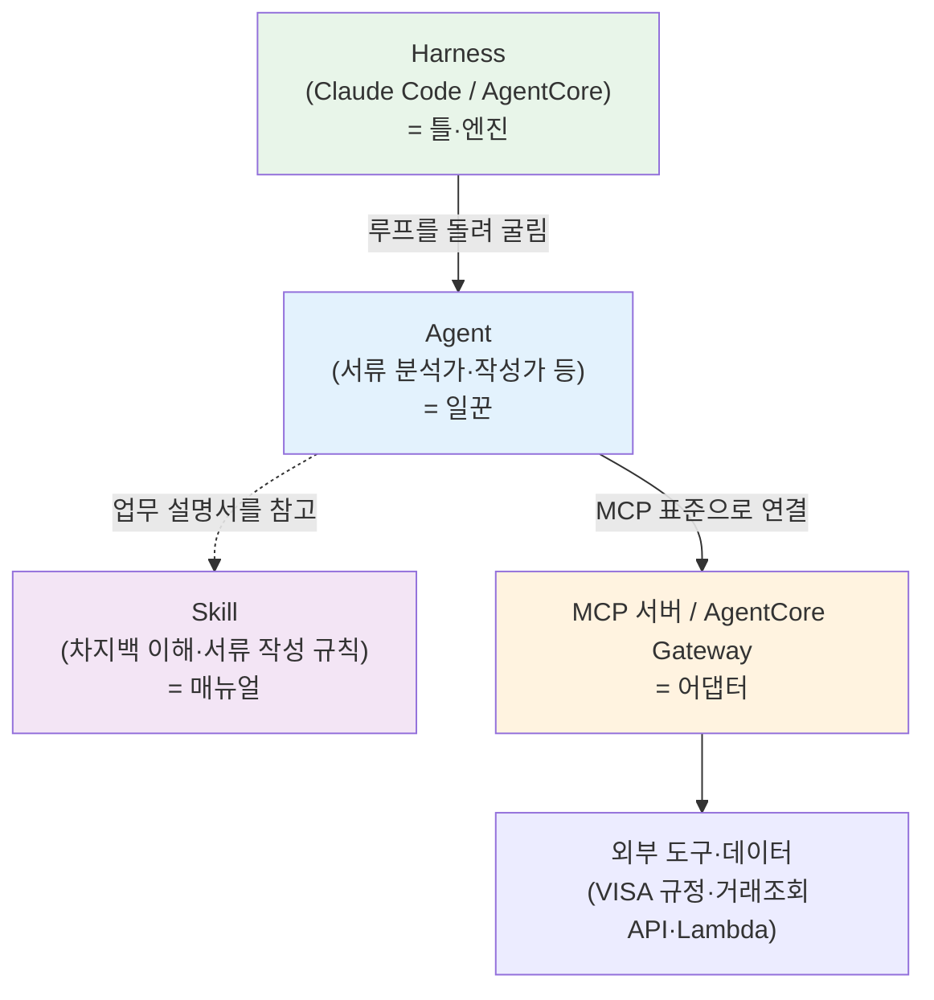

# Lab 1 · 핵심 개념 — 스킬 · 에이전트 · Harness · MCP

[← 이전: Lab 0.5 스킬·플러그인 설치](00b-skills-plugins.md) · [🏠 목차](README.md) · [다음: Lab 2 차지백 스킬 제작 →](02-build-chargeback-skill.md)

이번 단계에서는 코딩도, 케이스 처리도 하지 않습니다. 대신 오늘 오후 내내 우리가 손에 쥐고 쓸 **네 가지 핵심 개념** — 스킬(skill) · 에이전트(agent) · Harness · MCP — 를 **현업의 말로** 이해합니다. 차지백 업무를 새 직원에게 인수인계한다고 생각해 보세요. ① 업무 설명서를 건네주고(스킬), ② 일을 대신 해줄 담당자를 붙이고(에이전트), ③ 그 담당자가 일하는 사무실·책상·업무 루틴을 마련하고(Harness), ④ 사내 시스템·규정집에 접속할 권한을 줍니다(MCP). 이 네 가지가 오늘과 앞으로의 모든 실습을 떠받칩니다.

**예상 소요시간:** 약 30분 (10:35–11:05) · 강사 데모 + 개념 정리 + 가벼운 손풀기, 화면을 함께 보며 진행

> ℹ️ **참고:** 이 모듈은 "암기"가 목표가 아닙니다. 네 단어를 **차지백 업무에 빗대어** 한 번 감 잡아 두면, Lab 2(스킬 제작)·Lab 4(AWS 배포)에서 같은 단어를 다시 만났을 때 훨씬 빨리 이해됩니다. 막히는 단어가 있어도 멈추지 말고 끝까지 한 번 훑으세요.

---

## 0. 먼저 완성된 모습부터 — 강사 데모 (Show, don't tell)

개념을 말로 풀기 전에, **오늘 우리가 끝에 무엇을 손에 쥐게 되는지** 먼저 눈으로 봅니다. 강사가 화면에서 **완성된 "차지백 재반박 도우미"** — 오늘 오후 **Lab 4에서 우리가 직접 클라우드에 배포할 바로 그 서비스** — 를 약 5~8분간 시연합니다. 참가자는 **보기만** 하면 됩니다(따라 입력하지 않습니다).

데모에서 보게 될 흐름:

1. 분쟁 케이스(접수내역·가맹점 자료·이메일)를 도우미에 넘긴다.
2. 도우미가 **사실을 정리 → 규정 사유코드에 매칭 → 재반박서 영문 초안**까지 스스로 만들어 낸다.
3. 사람이 마지막으로 초안을 검토·보완해 마무리한다.

**예상 결과**

> 한 건의 차지백이 들어왔을 때, 분석부터 영문 초안까지 **사람이 일일이 손으로 하던 과정**이 도우미를 통해 단숨에 흘러가는 모습을 봅니다. "이게 정말 오늘 안에 만들어지는 건가?"라는 느낌이 들면 충분합니다.

**확인하세요** — 지금 본 이 완성품을 떠받치는 부품이 곧 배울 **스킬 · 에이전트 · Harness · MCP** 네 가지입니다. 데모를 머릿속에 담아 둔 채로 아래 개념을 읽으면, 추상적인 단어가 "아, 아까 그 화면의 이 부분"으로 이어집니다. **이걸 오늘 우리가 직접 만듭니다.**

> 📸 (스크린샷: 완성된 차지백 재반박 도우미가 케이스를 받아 재반박서 초안까지 만들어 내는 데모 화면)

> 강사 노트:
>
> - 이 데모는 **동기 부여용**입니다. 부품(스킬·에이전트 등)을 여기서 설명하지 마세요 — "끝 그림"만 강렬하게 보여주고 "이걸 오늘 만든다"로 닫으세요.
> - Lab 4의 배포 결과물(또는 사전 녹화 화면)을 그대로 재생해도 됩니다. 5~8분을 넘기지 마세요.
> - 참가자가 따라 입력하지 않도록 "지금은 보기만 하세요"를 한 번 짚어 주세요.

---

## 시작하기 전에

다음을 먼저 확인하세요.

- [ ] Lab 0에서 `/status`로 **Amazon Bedrock + 서울 리전** 연결을 확인했다
- [ ] `cd workshop/mvp` 폴더에서 `claude` 세션이 떠 있다 (없으면 다시 실행)
- [ ] Lab 0.5에서 "AI에 능력을 추가한다"는 감을 한 번 잡았다

## 이 단계에서 할 일

이번 단계를 마치면 다음을 **자기 말로** 설명할 수 있습니다.

1. **스킬**이 "업무 설명서"라는 것 — 오늘 Lab 2에서 우리가 직접 만든다.
2. **에이전트**가 "한 가지 일을 스스로 하는 일꾼"이라는 것 — 지금은 내 노트북 안, 나중엔 AWS 위.
3. **Harness**가 "일꾼을 굴려주는 틀(엔진)"이라는 것 — Claude Code가 바로 그 틀.
4. **MCP**가 "AI를 외부 도구·데이터에 잇는 표준 어댑터"라는 것 — 차지백에선 규정·거래조회를 붙일 길.

> 💡 **팁:** 네 단어가 헷갈리면 한 문장으로 외우세요 — **"Harness(틀)가 Agent(일꾼)를 굴리고, 일꾼은 Skill(설명서)을 보며 일하고, MCP(어댑터)로 바깥 시스템에 손을 뻗는다."**

---

## 1. 스킬(skill) — 업무 설명서

- **비유 1줄** — 신입에게 건네는 표준 작업 매뉴얼(SOP). "이런 상황엔 이렇게 처리한다"를 적어둔 글.
- **차지백 연결 1줄** — "재반박서는 어떤 순서로, 어떤 필수 문구·증빙으로 쓴다"는 규칙 묶음. AI가 상황에 맞춰 이 설명서를 **알아서 꺼내** 쓰므로, 매번 "매뉴얼 몇 페이지 봐"라고 시킬 필요가 없습니다.
- **어디서 다시 만나나** — 오늘 **Lab 2**에서 **"차지백 이해 스킬"**을 우리 손으로 직접 한 장 써봅니다.

> ℹ️ **참고:** 우리 프로젝트에는 이미 `chargeback-1cb` 스킬이 들어 있습니다(`workshop/mvp/.claude/skills/chargeback-1cb/`). 분쟁 서류 본문(영문)을 어떤 구조·톤·필수 문구로 쓰는지 정의한 설명서이고, 폴더에 있기만 하면 자동 인식됩니다(Lab 0.5에서 확인).

---

## 2. 에이전트(agent) — 한 가지 일을 스스로 하는 일꾼

- **비유 1줄** — 맡은 한 가지 일을 시작부터 끝까지 스스로 처리해 결과를 가져오는 담당자(일꾼). 단순히 한 번 대답하는 게 아니라 파일을 읽고·정리하고·결과를 만듭니다.
- **차지백 연결 1줄** — 분석가→규정 담당→작성가로 **일을 쪼개 분업**하면 각자 자기 일에 집중해 품질이 올라갑니다. 우리 프로젝트에는 이 분업이 서브에이전트 셋(내 노트북 안의 에이전트)으로 들어 있습니다.

| 에이전트 | 맡은 일(현업 비유) |
|---|---|
| `document-analyzer` | **서류 분석가** — 접수내역·가맹점 자료·이메일을 읽어 핵심사실·타임라인·쟁점을 정리하고 방향(인바운드/아웃바운드)을 판별 |
| `rule-matcher` | **규정 담당** — 정리된 사실을 VISA/내부 규정의 사유코드에 매칭 |
| `draft-writer` | **서류 작성가** — 매칭 결과로 재반박서/카드홀더레터 영문 초안 작성 |

- **어디서 다시 만나나** — 지금 본 셋은 **로컬 에이전트**(내 노트북에서 동작)입니다. **Lab 4**에서 이 일꾼을 **Amazon Bedrock AgentCore의 agent**(클라우드에서 도는 담당자)로 옮깁니다.

---

## 3. Harness — 일꾼을 굴려주는 틀(엔진)

- **비유 1줄** — 일꾼이 일하는 **사무실+업무 루틴**. "생각 → 도구 사용 → 결과 확인"을 반복하도록 돌려주는 틀이며, 일꾼(에이전트) 자신이 아니라 일꾼을 **굴리는** 쪽입니다.
- **차지백 연결 1줄** — 우리가 오전부터 쓰는 `claude` 세션(=내 노트북 Harness)이 바로 이 루프를 돌려 파일을 읽고·고치고·결과를 냅니다.



- **어디서 다시 만나나** — **Lab 4 배포**. 같은 일꾼을 노트북 Harness(Claude Code)에서 **클라우드 Harness(AgentCore)**로 옮기는 것이 배포의 핵심입니다 — 모델·프롬프트·도구만 선언하면 클라우드가 루프를 대신 돌립니다.

---

## 4. MCP (Model Context Protocol) — AI를 외부에 잇는 표준 어댑터

- **비유 1줄** — AI와 외부 시스템을 잇는 **USB-C 같은 표준 어댑터**. 단자가 제각각이어도 규격 하나로 다 꽂히듯, 외부 도구·데이터를 공통 규격으로 연결합니다.
- **차지백 연결 1줄** — VISA 규정 조회·내부 거래내역 조회를 MCP로 붙이면, 에이전트가 "이 거래 승인 시각이 언제였지?"를 사람에게 묻지 않고 **직접 시스템에서 확인**합니다. (스킬=어떻게 할지, MCP=자료·시스템에 손을 뻗는 통로.)
- **어디서 다시 만나나** — 차지백 고도화 단계. **AgentCore Gateway**가 회사가 이미 가진 기존 API·Lambda를 MCP 도구로 바꿔 붙여 줍니다 — 스킬·에이전트는 그대로 두고 어댑터만 추가로 꽂는 그림입니다.

> ⚠️ **주의:** MCP로 민감 시스템을 붙일 때도 Lab 0 원칙은 그대로입니다 — 회사 통제 안(Bedrock/AWS 경유, 서울 리전)에서만 연결하고, 카드번호·고객정보 같은 민감정보는 외부로 새지 않게 합니다.

---

## 5. 네 개념은 어떻게 맞물리나

한 장의 그림으로 모으면 이렇습니다. **Harness가 에이전트를 돌리고, 에이전트는 스킬(설명서)을 참고하며, MCP로 바깥 도구·데이터에 연결**합니다.



읽는 법(현업 한 줄씩):

- **Harness**가 일꾼을 출근시키고 업무 루틴을 돌립니다 (사무실+루틴).
- **Agent**가 그 안에서 맡은 일을 처음부터 끝까지 처리합니다 (담당자).
- **Skill**은 담당자가 펴 보는 업무 매뉴얼입니다 (설명서).
- **MCP**는 담당자가 사내 시스템·규정집에 접속하는 표준 통로입니다 (어댑터).

> ℹ️ **참고:** 네 개념은 **층위가 다릅니다.** "Harness ⊃ Agent → (Skill 참고 / MCP 연결)" 구조로 외워 두면 헷갈리지 않습니다. 같은 일꾼(Agent)을 노트북 Harness에서 굴리든 클라우드 Harness에서 굴리든, 참고하는 Skill과 붙이는 MCP는 그대로 재사용됩니다.

> 💡 **팁:** 지금은 한 번 감만 잡으면 충분합니다. 바로 다음 **Lab 2**에서 스킬을 직접 손으로 만들며 **체험으로** 더 깊이 익힙니다 — 말로 외우는 것보다 한 번 만들어 보는 게 훨씬 빠릅니다.

---

## 6. 가볍게 손풀기 — 개념을 화면에서 확인

이제 `claude` 세션에서 핵심 개념 **둘**을 **눈으로** 확인합니다. 새 케이스를 처리하지 않습니다. 시간에 맞춰 가장 핵심이 되는 두 가지만 직접 해봅니다. `cd workshop/mvp`에서 `claude`가 떠 있어야 합니다.

### 6-1. `/agents` — 이 프로젝트의 에이전트(일꾼) 목록 보기

**[입력]**

```text
/agents
```

**예상 결과**

> `workshop/mvp/` 프로젝트에 들어 있는 **서브에이전트 셋**이 보입니다.

```text
프로젝트 서브에이전트

  document-analyzer   서류 분석가 — 사실 추출·방향 판별
  rule-matcher        규정 담당 — 사유코드 매칭
  draft-writer        서류 작성가 — 영문 초안 작성
```

**확인하세요** — 방금 개념으로 배운 "일꾼"이 실제로 세 명 들어 있습니다. 각 줄의 설명이 "한 가지 일을 책임지는 담당자"라는 에이전트 개념과 그대로 맞아떨어지는지 보세요.

> 📸 (스크린샷: /agents 출력에 document-analyzer·rule-matcher·draft-writer가 보이는 화면)

### 6-2. 자연어로 스킬 물어보기 — "설명서" 체감

**[입력]** 슬래시 없이 한국어 문장 그대로 붙여넣고 Enter.

```text
이 프로젝트에 어떤 스킬이 있고, 각 스킬이 무슨 일을 위한
설명서인지 한국어로 짧게 알려줘.
```

**예상 결과**

```text
이 프로젝트에는 chargeback-1cb 스킬이 있습니다.
분쟁 서류(영문 본문)를 어떤 구조·톤·필수 문구로 쓸지 정의한
'서류 작성 업무 설명서'입니다. 기본은 매입사 재반박서이고,
보조로 발급사 1CB 카드홀더레터 작성 규칙을 담고 있습니다.
```

**확인하세요** — AI가 폴더 안의 스킬을 **알아서 찾아** 설명합니다. 내가 "어디 폴더 봐"라고 짚어주지 않아도 되는 것 — 이게 "상황에 맞춰 설명서를 자동으로 꺼내 쓴다"는 스킬의 핵심 감각입니다.

> 📸 (스크린샷: AI가 chargeback-1cb 스킬을 한국어로 설명한 화면)

> 💡 **팁:** Harness(`/help`로 보는 명령 목록)와 MCP는 화면으로 직접 확인하지 않고 넘어갑니다 — 둘은 **Lab 4 배포**에서 실제로 다시 손에 잡습니다. 시간이 남으면 강사가 `/help`를 한 번 시연해 "이 목록 전체가 Harness가 주는 능력"임을 짚어 줘도 좋습니다.

---

## ✅ 완료 확인

다음 네 가지를 **자기 말로 한 줄씩** 말할 수 있으면 이 단계는 성공입니다.

- [ ] **스킬** = "이 일은 이렇게 해" 적어둔 업무 설명서. AI가 상황에 맞춰 자동으로 꺼내 씀 → Lab 2에서 직접 만든다.
- [ ] **에이전트** = 한 가지 일을 스스로 끝내는 일꾼(서류 분석가·작성가) → 로컬에서 나중에 AgentCore의 agent로 확장.
- [ ] **Harness** = 일꾼을 "생각→도구→확인" 루프로 굴려주는 틀. Claude Code=노트북 Harness, AgentCore=클라우드 Harness → Lab 4에서 다시.
- [ ] **MCP** = AI를 외부 도구·데이터에 잇는 표준 어댑터(USB-C). AgentCore Gateway가 기존 API·Lambda를 MCP 도구로 연결 → 차지백에선 VISA 규정·거래조회를 붙임.

핵심 한 줄로 다시 — **Harness(틀)가 Agent(일꾼)를 굴리고, 일꾼은 Skill(설명서)을 보며 일하고, MCP(어댑터)로 바깥 시스템에 손을 뻗는다.** 이 한 문장이 오늘 오후 실습 전체의 지도입니다.

> 강사 노트:
>
> **진행 팁**
> - 네 단어를 칠판/화면에 **층위 그림**(Harness ⊃ Agent → Skill / MCP)으로 한 번 그려 주세요. 학습자가 가장 많이 헷갈리는 지점은 "Agent와 Harness의 차이"입니다 — "일꾼 vs 일꾼을 굴리는 사무실"로 반복해 짚으세요.
> - 손풀기(6장)는 **개념 확인용**입니다. 출력 문구가 예시와 똑같지 않아도 정상 — 목록/설명이 "일꾼·설명서" 개념과 맞물리는지만 확인시키세요.
> - `/agents`에서 셋이 안 보이면 폴더를 잘못 잡은 것입니다(`cd workshop/mvp` 재확인). Lab 0의 폴더 점검과 동일한 증상입니다.
> - 시간이 빠듯하면 6-2(스킬 물어보기)는 강사 시연으로 대체하고 6-1(`/agents`)만 직접 해봐도 학습목표는 충족됩니다.
>
> **시간 관리 (강사 기준)**
> - 전체 **30분 안**(10:35–11:05)이 목표입니다. 권장 배분: **강사 데모(0장) 5~8분 → 개념 1~5장 약 20분 → 손풀기 6장 + 완료 점검 약 5분.** 개념 한 단어당 3~4분을 넘기지 마세요. 데모가 길어지면 개념의 "어디서 다시 만나나" 줄을 빠르게 읽고 넘기세요.
>
> **예상 질문 Q&A**
> - **Q. 에이전트랑 Harness가 같은 거 아닌가요?** A. 다릅니다. 에이전트=일을 하는 일꾼, Harness=그 일꾼을 출근시켜 루프를 돌리는 틀(Claude Code·AgentCore). 일꾼은 같아도 굴리는 사무실(노트북/클라우드)이 다를 수 있습니다.
> - **Q. 스킬과 MCP는 뭐가 다르죠?** A. 스킬=어떻게 할지 적은 설명서(지식), MCP=필요한 외부 시스템·데이터에 잇는 통로(연결). 설명서를 봐도 자료가 시스템 안에 있으면 MCP로 꺼내 와야 합니다.
> - **Q. 이걸 외워야 하나요?** A. 아니요. "Harness가 Agent를 굴리고, Agent는 Skill을 보고, MCP로 바깥에 손 뻗는다" 한 문장만 잡으면 됩니다. Lab 2·4에서 직접 만지며 자연히 익습니다.

## 다음 단계

이제 오늘과 앞으로의 실습을 떠받치는 네 개념 — 스킬·에이전트·Harness·MCP — 를 현업의 말로 잡았습니다. 다음 **Lab 2**에서는 이 중 **스킬**을 직접 손으로 만듭니다. 차지백 업무를 AI에게 가르치는 **"차지백 이해 스킬"**을 한 장 써보면서, "설명서를 건네면 AI가 알아서 따른다"는 개념을 코드가 아닌 우리 업무 언어로 구현합니다.

[← 이전: Lab 0.5 스킬·플러그인 설치](00b-skills-plugins.md) · [🏠 목차](README.md) · [다음: Lab 2 차지백 스킬 제작 →](02-build-chargeback-skill.md)
