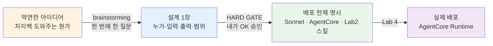
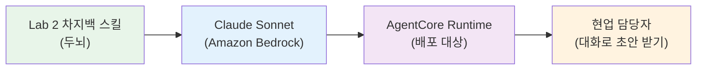

# Lab 3 · 서비스 정의 & 배포 준비 — brainstorming

[← 이전: Lab 2 차지백 이해 스킬 만들기](02-build-chargeback-skill.md) · [🏠 목차](README.md) · [다음: Lab 4 프론트엔드 & AgentCore 배포 →](04-frontend-and-agentcore.md)

Lab 2에서 우리는 차지백을 이해하는 **스킬(skill)** 을 만들었습니다. 스킬은 "차지백을 이렇게 읽고, 이렇게 판단하라"는 AI의 업무 지식 — 말하자면 **두뇌**입니다. 그런데 두뇌만 있으면 아직 서비스가 아닙니다. 누가, 무엇을 넣어서, 무엇을 받아갈지가 정해져야 비로소 "서비스"가 됩니다. 이번 단계에서는 머릿속의 "차지백을 도와주는 뭔가를 만들고 싶다"는 막연한 생각을, AI와 함께 **brainstorming(브레인스토밍)** 으로 캐물어 가며 구체적인 **설계 한 장**으로 좁힙니다. 그리고 그 설계가 **AWS에 배포(Amazon Bedrock AgentCore + Claude Sonnet)** 될 것을 전제로, Lab 4에서 그대로 쓸 **배포 준비 프롬프트**까지 정리합니다.

**예상 소요시간:** 약 40분 (13:00–13:40 · 강사와 함께 진행)

> ℹ️ **참고:** 이번 단계에서는 **코드를 배포하지 않습니다.** AgentCore에 실제로 올리는 명령은 Lab 4에서 다룹니다. 여기서는 "무엇을·왜 만들 것인가"를 brainstorming으로 정의하고, Lab 4에서 복사해 쓸 프롬프트를 손에 쥐는 것까지가 목표입니다.

> ⏱️ **40분 진행 방식(강사 주도):** 각자 백지에서 brainstorming을 시작하면 시간 안에 끝나지 않습니다. **강사가 설계 뼈대(아래 예시 `design.md` 골격)를 먼저 화면에 보여주고**, 참가자는 그것을 **검토·커스텀**하는 방식으로 진행합니다. `/superpowers:brainstorming`은 그대로 손으로 체험하되, 핵심 2~3문답 + 배포 준비 프롬프트 정리까지만 빠르게 통과합니다.

## 시작하기 전에

다음을 먼저 확인하세요.

- [ ] Lab 2를 완료해 **차지백 이해 스킬**이 `workshop/mvp/`에 만들어져 있다
- [ ] `cd workshop/mvp` 후 `claude` 세션이 떠 있다(없으면 Lab 0 참고)
- [ ] `/status`에 **Amazon Bedrock** / **`ap-northeast-2`** 가 보인다

## 이 단계에서 할 일

이번 단계를 마치면 다음을 직접 할 수 있습니다.

1. `/superpowers:brainstorming`을 실행해, 막연한 아이디어를 AI와의 **한 번에 하나씩** 문답으로 좁혀 나간다.
2. "누가 쓰나 / 입력은 / 출력은 / 범위는"에 답하며 **차지백 재반박 서비스의 윤곽**을 잡는다.
3. AI가 제시한 접근법 2~3개 중 하나를 골라 **설계(스펙) 한 장**으로 확정한다.
4. 그 설계에 **모델=Bedrock Claude Sonnet, 배포=AgentCore Runtime, 두뇌=Lab 2 스킬**을 명시하고, Lab 4에서 쓸 **배포 준비 프롬프트**를 한곳에 모아 둔다.

> 💡 **팁:** 이번 단계의 주인공은 "정답을 빨리 적는 것"이 아니라 **"질문에 답하면서 생각을 정리하는 것"** 입니다. AI가 묻는 말에 솔직하게, 현업의 언어로 답하면 됩니다. 모르면 "그건 잘 모르겠고, 우선 ~만 되면 좋겠어"라고 답해도 괜찮습니다.

### 강사가 먼저 보여주는 설계 뼈대 (검토·커스텀용)

40분에 맞추기 위해, 강사가 아래 **`design.md` 골격**을 먼저 화면에 띄웁니다. 참가자는 백지에서 시작하지 말고, 이 뼈대의 각 칸이 **내 업무와 맞는지 검토**하고, 다른 부분만 **고쳐(커스텀)** 가면 됩니다.

```text
# 차지백 재반박 어시스턴트 — 설계 (뼈대 · 강사 제공)
- 두뇌:    Lab 2에서 만든 '차지백 이해 스킬'           ← 그대로
- 사용자:  차지백 처리 현업 담당자(비개발자)          ← 검토/수정
- 입력:    가맹점 분쟁 자료(전표·증빙·메모)            ← 검토/수정
- 출력:    재반박서 '초안' (최종 제출은 사람 — HITL)   ← 검토/수정
- 접근법:  ( A 대화형 / B 양식 / C 배치 중 택1 )        ← 본인이 선택
- 범위 밖: 자동 제출, 카드사 시스템 직접 연동           ← 검토/수정
```

> 💡 **팁:** "두뇌" 줄은 **고정**입니다 — 서비스의 판단 능력은 Lab 2에서 만든 스킬이 담당하므로 새로 만들지 않습니다. 나머지 칸만 brainstorming으로 한두 군데 다듬으면 설계가 완성됩니다.

### 왜 brainstorming이 먼저인가

현업이 "차지백을 도와주는 서비스를 만들고 싶다"고 말할 때, 머릿속에는 그림이 있지만 그게 글로 정리돼 있지는 않습니다. 이 상태에서 곧장 "만들어줘"라고 하면 두 가지 함정에 빠집니다.

- **백지 공포:** 무엇부터 적어야 할지 몰라 손이 멈춥니다.
- **요구사항 모호:** AI가 알아서 만들지만, 막상 나온 결과가 내가 원한 것과 다릅니다("이게 아닌데…").

`brainstorming`은 이 함정을 막기 위해 **구현 전에 의도와 요구사항을 먼저 캐내는** 절차입니다. 핵심 규칙은 두 가지입니다.

- **한 번에 한 질문:** AI가 질문을 한꺼번에 쏟지 않고, 하나씩 물어 답을 쌓아 갑니다. 현업은 답하기만 하면 생각이 정리됩니다.
- **HARD GATE(설계 승인 전 구현 금지):** 설계가 내 손으로 "OK" 승인되기 전까지 AI는 코드를 만들지 않습니다. 엉뚱한 결과물에 시간을 버리지 않게 막아 주는 안전장치입니다.



이번 Lab은 위 흐름에서 **A → B → C**까지입니다. 마지막 **D(실제 배포)** 는 Lab 4의 몫입니다.

> ℹ️ **참고(핵심 한 줄):** Lab 2가 "차지백을 어떻게 판단하나"(두뇌)였다면, Lab 3은 "그 두뇌를 누가·어떻게 쓰는 서비스로 만들 것인가"(설계)입니다. 두뇌가 서비스의 몸을 입는 단계라고 생각하면 됩니다.

---

## 1. `/superpowers:brainstorming` 시작하기 ⭐

brainstorming 세션을 열고, **Lab 2에서 만든 스킬을 두뇌로 쓰겠다**는 점을 명시하며 던집니다. 강사가 띄운 뼈대를 옆에 두고, 그대로 확인만 해도 됩니다.

1. `claude` 세션의 입력 커서에 아래를 그대로 입력하고 Enter.

```text
/superpowers:brainstorming
```

2. AI가 주제를 물으면, **Lab 2 스킬을 두뇌로 명시**해 답합니다.

```text
Lab 2에서 만든 차지백 스킬(workshop/mvp의 차지백 이해 스킬)을 그대로 '두뇌'로 써서,
현업이 재반박(representment)을 더 빨리 처리하는 서비스를 만들고 싶어.
스킬은 이미 있으니 새로 만들지 말고, 그 스킬을 누가·어떻게 쓰는지 설계만 같이 좁혀줘.
```

**예상 결과**

> AI가 한꺼번에 묻지 않고 **한 번에 하나씩** 질문을 시작합니다(예시 — 실제 문구·순서는 다를 수 있음).

```text
좋아요. Lab 2 스킬(두뇌)은 그대로 쓰고, 그 위에 어떤 서비스를 올릴지만 좁혀 봅시다.

❓ (1/3) 이 서비스를 실제로 손에 쥐고 쓸 사람은 누구인가요?
   예: 차지백 처리하는 현업 담당자 본인 / 팀 전체 / 관리자 보고용 등
```

AI가 질문을 하나만 던지는 게 정상입니다. "스킬은 이미 있으니 새로 만들지 마"라고 못 박았기 때문에, AI는 **두뇌 재사용을 전제로** 설계만 좁혀 갑니다.

> 💡 **팁:** 프롬프트에 **Lab 2 스킬을 두뇌로 쓴다**고 적는 것이 핵심입니다. 이 한 줄이 빠지면 AI가 차지백 판단 로직을 처음부터 다시 만들려 할 수 있습니다.

> 📸 (스크린샷: /superpowers:brainstorming 실행 후 AI가 첫 질문 하나만 던진 화면)

---

## 2. 뼈대 검토하며 핵심 2~3개 문답으로 좁히기

강사 뼈대를 보며, AI 질문에 **하나씩** 답합니다. 뼈대와 같으면 "맞아"로 빠르게, 다르면 그 칸만 고칩니다.

1. (1/3) "누가 쓰나" — 뼈대대로면 그대로 확인합니다.

```text
맞아. 차지백을 직접 처리하는 현업 담당자 본인이 써. 비개발자야.
```

2. AI가 입력·출력을 이어서 물으면, 뼈대 기준으로 답합니다.

```text
❓ (2/3) 입력은 무엇을 넣고, 결과로 무엇을 받고 싶나요?
```
```text
입력은 가맹점 분쟁 자료(전표·증빙·메모). 출력은 '재반박서 초안'이야.
최종 제출은 사람이 한다는 전제(HITL)로.
```

3. AI가 범위를 물으면 답합니다.

```text
❓ (3/3) 이번 버전에서 안 할 것(범위 밖)은요?
```
```text
자동 제출, 카드사 시스템 직접 연동은 이번엔 안 해. 초안 작성까지만.
```

**예상 결과**

> AI가 답을 모아 **윤곽을 한 번 되짚어** 줍니다. 뼈대와 같으면 곧장 다음 단계로 넘어갑니다.

```text
정리하면 이렇게 이해했어요. 맞으면 다음으로 넘어갈게요.

  • 두뇌:    Lab 2 차지백 스킬 재사용 (새로 만들지 않음)
  • 사용자:  차지백 처리 현업 담당자(비개발자)
  • 입력:    가맹점 분쟁 자료(전표·증빙·메모)
  • 출력:    재반박서 '초안' (최종 제출은 사람 — HITL)
  • 범위 밖: 자동 제출, 카드사 시스템 직접 연동
```

> 👀 **확인:** 되짚어 준 줄이 강사 뼈대와 일치하나요? 다르면 지금 한 줄로 고치세요 — "출력은 초안 말고 체크리스트가 더 좋겠어"처럼.

> ⚠️ **주의:** 아직 "만들어줘"라고 하지 마세요. 구현은 설계 승인(HARD GATE) 이후입니다.

> 📸 (스크린샷: AI가 두뇌·사용자·입력·출력·범위를 되짚어 준 화면)

---

## 3. 접근법 선택 → 설계(스펙) 확정

뼈대에서 비어 있던 **접근법 칸**만 채우면 설계가 끝납니다. AI에게 2~3가지를 비교받고 하나를 고릅니다.

1. 접근법을 비교해 달라고 요청합니다.

```text
이걸 만드는 방법을 2~3가지로 비교해줘. 비개발자가 쓰기 쉬운 쪽을 한 줄로 추천해줘.
```

**예상 결과**

> AI가 접근법을 **나란히 비교**하고 추천을 덧붙입니다(예시).

```text
  A. 대화형 어시스턴트 — 자료를 붙여넣으면 대화로 초안을 다듬음  + 쉽고 빠름
  B. 양식 기반 — 정해진 칸에 넣으면 초안이 나옴                + 입력 누락 적음
  C. 배치 처리 — 여러 건을 한 번에 처리                       + 대량 유리, − HITL 약화 위험

👉 추천: A(대화형). 비개발자가 쓰기 쉽고, 초안마다 사람이 검토(HITL)하기 자연스러워요.
```

2. 하나를 고르고, 뼈대를 **`design.md` 한 장으로 확정·저장**해 달라고 합니다.

```text
A(대화형)로 갈게. 아까 강사 뼈대 + 우리가 정한 걸 'design.md' 한 장으로 저장해줘.
두뇌(Lab 2 스킬)/사용자/입력/출력/범위/접근법(A)과 그 이유까지 담아줘.
```

**예상 결과**

> AI가 `design.md`(설계 1장)를 만들고 요약을 보여 줍니다.

```text
design.md 저장 완료. 핵심은 이렇습니다.

  # 차지백 재반박 어시스턴트 — 설계
  - 사용자:   차지백 처리 현업(비개발자)
  - 입력:     가맹점 분쟁 자료(전표·증빙·메모)
  - 출력:     재반박서 초안 + 사유코드 매칭 근거 (HITL: 최종 제출은 사람)
  - 접근법:   A 대화형 어시스턴트 (쉬움 + HITL 자연스러움)
  - 범위 밖:  자동 제출, 카드사 직접 연동
```

> 👀 **확인:** `design.md`가 한 장으로 깔끔하게 정리됐나요? 이 한 장이 Lab 4 배포의 **출발점**입니다. 분량은 짧아도 좋지만, **사용자·입력·출력·범위·접근법** 다섯 가지는 반드시 들어가야 합니다.

> 📸 (스크린샷: AI가 접근법 A/B/C를 비교하고 design.md를 저장해 준 화면)

---

## 4. 배포 전제(Sonnet · AgentCore · Lab 2 스킬) 반영하기

이제 이 설계가 **AWS에 배포될 서비스**라는 사실을 설계에 못 박습니다. 두뇌(Lab 2 스킬)는 이미 있으니, 그 두뇌가 **어떤 모델 위에서, 어디에 배포되는지**를 한 단락 추가합니다.

1. 배포 전제를 `design.md`에 반영해 달라고 지시합니다.

```text
이 설계에 '배포 전제' 섹션을 추가해서 design.md를 업데이트해줘.
  - 두뇌:  Lab 2에서 만든 '차지백 이해 스킬'을 그대로 사용
  - 모델:  Amazon Bedrock의 Claude Sonnet
  - 배포:  Amazon Bedrock AgentCore Runtime에 에이전트로 올림
  - 단, 실제 배포 명령은 Lab 4에서 한다는 점도 한 줄로 명시해줘.
```

**예상 결과**

> AI가 `design.md`에 배포 전제 섹션을 더해 줍니다(예시).

```text
design.md에 아래 섹션을 추가했어요.

  ## 배포 전제
  - 두뇌:  Lab 2 '차지백 이해 스킬' 재사용 (별도 학습 X)
  - 모델:  Amazon Bedrock · Claude Sonnet
  - 배포:  Amazon Bedrock AgentCore Runtime (에이전트 형태)
  - 비고:  실제 배포·실행 명령은 Lab 4에서 진행 (이번 Lab은 정의까지)
```

이렇게 적어 두면, Lab 4에서 "무엇을 어디에 올릴지"를 다시 설명할 필요가 없습니다. 설계 한 장만 보면 **두뇌(스킬) → 모델(Sonnet) → 배포(AgentCore)** 의 연결이 한눈에 보입니다.



> ⚠️ **주의:** 여기서 AgentCore나 Sonnet을 **실제로 호출하지 않습니다.** 이 단계는 설계 문서에 "이렇게 배포할 것"이라고 **적기만** 합니다. 실제 명령(`agentcore` 배포, 모델 연결 등)은 **Lab 4**에서 다룹니다.

> 📸 (스크린샷: design.md에 '배포 전제' 섹션이 추가된 화면)

---

## 배포 준비 프롬프트 모음 (복사용)

아래는 이번 Lab에서 정리한 내용을 바탕으로, **Lab 4에서 그대로 복사해 쓸** 프롬프트 모음입니다. 지금은 실행하지 말고, `design.md` 옆에 메모로 붙여 두기만 하세요.

> 💡 **팁:** 아래 박스를 통째로 `design.md` 맨 아래 "## Lab 4용 프롬프트"에 붙여 넣어 두면, Lab 4에서 위에서부터 하나씩 실행하기만 하면 됩니다.

```text
# 1) 스킬을 에이전트로 만들 준비
이 차지백 이해 스킬(Lab 2)을 Amazon Bedrock AgentCore에 배포할
'에이전트'로 만들 준비를 해줘. 모델은 Amazon Bedrock의 Claude Sonnet을 쓰고,
대화형(접근법 A)으로 동작하게 해줘. design.md의 설계를 그대로 따라.

# 2) 입력/출력 규약 확정
에이전트의 입력은 '가맹점 분쟁 자료(전표·증빙·메모)', 출력은
'재반박서 초안 + 사유코드 매칭 근거'로 고정해줘. 최종 제출은 사람이 한다는
HITL 전제를 시스템 프롬프트에 명시해줘.

# 3) AgentCore 배포 구성 미리보기
AgentCore Runtime에 올리기 위해 필요한 구성(엔트리포인트, 모델 설정,
필요한 권한)을 design.md 기준으로 정리해서 보여줘. 아직 실행은 하지 말고
무엇이 필요한지 목록만 만들어줘.

# 4) 프론트엔드 연결 지점 정리
현업이 대화로 자료를 넣고 초안을 받는 화면(프론트엔드)이 이 에이전트와
어디서 연결되는지(요청·응답 형태)를 한 단락으로 정리해줘.
```

> ℹ️ **참고:** 위 프롬프트는 "무엇을·왜"까지를 담은 **준비**입니다. 각 프롬프트를 실제로 실행해 AgentCore에 올리고, Sonnet과 연결하고, 프론트엔드를 붙이는 **실행**은 Lab 4의 내용입니다.

---

## 문제 해결

brainstorming이 막힐 때 아래 표에서 증상을 찾아 대응하세요.

| 증상 | 원인 | 해결 |
|------|------|------|
| AI가 질문을 **한꺼번에 여러 개** 쏟아낸다 | brainstorming 리듬이 흐트러짐 | "한 번에 하나씩만 물어봐"라고 한 줄로 요청 — AI가 다시 한 질문씩 돌아옵니다 |
| 질문이 **너무 많아** 지친다 | 범위가 넓어 캐물을 게 많음 | "지금 정한 것만으로 일단 설계 1장 만들어줘. 나머지는 나중에"라고 잘라 줍니다(HITL은 내가 쥡니다) |
| 주제가 **너무 커서** 좁혀지지 않는다 | 한 번에 다 만들려는 욕심 | "이번 버전은 **재반박서 초안 작성까지만**"처럼 범위를 좁혀 한 조각으로 쪼개세요 — 자동 제출·연동은 다음 버전 |
| AI가 **물어보지도 않고 코드부터** 만든다 | HARD GATE를 건너뜀 | "아직 구현하지 마. 설계 합의가 먼저야"라고 멈춰 세웁니다 — 승인 전 구현은 하지 않는 게 원칙 |
| `design.md`에 **다섯 항목이 빠졌다** | 되짚기 단계를 건너뜀 | "사용자·입력·출력·범위·접근법 다섯 가지가 다 들어가게 다시 정리해줘"라고 보완 요청 |

### 자주 헷갈리는 것

| 헷갈리는 것 | 어떻게 나타나나 | 바로잡는 법 |
|---|---|---|
| **스킬(두뇌) vs 서비스(설계)** | "Lab 2에서 다 만들었는데 왜 또?"라고 느낌 | 스킬은 **판단 지식**, 이번 Lab은 그걸 **누가·어떻게 쓰는지**의 설계입니다 |
| **이번 Lab에서 배포까지 하려 함** | `agentcore` 명령을 지금 치려고 함 | 이번 Lab은 **정의·준비까지** — 실제 배포는 Lab 4 |
| **AI에게 결정을 다 떠넘김** | 질문에 "알아서 해줘"로만 답함 | 핵심(사용자·범위)은 **현업이 결정** — AI는 좁혀 주는 역할 |
| **완벽한 설계를 한 번에** | 한 문답에 모든 걸 답하려다 막힘 | 묻는 것 **하나에만** 답하면 됩니다. 나머지는 다음 질문에서 |

> 💡 **팁:** 막히면 "지금까지 정한 걸 한 번 정리해줘"라고 말해 보세요. AI가 현재 윤곽을 되짚어 주면, 어디까지 왔고 무엇이 비었는지가 한눈에 보입니다.

---

## ✅ 완료 확인

다음이 모두 충족되면 이 단계는 성공입니다.

- [ ] 강사 뼈대(`design.md` 골격)를 검토하고, `/superpowers:brainstorming`으로 **핵심 2~3문답**을 진행했다
- [ ] 첫 프롬프트에 **두뇌=Lab 2 스킬(새로 만들지 않음)** 을 명시했고, AI가 사용자·입력·출력·범위를 되짚어 줬다
- [ ] 접근법 2~3개를 비교받고 하나를 골라 **`design.md`(설계 1장)** 를 저장했다
- [ ] `design.md`에 **두뇌=Lab 2 스킬 / 모델=Bedrock Sonnet / 배포=AgentCore** 가 명시됐다
- [ ] **Lab 4용 배포 준비 프롬프트**가 한곳(예: `design.md` 하단)에 정리됐다

핵심만 다시 짚으면 — Lab 2가 두뇌(스킬)였다면, Lab 3은 그 두뇌를 **누가·무엇을 넣어·무엇을 받는** 서비스로 만들지 정의하는 단계입니다. brainstorming(한 번에 한 질문 + 설계 승인 전 구현 금지)으로 막연함을 설계 한 장으로 좁히고, 배포 전제(Sonnet·AgentCore·Lab 2 스킬)와 Lab 4용 프롬프트까지 손에 쥐면 끝입니다.

> 강사 노트:
>
> **진행 팁 (강사 주도 · 백지 확산 방지)**
> - 시작하자마자 **설계 뼈대 `design.md` 골격을 화면에 띄우고**, "백지에서 시작하지 말고 이 칸들을 검토·커스텀하세요"로 프레이밍하세요. 각자 백지 brainstorm으로 흩어지면 40분에 끝나지 않습니다.
> - **두뇌 줄(Lab 2 스킬)은 고정**임을 강조하세요. brainstorm 첫 프롬프트에 "Lab 2 스킬을 두뇌로, 새로 만들지 마"를 반드시 넣게 하면 AI가 판단 로직을 재생성하지 않습니다.
> - `/superpowers:brainstorming`은 **핵심 2~3문답**만 손으로 체험시키고, 뼈대와 같은 칸은 "맞아"로 빠르게 통과시키세요.
> - AI가 질문을 한꺼번에 쏟거나 코드부터 만들려 하면 즉시 "한 번에 하나씩만 / 아직 구현하지 마(HARD GATE)"로 멈춰 세우는 걸 시연하세요.
>
> **시간 관리 (13:00–13:40 · 강사 기준)**
> - 뼈대 소개+개념 13:00–13:06, brainstorming 실행+핵심 문답 13:06–13:18, 접근법 선택+`design.md` 저장 13:18–13:28, 배포 전제 반영+프롬프트 정리 13:28–13:37, 완료 점검 13:37–13:40.
> - 길을 잃는 페어는 "강사 뼈대 그대로 저장하고 접근법만 골라"로 잘라 진도를 맞추세요. 완벽한 설계보다 **한 장을 끝내는 것**이 목표입니다.
>
> **예상 질문 Q&A**
> - **Q. Lab 2에서 스킬을 만들었는데 왜 또 설계하나요?** A. Lab 2는 "어떻게 판단하나"(두뇌), Lab 3은 그 두뇌를 "누가·어떻게 쓰는 서비스인가"(설계)입니다.
> - **Q. 지금 AgentCore에 올려 보면 안 되나요?** A. 이번 Lab은 정의·준비까지입니다. 실제 배포는 Lab 4에서 이 프롬프트를 그대로 써서 진행합니다.
> - **Q. 모델을 꼭 Sonnet으로 적어야 하나요?** A. 이번 워크숍은 Amazon Bedrock의 Claude Sonnet 전제입니다. 설계에 명시하면 Lab 4에서 그대로 연결됩니다.

## 다음 단계

이제 막연한 아이디어가 **설계 한 장**이 되었고, 그 설계에 배포 전제(Sonnet·AgentCore·Lab 2 스킬)와 Lab 4용 프롬프트까지 담겼습니다. Lab 4에서는 이 설계와 프롬프트를 들고, 실제로 **프론트엔드를 붙이고 Amazon Bedrock AgentCore에 에이전트를 배포**합니다.

[← 이전: Lab 2 차지백 이해 스킬 만들기](02-build-chargeback-skill.md) · [🏠 목차](README.md) · [다음: Lab 4 프론트엔드 & AgentCore 배포 →](04-frontend-and-agentcore.md)
