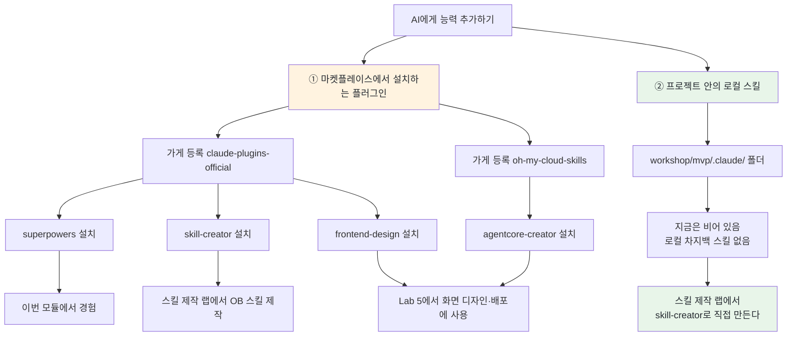

# Lab 1 · 스킬·플러그인 설치 및 이해

[← 이전: Lab 0 환경 점검](00-environment.md) · [🏠 목차](README.md) · [다음: Lab 2 핵심 개념 →](02-concepts.md)

이번 단계에서는 본격적인 차지백 실습에 앞서 **"AI에게 능력을 추가한다"는 감을 잡습니다.** Claude Code에 **플러그인(스킬 묶음)**을 설치하는 표준 방법을 두 번 경험합니다 — 검증된 워크플로우 꾸러미 `superpowers`, 그리고 **새 스킬을 직접 만들어 주는 도구 `skill-creator`**입니다. `skill-creator`는 뒤에 나오는 **스킬 제작 랩(`03-build-chargeback-skill.md`)**에서 우리만의 차지백(아웃바운드) 스킬을 직접 만들 때 쓰게 되므로, 여기서 미리 설치해 둡니다. 또 **로컬 스킬**(프로젝트 폴더 안의 스킬)이 마켓플레이스 설치와 어떻게 다른지도 함께 짚습니다.

**예상 소요시간:** 약 25분 (오전 환경 준비 직후, Lab 0 바로 다음 · SA 화면을 함께 보며 한 단계씩 진행)

> ⚠️ **주의:** 이 모듈을 시작하기 전에 다음을 확인하세요.
> - [ ] Lab 0(환경 준비) 완료 — Claude Code 실행 중, `/status`에 **Amazon Bedrock**이 보임
> - [ ] `cd workshop/mvp` 후 `claude`를 실행한 상태 (작업 폴더가 `workshop/mvp/`)
> - [ ] 인터넷 연결됨 (와이파이 `guest`) — 플러그인 설치(`superpowers`·`skill-creator`·`frontend-design`·`agentcore-creator`)에 필요

## 이 단계에서 할 일

이번 단계를 마치면 다음을 직접 할 수 있습니다.

1. **스킬 · 플러그인 · 마켓플레이스**가 각각 무엇이고 어떻게 다른지 비개발자 언어로 설명한다.
2. `/plugin` 메뉴로 **마켓플레이스(`claude-plugins-official`)를 추가**하고, 그 안의 **`superpowers` 플러그인을 설치**한 뒤 `/reload-plugins` 또는 재시작으로 반영한다.
3. 같은 방법으로 **`skill-creator` 플러그인을 설치**한다 — 이건 **스킬 제작 랩(`03-build-chargeback-skill.md`)에서 우리만의 차지백(아웃바운드) 스킬을 직접 만들 때** 쓰는 도구다.
4. 같은 방법으로 **`frontend-design`·`agentcore-creator` 플러그인을 설치**한다 — **Lab 5(프론트엔드 & AgentCore 배포)에서** 화면 디자인과 스킬→AgentCore 배포에 쓰는 도구다. (`agentcore-creator`는 **다른 마켓플레이스**라 가게부터 추가한다.)
5. 설치된 플러그인을 `/plugin`의 Installed 탭과 `/help`에서 **확인**하고, `/superpowers:brainstorming`을 한 번 불러 동작을 체감한다.
6. **마켓플레이스에서 설치하는 플러그인**과 **프로젝트 폴더 안의 로컬 스킬**(설치 없이 그 폴더에서 `claude`를 켜면 자동 인식)의 차이를 구분한다. 이 워크숍의 로컬 차지백 스킬은 **아직 없으며 스킬 제작 랩에서 직접 만든다.**

> 💡 **팁:** 화면 글자는 Claude Code 버전에 따라 조금씩 다를 수 있습니다. **"비슷한 화면이 뜨면 정상"**으로 보세요. 막히면 혼자 5분 이상 헤매지 말고 옆 페어나 SA에게 손을 드세요.

### 용어 3개 — 설명서 · 꾸러미 · 가게

차지백 업무에 비유하면 이렇게 정리됩니다.

| 용어 | 비유 | 쉽게 말하면 |
|------|------|------------|
| **스킬(Skill)** | 업무 매뉴얼 한 장 | "이런 일은 이렇게 해"라고 적힌 **설명서**. AI가 필요할 때 알아서 펼쳐 봅니다. (예: 차지백 신청서를 어떤 구조·톤으로 쓰는지) |
| **플러그인(Plugin)** | 매뉴얼 + 담당자를 묶은 **꾸러미** | 스킬 여러 개 + 서브에이전트 + 자동화를 한 봉투에 넣은 것. (예: `superpowers`) |
| **마켓플레이스(Marketplace)** | 앱스토어(플러그인 가게) | 플러그인을 골라 받을 수 있는 **목록 카탈로그**. 가게를 등록해야 그 안의 플러그인을 받을 수 있습니다. (예: `claude-plugins-official`) |

**왜 이 세 가지를 구분할까요?** "가게(마켓플레이스)를 등록 → 그 안에서 꾸러미(플러그인)를 골라 설치 → 꾸러미 안의 설명서(스킬)를 AI가 사용"이라는 **계단형 구조**이기 때문입니다. 앱을 쓰려면 먼저 앱스토어가 있어야 하고, 앱스토어에서 앱을 받아야 그 안의 기능을 쓰는 것과 똑같습니다.

### 능력을 추가하는 길은 두 종류



> ℹ️ **참고(이 모듈의 핵심 한 문장):** AI에 능력을 더하는 길은 두 갈래입니다 — ① **마켓플레이스에서 설치하는 플러그인**, ② **프로젝트 폴더 안의 로컬 스킬**. 이번 모듈에서는 ①을 직접 해 보고(`superpowers`·`skill-creator`는 이번·스킬 제작 랩에서, `frontend-design`·`agentcore-creator`는 Lab 5에서 사용 — 네 개 모두 오늘 미리 설치), ②는 "폴더에 있으면 자동 인식"이라는 원리만 짚습니다. 이 워크숍의 로컬 차지백 스킬은 **아직 만들지 않았고, 뒤의 스킬 제작 랩에서 방금 설치한 `skill-creator`로 직접 만듭니다.**

**왜 로컬 스킬은 설치가 필요 없나요?** Claude Code는 켤 때 **현재 작업 폴더 안의 `.claude/` 폴더**를 자동으로 들여다봅니다. 그래서 `workshop/mvp/.claude/skills/`에 스킬 폴더가 있으면 **그 폴더에서 `claude`를 켜기만 하면** 별도 설치 없이 인식됩니다. 다만 **지금은 `.claude/`가 비어 있어** 보여 줄 로컬 스킬이 없습니다 — 스킬 제작 랩에서 `skill-creator`로 우리만의 차지백(아웃바운드) 스킬을 만들면, 바로 이 자리(`workshop/mvp/.claude/skills/`)에 들어가 자동 인식됩니다.

> 💡 **팁:** 아래 코드블록 중 슬래시(`/`)로 시작하는 것은 Claude Code에 입력하는 **명령**, 한국어 문장은 그대로 입력하는 **자연어 프롬프트**입니다. **예상 결과**는 화면에 나타나는 모습입니다.

---

## 1. 플러그인 관리 메뉴 열기

먼저 플러그인을 관리하는 시각적 메뉴를 엽니다.

1. Claude Code 안에서 아래를 입력합니다.

```text
/plugin
```

**예상 결과**

> **탭(Tab) 4개로 나뉜 플러그인 관리 화면**이 열립니다. `Tab` 키로 탭 사이를 이동(역방향은 `Shift+Tab`), 방향키 `↑ ↓`로 항목 이동, `Enter`로 선택, `Esc`로 닫기입니다.

| 탭 | 하는 일 |
|----|---------|
| **Discover** (둘러보기) | 등록된 마켓플레이스의 설치 가능한 플러그인 구경·설치 |
| **Installed** (설치됨) | 이미 설치한 플러그인 보기·켜기/끄기/삭제 |
| **Marketplaces** (마켓플레이스) | 플러그인 가게 추가·갱신·삭제 |
| **Errors** (오류) | 플러그인 로딩 오류 확인 |

`/plugin`은 플러그인을 **시각적 메뉴**로 관리하는 입구입니다. 외울 명령이 거의 없이 `Tab`과 방향키만으로 "가게 등록 → 플러그인 설치 → 확인"을 다 할 수 있게 설계돼 있습니다. 오늘은 이 메뉴를 주로 쓰고, 명령 한 줄 방식은 보조로만 소개합니다.

**확인하세요**

- [ ] 상단에 **Discover · Installed · Marketplaces · Errors** 4개 탭이 보이는가?
- [ ] `Tab` 키를 한두 번 눌러 탭이 바뀌는가?

> ⚠️ **주의:** `/plugin`이 "unknown command(알 수 없는 명령)"라고 나오면 Claude Code 버전이 오래된 것입니다. SA에게 손을 들어 업데이트를 확인하세요(보통 D-1 설치본은 정상). 막히면 이 모듈은 **시연으로 대체**하고 넘어가도 됩니다.

> 📸 (스크린샷: `/plugin` 메뉴 첫 화면 — 상단에 Discover · Installed · Marketplaces · Errors 탭)

---

## 2. 마켓플레이스(가게) 추가

`superpowers`는 **`claude-plugins-official`**(앤트로픽 공식 마켓플레이스)에 들어 있습니다. 공식 마켓플레이스는 보통 Claude Code 첫 실행 때 **자동 등록**되어 있어, **Marketplaces** 탭에 이미 보일 수 있습니다.

1. **방법 A — 메뉴 (권장):** `/plugin` → `Tab`으로 **Marketplaces** 탭 이동 → 목록에 `claude-plugins-official`이 있으면 그대로 둡니다. **없을 때만** "Add marketplace(마켓플레이스 추가)" 항목을 골라 아래 이름을 입력합니다.

```text
anthropics/claude-plugins-official
```

2. **방법 B — 명령 한 줄:** 메뉴가 헷갈리면 직접 칠 수도 있습니다.

```text
/plugin marketplace add anthropics/claude-plugins-official
```

**예상 결과**

> "marketplace added(마켓플레이스가 추가됨)" 류의 안내가 나오고 카탈로그를 내려받습니다. **이 단계에서는 아직 아무 플러그인도 설치되지 않습니다** — 가게만 등록한 상태입니다.

가게(마켓플레이스)를 등록해야 그 안의 플러그인 목록을 볼 수 있습니다. 앱스토어를 폰에 깔아야 앱을 받을 수 있는 것과 같습니다. 이미 등록돼 있다면 이 단계는 건너뛰어도 됩니다.

**확인하세요**

- [ ] **Marketplaces** 탭 목록에 `claude-plugins-official`이 보이는가?
- [ ] "이미 있다(already exists)" 메시지가 나왔다면 → 정상입니다. 다음 단계로.

> ⚠️ **주의:** 사내망/프록시로 추가가 막히면(타임아웃·네트워크 오류) 설치 단계는 **SA 시연으로 대체**할 수 있습니다. 단 **`skill-creator`는 스킬 제작 랩의 전제**이니, 막히면 트레이너 PC에 설치돼 있는지 SA에게 확인하세요.

> 📸 (스크린샷: Marketplaces 탭에 claude-plugins-official이 등록된 목록)

---

## 3. `superpowers` 플러그인 설치

이제 가게에서 플러그인 하나를 골라 설치합니다.

1. **방법 A — 메뉴 (권장):** `/plugin` → **Discover** 탭 → 방향키로 `superpowers` 찾기 → `Enter`로 상세 보기(이 플러그인이 추가하는 스킬·에이전트 목록과 토큰 비용이 표시됨) → 설치 범위를 고릅니다.

- **User scope(사용자 전체)** ← 워크숍에서는 **이걸 고릅니다.** 내 모든 프로젝트에서 쓸 수 있게 설치.
- Project scope(이 저장소 공유) / Local scope(이 저장소·나만)는 오늘은 안 씁니다.

2. **방법 B — 명령 한 줄:** 메뉴 없이 바로 설치하려면(기본값이 User scope) 아래를 입력합니다.

```text
/plugin install superpowers@claude-plugins-official
```

**예상 결과**

> 설치 진행 후 완료 안내가 나옵니다. 함께 깔리는 구성요소(스킬·에이전트 개수)도 같이 표시됩니다.

3. 설치 직후 바로 안 보일 수 있습니다. **재시작 없이** 아래 한 줄로 즉시 반영합니다.

```text
/reload-plugins
```

> ⚠️ **주의(재시작 / 갱신):** `/reload-plugins`를 실행하면 "plugins / skills / agents… 개수"가 표시되며 새로 로드됐다고 알려줍니다. 그래도 안 보이면 Claude Code를 완전히 종료(`Esc` 여러 번 또는 창 닫기) 후 `claude`로 다시 켭니다.

플러그인은 **내 컴퓨터에서 코드를 실행할 수 있는** 능력을 더하므로, Claude Code는 설치 시 한 번 메모리에 반영해야 합니다. `/reload-plugins`는 재시작 없이 그 반영을 즉시 트리거하는 명령입니다. `superpowers`는 "아이디어 → 설계 → 계획 → 실행" 순서를 AI가 같이 잡아 주는 검증된 워크플로우 꾸러미입니다(부록 C 참고).

**확인하세요**

- [ ] "installed(설치됨)" 안내가 나왔는가?
- [ ] `/reload-plugins`가 정상 동작했는가? (개수 표시 확인)

> 📸 (스크린샷: superpowers 설치 완료 + /reload-plugins 결과 메시지)

### 문제 해결 — 설치 중 막힐 때

| 증상 | 해결 |
|------|------|
| **권한/신뢰 확인 프롬프트**가 뜸 | 플러그인은 내 컴퓨터에서 코드를 실행할 수 있어 신뢰 확인을 묻습니다. 공식 마켓플레이스(`claude-plugins-official`)의 `superpowers`는 신뢰해도 되므로 **허용(Yes/Trust)** 선택. 출처를 모르는 플러그인이면 설치 금지 |
| "not found in any marketplace(어느 마켓플레이스에도 없음)" | 2단계로 돌아가 마켓플레이스 추가/갱신(`/plugin marketplace update claude-plugins-official`) 후 다시 설치 |

---

## 4. `skill-creator` 플러그인 설치 — 나중에 우리 스킬을 만들 도구

`skill-creator`는 **새 스킬을 대화하듯 만들어 주는** 별도 플러그인입니다. `superpowers`와 **같은 마켓플레이스(`claude-plugins-official`)**에 나란히 들어 있어, 설치 방법도 똑같습니다. 지금 설치만 해 두면, 뒤의 **스킬 제작 랩(`03-build-chargeback-skill.md`)**에서 이걸로 **우리만의 차지백(아웃바운드) 스킬**을 직접 만들게 됩니다.

1. **방법 A — 메뉴 (권장):** `/plugin` → **Discover** 탭 → 방향키로 `skill-creator` 찾기 → `Enter`로 상세 보기 → 설치 범위 **User scope(사용자 전체)** 선택 → 설치.

2. **방법 B — 명령 한 줄:**

```text
/plugin install skill-creator@claude-plugins-official
```

**예상 결과**

> 설치 진행 후 완료 안내가 나옵니다. (`superpowers` 때와 동일한 흐름입니다.)

3. 바로 안 보이면 `superpowers` 때처럼 즉시 반영합니다.

```text
/reload-plugins
```

`skill-creator`는 **"이런 일을 하는 스킬을 만들고 싶어"**라고 말하면 AI가 질문을 던지며 스킬 폴더(`.claude/skills/...`)를 만들어 주는 도구입니다. 즉 **로컬 스킬을 손으로 짜지 않고 만들 수 있게** 돕습니다. 오늘은 **설치만** 해 두고, 실제 제작은 스킬 제작 랩에서 합니다.

**확인하세요**

- [ ] `skill-creator` 설치 "installed(설치됨)" 안내가 나왔는가?
- [ ] `/plugin`의 **Installed** 탭에 `superpowers`와 `skill-creator` **둘 다** 보이는가?

> 📸 (스크린샷: Installed 탭에 superpowers + skill-creator 두 개)

---

## 4-1. `frontend-design` 플러그인 설치 — Lab 5에서 화면 디자인에 쓰는 도구

`frontend-design`은 **웹 화면(UI)의 디자인 방향을 잡아 주는** 플러그인입니다. `superpowers`·`skill-creator`와 **같은 마켓플레이스(`claude-plugins-official`)**에 들어 있어 설치 방법도 똑같습니다. 지금 설치만 해 두면, **Lab 5(프론트엔드 & AgentCore 배포)**에서 1CB 이의신청 도우미 화면을 디자인할 때 씁니다.

1. **방법 A — 메뉴 (권장):** `/plugin` → **Discover** 탭 → 방향키로 `frontend-design` 찾기 → `Enter`로 상세 보기 → 설치 범위 **User scope(사용자 전체)** 선택 → 설치.

2. **방법 B — 명령 한 줄:**

```text
/plugin install frontend-design@claude-plugins-official
```

**예상 결과**

> 설치 진행 후 완료 안내가 나옵니다. (`superpowers`·`skill-creator` 때와 동일한 흐름입니다.)

3. 바로 안 보이면 즉시 반영합니다.

```text
/reload-plugins
```

**확인하세요**

- [ ] `frontend-design` 설치 "installed(설치됨)" 안내가 나왔는가?
- [ ] `/plugin`의 **Installed** 탭에 `frontend-design`이 보이는가?

> 📸 (스크린샷: Installed 탭에 frontend-design 추가)

---

## 4-2. `agentcore-creator` 플러그인 설치 — Lab 5에서 스킬→AgentCore 배포에 쓰는 도구

`agentcore-creator`는 **직접 만든 스킬을 AgentCore 에이전트로 감싸 클라우드에 배포**하도록 안내하는 플러그인입니다. **앞의 셋과 달리 다른 마켓플레이스**(`oh-my-cloud-skills`)에 들어 있어, **가게부터 먼저 추가**해야 합니다 — 1단계에서 배운 "가게 등록 → 플러그인 설치" 계단형 구조를 한 번 더 경험하는 셈입니다. 지금 설치만 해 두면, **Lab 5**에서 `ob-chargeback-domain` 스킬을 AgentCore에 배포할 때 씁니다.

1. **(가게 추가) 방법 A — 메뉴:** `/plugin` → `Tab`으로 **Marketplaces** 탭 이동 → "Add marketplace(마켓플레이스 추가)" 항목을 골라 아래 이름을 입력합니다.

```text
Atom-oh/oh-my-cloud-skills
```

   **(가게 추가) 방법 B — 명령 한 줄:**

```text
/plugin marketplace add Atom-oh/oh-my-cloud-skills
```

2. **(플러그인 설치) 방법 A — 메뉴 (권장):** `/plugin` → **Discover** 탭 → 방향키로 `agentcore-creator` 찾기 → `Enter`로 상세 보기 → 설치 범위 **User scope(사용자 전체)** 선택 → 설치.

   **(플러그인 설치) 방법 B — 명령 한 줄:**

```text
/plugin install agentcore-creator@oh-my-cloud-skills
```

**예상 결과**

> 새 마켓플레이스(`oh-my-cloud-skills`)가 등록된 뒤 `agentcore-creator` 설치가 진행됩니다. 출처를 모르는 마켓플레이스가 아니라 **이 워크숍이 지정한 가게**이니, 신뢰 확인이 뜨면 **허용(Yes/Trust)**을 선택하세요.

3. 바로 안 보이면 즉시 반영합니다.

```text
/reload-plugins
```

**확인하세요**

- [ ] **Marketplaces** 탭에 `oh-my-cloud-skills`가 보이는가?
- [ ] `agentcore-creator` 설치 "installed(설치됨)" 안내가 나왔는가?
- [ ] `/plugin`의 **Installed** 탭에 `agentcore-creator`가 보이는가?

> ⚠️ **주의:** 사내망/프록시로 새 마켓플레이스 추가가 막히면(타임아웃·네트워크 오류) 이 단계는 **SA 시연으로 대체**할 수 있습니다. 단 `frontend-design`·`agentcore-creator`는 **Lab 5의 전제**이니, 막히면 트레이너 PC에 설치돼 있는지 SA에게 확인하세요.

> 📸 (스크린샷: Marketplaces 탭의 oh-my-cloud-skills + Installed 탭의 agentcore-creator)

---

## 5. 설치 확인

플러그인이 진짜 들어왔는지 두 가지로 확인합니다.

1. **(a) 메뉴에서 확인:** 아래를 입력합니다.

```text
/plugin
```

**예상 결과**

> **Installed** 탭에 `superpowers`·`skill-creator`·`frontend-design`·`agentcore-creator` **네 개**가 보입니다.

2. **(b) 스킬 목록에서 확인:** 아래를 입력합니다.

```text
/help
```

**예상 결과**

> 사용 가능한 기능 목록에 `superpowers:`로 시작하는 항목들(예: `superpowers:brainstorming`), `skill-creator:`, `frontend-design:`, `agentcore-creator:`로 시작하는 항목이 보입니다.

플러그인 스킬은 이름 충돌을 막으려고 항상 **`플러그인이름:스킬이름`** 형태로 표시됩니다. 그래서 `brainstorming`이 아니라 `superpowers:brainstorming`입니다. 이 접두어가 보이면 플러그인이 제대로 로드된 증거입니다.

**확인하세요**

- [ ] **Installed** 탭에 `superpowers`·`skill-creator`·`frontend-design`·`agentcore-creator` 네 개가 보이는가?
- [ ] `/help` 목록에 `superpowers:` / `skill-creator:` / `frontend-design:` / `agentcore-creator:`로 시작하는 항목이 보이는가?

> ⚠️ **주의:** 안 보이면 3단계의 `/reload-plugins`를 한 번 더 실행하거나 Claude Code를 재시작합니다.

> 📸 (스크린샷: Installed 탭의 superpowers + /help 목록의 superpowers: 항목)

---

## 6. 살짝 써보기 — 감만 잡기

설치한 스킬을 한 번 불러서 "AI가 정리를 도와주는" 흐름을 맛만 봅니다. **깊이 들어가지 말고**, 어떤 느낌인지만 확인하세요.

1. 아래를 입력합니다.

```text
/superpowers:brainstorming
```

**예상 결과**

> AI가 결과를 곧장 쏟아내지 않고, "무엇을 만들지 / 어떤 문제를 풀지"를 **질문으로 되물으며** 생각을 정리해 주는 흐름이 시작됩니다.

```text
무엇을 만들거나 해결하고 싶으신가요? 막연한 아이디어라도 좋습니다.
몇 가지 질문으로 구체적인 설계로 좁혀 보겠습니다.

- 이 작업의 최종 사용자는 누구인가요?
- 성공했다고 판단하는 기준은 무엇인가요?
- ...
```

이것이 **스킬이 동작한다는 증거**입니다. `superpowers:brainstorming`은 "아이디어 → 설계"를 좁혀 주는 워크플로우라서, AI가 곧장 답을 내지 않고 **질문을 던지는 모드**로 바뀝니다. 차지백 맥락에서는 "차지백 도우미에 'X 케이스 자동 분류' 기능을 더하고 싶어" 같은 막연한 요청도 이 흐름으로 구체화할 수 있습니다(부록 C 워크스루 참고).

2. 흐름을 멈추려면 그냥 `"여기까지 할게, 고마워"`라고 말하거나 `Esc`를 누릅니다.

**확인하세요**

- [ ] AI가 곧장 결과를 쏟아내지 않고 **질문으로 정리를 돕는** 모드로 바뀌는가?
- [ ] 한두 번만 대답해 보고 멈췄는가? (오늘은 감만 잡으면 충분)

> ⚠️ **주의:** `/superpowers:brainstorming`이 인식 안 되면 → 3단계로 돌아가 설치/이름(`superpowers:` 접두어)을 다시 확인합니다.

> 📸 (스크린샷: brainstorming이 질문으로 되묻는 화면)

---

## 7. 로컬 스킬은 어떻게 다른가 — 지금은 비어 있다

마지막으로 **마켓플레이스 설치(①)**와 대비되는 **프로젝트 로컬 스킬(②)**의 원리를 짚습니다. 핵심은 **Claude Code가 켜질 때 현재 작업 폴더의 `.claude/`를 자동으로 본다**는 점입니다. 즉 `workshop/mvp/.claude/skills/`에 스킬 폴더가 있으면 **그 폴더에서 `claude`를 켜기만 하면** 설치 없이 자동 인식됩니다.

다만 **지금 우리 `.claude/`에는 스킬이 없습니다.** 이 워크숍의 차지백(아웃바운드) 스킬은 **미리 만들어 두지 않고**, 뒤의 **스킬 제작 랩(`03-build-chargeback-skill.md`)에서 방금 설치한 `skill-creator`로 직접 만듭니다.** 그래서 이번 모듈에서는 "로컬 스킬이 자동 인식된다"는 **원리만** 확인하고 넘어갑니다.

1. **(a) 자연어로 물어보기:** 아래 문장을 그대로 입력합니다.

```text
이 폴더(.claude/skills)에 지금 등록된 로컬 스킬이 있는지,
있으면 이름을 한국어로 알려줘.
```

**예상 결과**

```text
현재 이 프로젝트(workshop/mvp/.claude/)에는 등록된 로컬 스킬이 없습니다.
로컬 스킬은 스킬 제작 랩에서 skill-creator로 직접 만들 예정입니다.
```

2. **(b) 설치한 플러그인 스킬은 보인다:** 반대로, 방금 마켓플레이스에서 설치한 스킬은 어디서든 보입니다.

```text
/help
```

> `superpowers:` / `skill-creator:`로 시작하는 항목이 보입니다. 이것이 **①번(설치하는 플러그인)**입니다. **②번(로컬 스킬)**은 지금 비어 있고, 스킬 제작 랩에서 채워집니다.

**왜 미리 안 만들어 두나요?** "스킬을 직접 만들어 보는 것" 자체가 오후 실습의 핵심 학습이기 때문입니다. 완성된 스킬을 받아 쓰는 대신, `skill-creator`로 **요구사항을 대화로 풀어 스킬을 빚는 과정**을 경험합니다. 그렇게 만든 스킬은 `workshop/mvp/.claude/skills/`에 들어가 **그 폴더에서 `claude`를 켜면 자동 인식**됩니다.

**확인하세요**

- [ ] 지금 `.claude/skills/`에 **로컬 스킬이 없다**는 것을 확인했는가?
- [ ] "마켓플레이스에서 **설치하는** 플러그인"과 "폴더에 있기만 하면 **자동 인식되는** 로컬 스킬"의 차이를 말로 설명할 수 있는가?
- [ ] 우리 차지백 스킬은 **스킬 제작 랩에서 `skill-creator`로 만든다**는 걸 이해했는가?

---

## 문제 해결

환경이 막힐 때 아래 표에서 증상을 찾아 대응하세요.

| 증상 | 원인 / 해결 |
|------|------------|
| `/plugin`이 unknown command | Claude Code 버전이 오래됨. SA에게 업데이트 요청, 막히면 시연 대체 |
| 마켓플레이스 추가 실패 | 사내망·프록시·네트워크 문제. SA 시연으로 대체. 단 **`skill-creator`는 스킬 제작 랩의 전제**이므로 트레이너 PC에 반드시 설치돼 있어야 함 |
| 설치했는데 안 보임 | **재시작 필요** — `/reload-plugins` 실행 또는 Claude Code 완전 종료 후 재실행 |
| 설치 중 권한/신뢰 프롬프트 | 공식 마켓플레이스 플러그인이면 **허용**. 출처 모르면 설치 금지 |
| `superpowers:brainstorming` 인식 안 됨 | 이름 앞 `superpowers:` 접두어 포함했는지 확인, 3단계 설치 재확인 |
| `skill-creator`가 안 보임 | 4단계 설치 후 `/reload-plugins` 재실행. Installed 탭에 보이는지 확인 |
| `/help`에 플러그인 스킬이 안 보임 | 같은 원인(반영 안 됨). `/reload-plugins` 또는 재시작 |
| 자연어 답이 엉뚱함 | `"실제로 이 폴더의 .claude 설정을 보고 답한 거야?"`라고 되묻기 |

> 💡 **팁(핵심 메시지):** 막혀도 괜찮습니다. `superpowers`는 "한 번 경험"이 목적이지만, **`skill-creator`는 스킬 제작 랩에서 실제로 쓰는 도구**이므로 설치는 꼭 확인하세요. 로컬 스킬은 지금 비어 있고, 스킬 제작 랩에서 직접 만듭니다.

---

## ✅ 완료 확인

다음이 모두 충족되면 이 단계는 성공입니다.

- [ ] 플러그인 **`superpowers`**를 설치해 `/plugin`의 Installed 탭 또는 `/help`에서 확인했다.
- [ ] 플러그인 **`skill-creator`**를 같은 방법으로 설치해 Installed 탭/`/help`에서 확인했다 — **스킬 제작 랩에서 차지백(아웃바운드) 스킬을 만들 도구**다.
- [ ] 플러그인 **`frontend-design`**(같은 마켓플레이스)을 설치해 Installed 탭/`/help`에서 확인했다 — **Lab 5에서 화면 디자인**에 쓴다.
- [ ] **`oh-my-cloud-skills` 마켓플레이스를 추가**하고 그 안의 **`agentcore-creator`**를 설치해 확인했다 — **Lab 5에서 스킬→AgentCore 배포**에 쓴다.
- [ ] `/superpowers:brainstorming`을 한 번 불러 **질문으로 되묻는 흐름**을 체감했다.
- [ ] 지금 `.claude/skills/`에 **로컬 스킬이 없으며** 스킬 제작 랩에서 직접 만든다는 것을 확인했다.
- [ ] "마켓플레이스에서 설치하는 플러그인"과 "폴더에 있기만 하면 자동 인식되는 로컬 스킬"의 **차이를 설명**할 수 있다.

핵심만 다시 짚으면 —

- **스킬 = 설명서, 플러그인 = 꾸러미, 마켓플레이스 = 가게.** "가게 등록 → 꾸러미 설치 → 설명서 사용"의 계단형 구조다.
- 능력을 더하는 길은 **두 갈래** — ① 마켓플레이스에서 설치하는 플러그인(예: `superpowers`·`skill-creator`·`frontend-design`·`agentcore-creator`), ② 프로젝트 폴더 안의 로컬 스킬(설치 불필요, 자동 인식). `agentcore-creator`만 **다른 마켓플레이스(`oh-my-cloud-skills`)**라 가게부터 추가한다.
- `skill-creator`는 **스킬을 직접 만들어 주는 도구**이고, 이 워크숍의 차지백 스킬은 **스킬 제작 랩에서 이걸로 만든다.** 지금 로컬 스킬은 비어 있다.
- 설치했는데 안 보이면 **재시작 또는 `/reload-plugins`**가 정답이다.

> 💡 **팁:** 더 깊이 보고 싶다면 **부록 C(유용한 플러그인 소개 — superpowers 사용법)**를 참고하세요. `brainstorming → writing-plans → 단계 실행` 흐름과 차지백 맥락 워크스루가 정리돼 있습니다. (공식 문서: https://code.claude.com/docs/en/discover-plugins)

> SA 노트:
>
> **진행 팁**
> - 공식 마켓플레이스가 **자동 등록**돼 있으면 2단계는 "이미 있음 확인"으로 빠르게 넘어가세요. 사내망 환경에서는 마켓플레이스 추가가 막힐 수 있으니, **트레이너 PC에 `superpowers`·`skill-creator`를 미리 설치**해 두고 설치 단계는 시연으로 진행하는 것이 안전합니다(부록 C 기준).
> - **`skill-creator` 설치(4단계)는 스킬 제작 랩의 전제**, **`frontend-design`·`agentcore-creator` 설치(4-1·4-2단계)는 Lab 5의 전제**입니다. 여기서 빠뜨리면 뒤에서 막히니 Installed 탭에 **네 플러그인이 다** 보이는지 꼭 확인하세요. `agentcore-creator`는 **다른 마켓플레이스(`oh-my-cloud-skills`)**라 가게부터 추가해야 한다는 점을 안내하세요.
> - **로컬 스킬은 미리 만들어 두지 않습니다.** 7단계에서 "지금 `.claude/`는 비어 있고, 스킬 제작 랩에서 `skill-creator`로 직접 만든다"는 점을 명확히 못 박으세요.
> - `superpowers:brainstorming`은 한두 번만 시연하고 멈추세요. 깊이 들어가면 시간이 새고, 오늘 목표는 "감만 잡기"입니다.
>
> **시간 관리 (SA 기준)**
> - 개념 설명은 **5분 이내로** — 스킬·플러그인·마켓플레이스 세 용어와 "두 갈래 길"만. 깊은 설명 금물.
> - 네트워크가 느리면 설치 단계를 SA 화면으로 합치되, **`skill-creator` 설치 확인은 전원이** 하도록 하세요(스킬 제작 랩 전제).
> - 권장 배분: ① 개념 설명 약 4분(세 용어 + 두 갈래 길), ② 1~2단계 약 4분(`/plugin` 메뉴 + 마켓플레이스), ③ 3단계 약 4분(`superpowers` 설치 + `/reload-plugins`), ④ 4단계 약 3분(`skill-creator` 설치 + 확인), ⑤ 4-1·4-2단계 약 5분(`frontend-design` 설치 + `oh-my-cloud-skills` 가게 추가 + `agentcore-creator` 설치), ⑥ 5~6단계 약 3분(설치 확인 + `brainstorming` 맛보기), ⑦ 7단계 약 2분(로컬 스킬은 비어 있음 + 차이 짚기). `frontend-design`·`agentcore-creator`는 **Lab 5 전제**이니 설치 확인은 전원이.
>
> **예상 질문 Q&A**
> - **Q. 플러그인을 꼭 설치해야 오후 실습을 하나요?** A. `skill-creator`는 **필수**입니다 — 스킬 제작 랩에서 차지백 스킬을 이걸로 만듭니다. `superpowers`는 "능력을 더하는 표준 방법"을 한 번 경험하는 용도입니다.
> - **Q. 설치했는데 `superpowers:`/`skill-creator:`가 안 보여요.** A. 재시작이 필요합니다. `/reload-plugins`를 실행하거나 Claude Code를 완전히 껐다 켜세요. 그래도 안 되면 2~4단계의 마켓플레이스·설치를 다시 확인합니다.
> - **Q. 권한/신뢰 프롬프트가 무서워요. 눌러도 되나요?** A. 공식 마켓플레이스(`claude-plugins-official`)의 `superpowers`·`skill-creator`는 허용해도 됩니다. 일반 원칙은 "출처를 모르는 플러그인은 설치하지 않는다"입니다.
> - **Q. 우리 회사 망에서 마켓플레이스 추가가 안 돼요.** A. 정상일 수 있습니다(프록시 차단). 설치는 SA 시연으로 대체하되, **`skill-creator`가 트레이너 PC에 설치돼 있어야** 스킬 제작 랩이 됩니다.
> - **Q. 우리 차지백 스킬은 어디 있나요?** A. 아직 없습니다. **스킬 제작 랩(`03-build-chargeback-skill.md`)에서 `skill-creator`로 직접 만들어** `workshop/mvp/.claude/skills/`에 둡니다. 그 폴더에서 `claude`를 켜면 자동 인식됩니다.

## 다음 단계

이제 "AI에 능력을 추가하는 두 가지 길"을 확인하고, **`superpowers`·`skill-creator`·`frontend-design`·`agentcore-creator` 네 플러그인을 설치**했습니다(`agentcore-creator`는 다른 마켓플레이스 `oh-my-cloud-skills`에서). `frontend-design`·`agentcore-creator`는 **Lab 5**에서 화면 디자인과 스킬→AgentCore 배포에 씁니다. 로컬 스킬은 아직 비어 있고, **스킬 제작 랩에서 `skill-creator`로 직접 만들** 예정입니다. 다음(Lab 2)에서는 **스킬·에이전트·Harness·MCP**라는 핵심 개념을 차지백·배포와 연결해 이해합니다. (방금 설치한 `superpowers:brainstorming`은 이후 **Lab 4**에서 "무엇을·왜 만들지"를 설계 한 장으로 정리할 때 본격적으로 씁니다.)

[← 이전: Lab 0 환경 점검](00-environment.md) · [🏠 목차](README.md) · [다음: Lab 2 핵심 개념 →](02-concepts.md)
