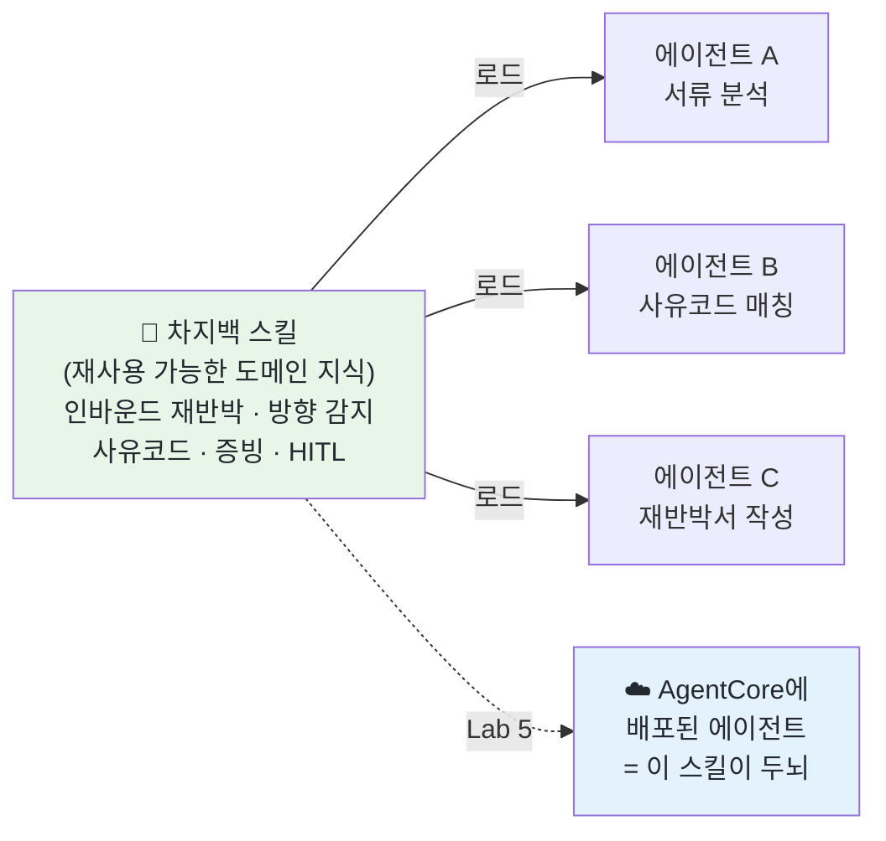

# Lab 3 · 차지백 이해 스킬 직접 만들기

[← 이전: Lab 2 핵심 개념](02-concepts.md) · [🏠 목차](README.md) · [다음: Lab 4 서비스 정의 & 배포 준비 →](04-brainstorm-and-deploy.md)

이번 단계에서는 **"차지백(특히 인바운드 재반박)을 잘 이해하는 AI"를 우리 손으로 만듭니다.** 방법은 코딩이 아니라 **스킬(Skill)을 만드는 것**입니다. 스킬은 "이 도메인은 이렇게 일한다"를 적어 둔 **재사용 가능한 도메인 지식 묶음**입니다. 한 번 만들어 두면, 그 스킬을 불러오는 **어떤 AI 에이전트든** 차지백을 우리 규칙대로 이해하게 됩니다. 오늘 만드는 이 스킬은 단순 연습이 아니라, **Lab 5에서 AgentCore에 배포할 에이전트의 "두뇌"** 가 됩니다. 그래서 여기서 도메인 지식을 정확히 담는 것이 오늘 워크숍의 토대입니다.

**예상 소요시간:** 약 55분 (11:05–12:00 · 오전 두 번째 실습 랩 · 강사와 화면을 함께 보며 진행)

> ℹ️ **참고:** 코딩은 필요 없습니다. 우리는 `skill-creator`라는 **"스킬 만드는 걸 도와주는 스킬"** 에게, 평소 쓰는 한국어 문장으로 *"차지백 재반박을 잘 이해하는 스킬을 만들어줘"* 라고 부탁하면 됩니다. 그러면 skill-creator가 스킬의 뼈대(폴더·파일·형식)를 잡아 주고, 우리는 **내용(차지백 도메인 지식)** 만 한국어로 불러 주면 됩니다.

## 시작하기 전에

다음을 먼저 확인하세요.

- [ ] Lab 0 환경 확인 완료 — `/status`에 **`Amazon Bedrock`** + **`ap-northeast-2`** 가 보임
- [ ] Lab 2(핵심 개념) 완료 — 인바운드/아웃바운드, 재반박/1CB, HITL의 큰 그림을 안다
- [ ] 터미널에서 `workshop/mvp/` 폴더로 이동 후 `claude` 실행한 상태
- [ ] `skill-creator` 스킬이 설치돼 있음 (Lab 1에서 설치 — 없으면 강사에게 알리기)

## 이 단계에서 할 일

이번 단계를 마치면 다음을 직접 할 수 있습니다.

1. **스킬이 무엇인지** 비개발자 언어로 설명한다 — "한 번 적어 두면 어떤 에이전트든 불러와 쓰는 재사용 가능한 도메인 지식".
2. `skill-creator`를 **자연어로 호출**해 차지백 스킬의 뼈대를 잡는다(목적·이름·내용을 묻는다).
3. **차지백 도메인 지식을 한국어로 불러 주고** 스킬 본문에 반영한다 — frontmatter(`name`/`description`) + 본문 규칙.
4. 방금 만든 스킬이 **자동으로 적용되는지** 확인하고(13.1 케이스로 테스트), 사람이 검토한다(HITL).

전체 흐름은 네 단계입니다: ① skill-creator 호출 → ② 도메인 지식 채우기 → ③ 동작 확인 → ④ (선택) 다듬기. 이 중 **② 도메인 지식 채우기** 가 오늘의 핵심입니다 — 스킬의 가치는 형식이 아니라 그 안에 담긴 **정확한 차지백 규칙**에서 나옵니다.

> 💡 **팁:** 막히면 혼자 5분 이상 헤매지 말고 옆 페어나 강사에게 손을 드세요. AI에게 `"방금 무슨 스킬을 어디에 만들었는지, 지금 내용이 어떤 상태인지 한국어로 알려줘"` 라고 물으면 현재 상태를 다시 잡을 수 있습니다.

### 스킬이란? — "한 번 적어 두면 누구나 쓰는 업무 매뉴얼"

스킬(Skill)은 **"이 도메인은 이렇게 일한다"를 적어 둔 문서 묶음**입니다. 사람으로 치면, 신입에게 건네는 **"우리 회사 차지백은 이렇게 처리한다"는 업무 매뉴얼**과 같습니다. 한 번 잘 써 두면, 그 매뉴얼을 펼쳐 보는 **모든 직원(에이전트)** 이 같은 규칙으로 일합니다.



핵심은 **재사용**입니다. 스킬 하나를 잘 만들어 두면, 차지백을 다루는 **어떤 에이전트든 그 스킬을 로드하는 순간 차지백을 우리 규칙대로 이해**합니다. 매번 같은 설명을 반복할 필요가 없습니다.

> ℹ️ **참고:** 스킬은 **frontmatter**(맨 위 `name`/`description`)와 **본문**으로 나뉩니다. AI는 평소엔 `description`만 슬쩍 보고 있다가, **지금 이 일에 이 스킬이 필요하다**고 판단하면 본문 전체를 펼쳐 읽습니다. 그래서 `description`을 정확히 쓰는 것이 **"언제 이 스킬이 켜질지"** 를 결정합니다.

### 왜 우리가 직접 만드나 — AI 기본 지식 vs 우리 규칙

AI에게 그냥 "VISA 13.1이 뭐야?"라고 물으면 자기 기억으로 **그럴듯하게 추측**합니다. 하지만 우리 업무에는 AI가 모르는 규칙이 있습니다 — **"재반박이 기본이다", "방향을 먼저 판별한다", "매입사 응답요건(Table 11-94/11-95)을 본다", "최종 결정은 사람이 한다"**. 이런 우리만의 규칙을 스킬에 적어 두면, AI가 추측 대신 **우리 규칙을 따르게** 됩니다.

| 방식 | 비유 | 차지백에서 |
|------|------|-----------|
| **AI 기본 지식만** | 일반 상식으로 일하는 신입 | 재반박 우선·방향 판별 같은 우리 규칙을 모름 |
| **우리가 만든 스킬** | 회사 매뉴얼을 읽은 직원 | 인바운드 재반박을 우리 규칙대로 처리 |

---

## ① skill-creator 호출 — 스킬 만들기 시작

먼저 `skill-creator`에게 스킬을 만들어 달라고 **자연어로** 부탁합니다.

1. `workshop/mvp/`에서 `claude` 실행 상태의 입력 커서에 아래 문장을 그대로 붙여넣고 Enter. 슬래시(`/`) 없이 한국어 문장 그대로입니다.

```text
차지백, 특히 인바운드 재반박(매입사 방어)을 잘 이해하는 스킬을 만들고 싶어.
skill-creator를 써서 스킬의 뼈대를 잡아줘.
```

**예상 결과**

> 익명·예시입니다. 실제 문구·질문 순서는 환경마다 다를 수 있습니다.

```text
skill-creator로 새 스킬을 만들겠습니다. 좋은 스킬을 만들려면
다음을 먼저 정해야 합니다.

1) 목적: 이 스킬이 AI에게 가르치려는 것은 무엇인가요?
   (예: 차지백 인바운드 재반박을 정확히 이해하고 처리하기)
2) 이름(name): 짧고 명확하게 (예: chargeback-domain)
3) 언제 켜질까(description): 어떤 상황에서 이 스킬이 필요한가요?
4) 본문에 담을 내용: AI가 따라야 할 핵심 규칙·구조

위 항목을 알려주시면 .claude/skills/<이름>/SKILL.md 형태로
뼈대를 만들어 드리겠습니다.
```

`skill-creator`는 곧바로 파일을 만들지 않고, **무엇을·왜·언제·어떤 내용** 인지를 먼저 묻습니다. 스킬의 가치는 형식이 아니라 **안에 담긴 정확한 규칙**에서 나오기 때문입니다. 이 질문들에 답하는 과정이 곧 "우리 차지백 업무를 한 문장씩 정리하는" 과정입니다.

> 📸 (스크린샷: skill-creator가 목적·이름·description·내용을 되묻는 화면)

**확인하세요**

- [ ] AI가 **곧바로 파일을 만들지 않고** 목적·이름·내용을 **되묻는가?** (바로 만들어 버리면 `"먼저 어떤 내용을 담을지 같이 정하자"` 로 멈추기)
- [ ] 만들 파일 위치가 **`.claude/skills/<이름>/SKILL.md`** 라고 안내됐는가?

---

## ② 도메인 지식 채우기 — 스킬에 차지백 규칙 반영 ⭐

**오늘의 핵심 단계**입니다. 아래 차지백 도메인 지식을 한국어로 불러 주고, 스킬 본문에 반영시킵니다. 이 내용이 정확해야 Lab 5의 에이전트가 제대로 일합니다.

### 스킬에 꼭 담아야 할 도메인 지식 (한국어로 불러 주기)

아래 8가지는 우리 차지백 업무의 **뼈대 규칙**입니다. 스킬에 빠짐없이 담겨야 합니다. 특히 **8번 PII 익명화·마스킹 가드레일은 필수**로, 워크숍 원칙(익명 데이터만 사용)을 스킬 차원에서 강제하는 장치입니다.

| # | 담을 규칙 | 핵심 한 줄 |
|---|----------|-----------|
| 1 | **인바운드 재반박이 기본** | 하나카드=매입사 → 가맹점 방어 → 재반박서(Acquirer Dispute Response)가 PRIMARY 산출물 |
| 2 | **방향 자동 감지** | 접수내역의 Issuer/Acquirer 필드로 우리가 매입사인지 발급사인지 먼저 판별. 불명확하면 인바운드로 가정하고 사람에게 확인 |
| 3 | **사유코드** | VISA 사유코드 확인(예: 13.1 미수령, 13.3 설명과 다름/하자). 규정에 없으면 지어내지 말고 "규정 확인 필요" |
| 4 | **필수증빙·매입사 응답요건** | 인바운드는 **매입사 응답요건(§11.10.2.6, Table 11-94/11-95)** 의 필수·유리 증빙. 아웃바운드는 발급사 제출요건(§11.10.2.5) |
| 5 | **재반박서 구조(영문)** | Header → Summary → Acquirer's Defense → Regulatory Basis → Request → Compelling Evidence. 화자는 매입사(가맹점 대리) |
| 6 | **HITL(사람이 최종 결정)** | AI는 초안·후보·제안만. 사유코드 확정·서류 승인은 사람. 출력에 "확정 전 담당자 검토 필요" 표시 |
| 7 | **익명 데이터 전제** | POC라 익명 더미 데이터만(예: 카드번호 `1111-1111-1111-1111`). 실제 고객 PII 금지 |
| 8 | **PII 익명화·마스킹 가드레일(필수)** | 출력 시 카드번호는 `1111-1111-1111-1111`류로 마스킹, 실명은 가명으로, 주민번호+카드번호 조합 식별 금지. 실제 PII는 절대 출력하지 않는다 |

1. 위 표의 내용을 아래처럼 한 번에 불러 줍니다. (그대로 붙여넣어도 되고, 표현을 바꿔도 됩니다.)

```text
[입력]
이 스킬에 다음 차지백 도메인 지식을 본문 규칙으로 담아줘. 한국어로.

1. 기본은 인바운드 재반박이다: 하나카드가 매입사(Acquirer)일 때 가맹점을 방어하며,
   핵심 산출물은 재반박서(Acquirer Dispute Response / Representment)다. 1CB는 보조.
2. 방향 자동 감지: 접수내역의 Issuer/Acquirer 필드로 우리가 매입사인지 발급사인지 먼저
   판별한다. 매입사면 인바운드/재반박, 발급사면 아웃바운드/1CB. 불명확하면 인바운드로
   가정하고 담당자에게 방향 확인을 요청한다.
3. 사유코드: VISA 사유코드를 확인한다(예: 13.1 미수령, 13.3 설명과 다름/하자).
   규정에 없으면 지어내지 말고 "규정 확인 필요"라고 표시한다.
4. 필수증빙: 인바운드(재반박)는 매입사 응답요건(§11.10.2.6, Table 11-94/11-95)의
   필수·유리 증빙을 기준으로 한다. 아웃바운드(1CB)는 발급사 제출요건(§11.10.2.5).
   증빙은 필수 먼저, 보강은 1~2개만. 없는 필수 증빙은 [MISSING]으로 표시한다.
5. 재반박서 구조(영문): Header → Summary of the Dispute → Acquirer's Defense →
   Regulatory Basis → Request → Compelling Evidence. 화자는 매입사(가맹점 대리).
6. HITL: AI는 초안·후보·제안만 만든다. 사유코드 확정과 서류 최종 승인은 반드시 사람이 한다.
   출력에는 항상 "확정 전 담당자 검토 필요"를 표시한다.
7. 익명 데이터 전제: POC라 익명 더미 데이터만 쓴다(카드번호 1111-1111-1111-1111 등).
   실제 고객 PII는 절대 넣지 않는다.
8. PII 익명화·마스킹 가드레일(필수): 모든 출력에서 개인정보를 마스킹·익명화한다.
   카드번호는 1111-1111-1111-1111류로, 실명은 가명으로 바꾸고, 주민번호+카드번호
   조합으로 개인을 식별할 수 있는 형태는 금지한다. 실제 PII는 어떤 경우에도 출력하지 않는다.

이름(name)은 chargeback-domain, description은 이 스킬이 차지백(특히 인바운드 재반박)을
이해·처리할 때 켜지도록 써줘. SKILL.md로 저장해줘.
```

**예상 결과**

> 익명·예시입니다. 실제 문구·줄 순서는 환경마다 다를 수 있습니다. `.claude/skills/chargeback-domain/SKILL.md` 에 저장됩니다.

```text
.claude/skills/chargeback-domain/SKILL.md 를 생성했습니다.

--- frontmatter ---
name: chargeback-domain
description: 차지백 분쟁처리(특히 인바운드 재반박/매입사 방어)를 이해·처리할 때 사용.
  방향 자동 감지(Issuer/Acquirer), VISA 사유코드, 매입사 응답요건(Table 11-94/11-95)
  기반 증빙, 재반박서(영문) 구조, HITL 원칙을 담는다.

--- 본문 (요약) ---
# 차지백 도메인 이해 (인바운드 재반박 우선)
## 1. 기본 = 인바운드 재반박 (하나카드=매입사, 가맹점 방어)
## 2. 방향 자동 감지 (Issuer/Acquirer → 인바운드/아웃바운드, 불명확하면 인바운드 가정)
## 3. 사유코드 (13.1 미수령 등 / 규정에 없으면 "규정 확인 필요")
## 4. 필수증빙 (인바운드=매입사 응답요건 11-94/11-95, 아웃바운드=발급사 제출요건)
## 5. 재반박서 구조(영문) — Header→Summary→Defense→Regulatory Basis→Request→Evidence
## 6. HITL — AI는 초안만, 확정·승인은 사람, "확정 전 담당자 검토 필요" 표시
## 7. 익명 데이터 전제 — 더미 데이터만, 실 PII 금지
## 8. PII 익명화·마스킹 가드레일 — 카드번호 1111-…, 실명→가명, 주민+카드 조합 식별 금지, 실 PII 출력 금지

저장 완료. 이 스킬은 차지백 관련 작업 시 자동으로 참고됩니다.
```

스킬의 `description`은 **"언제 켜질지"** 를 결정하므로 "차지백/인바운드 재반박을 처리할 때"라는 상황이 분명히 들어가야 합니다. 본문에는 위 8가지가 **규칙으로** 들어갑니다. 특히 **방향 자동 감지(2)** 와 **매입사 응답요건(4)** 은 우리 업무 고유의 규칙이라, 여기 빠지면 AI가 기본 지식으로 추측해 인바운드/아웃바운드를 헷갈립니다.

2. **PII 익명화 가드레일을 스킬에 명시적으로 넣습니다(필수).** 위 8번이 한 번에 안 들어갔거나 약하게 들어갔으면, 아래처럼 가드레일 규칙을 따로 다시 넣어 줍니다.

```text
[입력]
chargeback-domain 스킬에 익명화 가드레일 규칙을 넣어줘. 본문에 다음을 명확한 규칙으로 추가해줘:
- 모든 출력에서 개인정보(PII)는 마스킹·익명화한다.
- 카드번호는 1111-1111-1111-1111류로 마스킹한다.
- 실명은 가명으로 바꾼다.
- 주민번호 + 카드번호 조합으로 개인을 식별할 수 있는 형태는 금지한다.
- 실제 PII는 어떤 경우에도 그대로 출력하지 않는다.
기존 규칙은 그대로 두고, 이 가드레일을 핵심 규칙으로 본문에 추가해줘.
```

**예상 결과**

> 익명·예시입니다. `.claude/skills/chargeback-domain/SKILL.md` 본문에 마스킹 규칙이 추가됩니다.

```text
chargeback-domain/SKILL.md 본문에 PII 익명화·마스킹 가드레일 규칙을 추가했습니다.
(기존 규칙은 변경하지 않았습니다.)

## PII 익명화·마스킹 가드레일 (필수)
- 모든 출력에서 PII는 마스킹·익명화한다.
- 카드번호 → 1111-1111-1111-1111류로 마스킹
- 실명 → 가명
- 주민번호+카드번호 조합 식별 금지
- 실제 PII는 절대 그대로 출력하지 않는다.
```

> ⚠️ **주의:** 이 가드레일은 단순 권고가 아니라, 워크숍 **원칙(익명 데이터만 사용)을 스킬로 강제하는 장치**입니다. 비식별·마스킹 규칙이 본문에 명시돼야, 어떤 에이전트가 이 스킬을 로드해도 실제 PII가 출력으로 새어 나가지 않습니다. 빠졌다면 다음 단계로 넘어가지 말고 반드시 넣으세요.

> ⚠️ **주의:** 스킬은 **추상적이면 무용지물**입니다. "차지백을 잘 처리한다" 같은 막연한 문장이 아니라, **"인바운드면 Table 11-94/11-95를 본다", "방향이 불명확하면 인바운드로 가정한다"** 처럼 **구체적이고 검증 가능한 규칙**이어야 합니다. 추상적으로 나오면 [문제 해결](#문제-해결)의 "스킬이 너무 추상적"을 참고하세요.

> 📸 (스크린샷: chargeback-domain/SKILL.md의 frontmatter와 8개 규칙이 담긴 본문)

**확인하세요**

- [ ] 파일이 **`.claude/skills/chargeback-domain/SKILL.md`** 에 생성됐는가?
- [ ] frontmatter에 **`name`** 과, **차지백/인바운드 재반박 상황**을 가리키는 **`description`** 이 있는가?
- [ ] 본문에 **8가지 규칙이 모두** 담겼는가? (방향 자동 감지·매입사 응답요건이 특히 빠지기 쉬움)
- [ ] 규칙이 **구체적**인가? (막연한 한 줄이 아니라 "인바운드=Table 11-94/11-95" 처럼 검증 가능)
- [ ] **HITL("확정 전 담당자 검토 필요")** 과 **익명 데이터 전제**가 명시됐는가?
- [ ] **PII 익명화·마스킹 가드레일**이 본문에 명시됐는가? (카드번호 마스킹·실명→가명·주민+카드 조합 식별 금지·실 PII 출력 금지)

---

## ③ 스킬 동작 확인 — 자동으로 켜지는지 테스트

만든 스킬이 **차지백 일을 시킬 때 스스로 켜지는지** 확인합니다. 13.1 케이스로 테스트합니다.

1. 새 질문을 던집니다. 스킬을 직접 호출하지 않고, **그냥 차지백 질문만** 합니다.

```text
[입력]
13.1(상품·서비스 미수령) 케이스가 들어왔어. 이 건의 재반박 방향과,
재반박을 위해 필요한 필수 증빙을 우리 규칙대로 설명해줘.
```

**예상 결과**

> 익명·예시입니다. 실제 값은 케이스마다 다릅니다.

```text
(chargeback-domain 스킬 적용)

## 방향
- 13.1은 카드홀더가 "미수령"을 주장하는 건입니다.
- 우리(하나카드)가 매입사(Acquirer)라면 → 인바운드 → 재반박(가맹점 방어)이 기본입니다.
- 방향이 접수내역에서 불명확하면 인바운드로 가정하고 담당자에게 확인을 요청하세요.

## 필요한 필수 증빙 (인바운드 = 매입사 응답요건 Table 11-94/11-95)
- 서비스 실제 제공·이용 입증 자료 (예: 탑승확인서·passenger manifest)
- 여정·발권 기록 (가맹점)
- 거래 인증기록 (3DS 인증 결과) — 보강
- 거래 상세 (가맹점·금액·일자)
- 없는 필수 증빙은 [MISSING]으로 표시 → 가맹점 보완요청 대상

> 확정 전 담당자 검토 필요 (HITL): 방향·사유코드·증빙은 담당자가 최종 확정합니다.
```

스킬을 **직접 부르지 않았는데도** 답변이 "재반박 우선", "매입사 응답요건(11-94/11-95)", "확정 전 담당자 검토 필요"를 정확히 말한다면, 스킬이 **차지백 상황을 인식해 자동으로 켜진 것**입니다. 이것이 스킬의 핵심 — 한 번 만들어 두면 차지백 일에서 알아서 적용됩니다.

2. **사람이 검토합니다(HITL).** AI 설명이 우리 규칙(방향·증빙·HITL 표시)과 맞는지 직접 확인하고, 틀린 부분은 고쳐서 알려 줍니다. 예: 발급사 제출요건이 나왔다면 `"이 건은 인바운드(매입사)야. 매입사 응답요건(11-94/11-95)으로 다시 줘"`.

> 📸 (스크린샷: 스킬이 자동 적용돼 방향·증빙·HITL 표시가 들어간 답변)

**확인하세요**

- [ ] 스킬을 **직접 호출하지 않았는데도** 차지백 규칙이 적용됐는가? (스킬 적용 표시 또는 규칙대로의 답변)
- [ ] 답변에 **재반박 우선 + 매입사 응답요건(11-94/11-95)** 이 들어갔는가?
- [ ] **"확정 전 담당자 검토 필요"(HITL)** 가 표시됐는가?
- [ ] 발급사 제출요건(아웃바운드)을 잘못 적용하지 **않았는가?**

---

## ④ (선택) 스킬 다듬기 — 빠진 규칙 보강

테스트에서 빠지거나 약한 규칙이 보이면 스킬에 보강합니다. (시간 여유 시)

1. 빠진 규칙을 추가합니다.

```text
[입력]
chargeback-domain 스킬에 규칙을 하나 더 추가해줘:
"증빙 목록의 각 항목은 카드홀더 주장의 어느 부분을 반박하는지 한 줄로 근거를 단다."
기존 규칙은 그대로 두고 본문에만 덧붙여줘.
```

**예상 결과**

```text
chargeback-domain/SKILL.md 본문에 규칙을 추가했습니다.
(기존 8개 규칙은 변경하지 않았습니다.)

## 9. 증빙-반박 매핑
각 증빙이 카드홀더 주장의 어느 부분을 반박하는지 한 줄 근거를 단다.
```

스킬은 **살아 있는 문서**입니다. 워크숍 이후에도 자주 틀리는 패턴이 보이면 규칙을 한 줄씩 보강해 나가면, 그만큼 에이전트가 똑똑해집니다. 기존 규칙을 건드리지 않고 **덧붙이는** 방식이 안전합니다.

> 📸 (스크린샷: 9번째 규칙이 추가된 SKILL.md)

**확인하세요**

- [ ] 새 규칙이 **추가**됐고, 기존 8개 규칙은 **그대로**인가?
- [ ] 추가 규칙도 **구체적**인가? (막연한 문장 아님)

---

## ⚠️ 이 스킬이 Lab 5의 에이전트 "두뇌"가 됩니다

이 단계에서 만든 `chargeback-domain` 스킬은 단순 연습물이 아닙니다.

```mermaid
graph LR
    L2["Lab 3 (지금)<br/>차지백 스킬 제작<br/>chargeback-domain"]
    L3["Lab 4<br/>서비스 정의<br/>& 배포 준비"]
    L4["Lab 5<br/>AgentCore 배포<br/>에이전트 = 이 스킬이 두뇌"]
    L2 --> L3 --> L4
    L2 -.-> L3|① brainstorming에 직접 주입<br/>= 설계 기준|
    L2 -.-> L4|② 두뇌(페르소나)로 탑재|
    style L2 fill:#e8f5e9,color:#24292f
    style L3 fill:#fff3e0,color:#24292f
    style L4 fill:#e3f2fd,color:#24292f
```

이 스킬은 ① **Lab 4 brainstorming에 직접 주입**되어 우리가 만들 서비스(에이전트) 설계의 **기준**이 되고, ② **Lab 5에서 AgentCore 에이전트의 두뇌(페르소나)** 가 됩니다. 즉 Lab 3 → Lab 4 → Lab 5가 이 하나의 스킬로 **유기적으로 연결**됩니다.

> ✅ **핵심 연결:** 이 스킬은 ① Lab 4 brainstorming에 **직접 주입**되어 서비스 설계의 기준이 되고 ② Lab 5에서 **AgentCore 에이전트의 두뇌(페르소나)** 가 됩니다.

Lab 5에서 우리는 차지백 에이전트를 **Amazon Bedrock AgentCore**에 배포합니다. 그 에이전트가 "차지백을 어떻게 이해하고 처리하는가"는 **바로 이 스킬에 담긴 규칙**에서 나옵니다. 즉 **지금 스킬에 정확한 도메인 지식을 담을수록, Lab 5에서 배포될 에이전트가 똑똑해집니다.** 그래서 ②의 8가지 규칙(특히 방향 감지·매입사 응답요건·HITL·PII 익명화 가드레일)을 빠짐없이 담는 것이 오늘의 핵심입니다.

> ℹ️ **참고:** 스킬은 "두뇌(무엇을 아는가)", 에이전트는 "그 두뇌를 쓰는 일꾼(무엇을 하는가)"입니다. 같은 스킬을 여러 에이전트가 공유할 수 있어, **두뇌를 한 번 잘 만들면 여러 일꾼이 같은 규칙으로** 일합니다.

---

## 문제 해결

도구가 막힐 때 아래 표에서 증상을 찾아 대응하세요.

| 증상 | 원인 | 해결 |
|------|------|------|
| **스킬이 너무 추상적** | "차지백을 잘 처리한다" 같은 막연한 규칙 | `"규칙을 더 구체적으로. 인바운드면 Table 11-94/11-95를 본다처럼 검증 가능한 문장으로 다시 써줘"` |
| **스킬이 안 불러와짐** | `description`이 모호해 상황을 못 알아챔 | `description`에 **"차지백/인바운드 재반박을 처리할 때"** 라는 상황을 명시. 그래도 안 켜지면 `"chargeback-domain 스킬을 적용해서 답해줘"` 로 명시 호출 |
| **규칙 충돌 (재반박 vs 1CB 혼동)** | 인바운드/아웃바운드 규칙이 섞임 | `"기본은 인바운드(재반박)다. 아웃바운드(1CB)는 보조이고, 방향이 불명확하면 인바운드로 가정한다 — 이 우선순위를 본문에 명확히 적어줘"` |
| `skill-creator`가 안 보임 | 스킬 미설치 | Lab 1의 설치를 확인 — 없으면 강사에게 손 들기 |
| 곧바로 파일부터 만듦 | 내용 합의 없이 진행 | `"먼저 어떤 규칙을 담을지 같이 정하자. 8가지 도메인 지식부터 확인해줘"` |
| 발급사 제출요건만 나옴 | 방향을 아웃바운드로 오인 | `"기본은 인바운드(매입사)야. 매입사 응답요건(11-94/11-95) 규칙이 본문에 있는지 확인하고 보강해줘"` |

### AI가 자주 틀리는 것 (사람이 잡아야 함)

| AI가 자주 틀리는 것 | 어떻게 나타나나 | 사람이 잡는 법 |
|---|---|---|
| **추상적 규칙** | "차지백을 잘 이해한다" 수준의 막연한 문장 | 모든 규칙을 **검증 가능한 한 줄**로 — "인바운드=Table 11-94/11-95" |
| **방향 규칙 누락** | Issuer/Acquirer 판별 규칙이 빠짐 | 본문에 **방향 자동 감지 + 불명확 시 인바운드 가정**이 있는지 확인 |
| **매입사 응답요건 누락** | 증빙을 발급사 제출요건으로만 적음 | 인바운드 증빙은 **Table 11-94/11-95** 인지 확인 |
| **HITL 표시 빠짐** | "확정 전 담당자 검토" 없이 단정 | 본문에 **HITL 규칙**과 출력 표시가 있는지 확인 |
| **실 데이터 유입** | 예시에 진짜처럼 보이는 PII | 익명 더미(예: `1111-1111-1111-1111`)만 쓰는지 확인 |
| **PII 가드레일 누락** | 출력에 마스킹 규칙이 없어 실 PII가 그대로 노출될 위험 | 본문에 **마스킹·익명화 가드레일**(카드번호 마스킹·실명→가명·주민+카드 조합 식별 금지)이 명시됐는지 확인 |

> 💡 **팁(핵심 메시지):** 스킬의 가치는 **형식이 아니라 안에 담긴 규칙의 정확성**입니다. AI는 뼈대를 빠르게 잡지만, **무엇이 우리 규칙으로 맞는지는 여러분이** 결정합니다.

---

## ✅ 완료 확인

다음이 모두 충족되면 이 단계는 성공입니다.

- [ ] `skill-creator`를 **자연어로 호출**해 스킬 뼈대를 잡았다 (곧바로 파일부터 만들지 않고 목적·내용을 합의)
- [ ] `.claude/skills/chargeback-domain/SKILL.md`가 생성되고, frontmatter(`name`/`description`)와 본문이 있다
- [ ] 본문에 **8가지 도메인 규칙**이 모두 담겼다 (특히 방향 자동 감지·매입사 응답요건·HITL·익명 데이터·PII 익명화 가드레일)
- [ ] 13.1 테스트에서 스킬이 **자동 적용**돼 재반박 우선·11-94/11-95·HITL 표시가 나왔다
- [ ] AI 설명을 **사람이 검토**하고, 틀린 부분을 고쳤다 (HITL)

핵심만 다시 짚으면:

- **스킬 = 재사용 가능한 도메인 지식.** 한 번 만들면 어떤 에이전트든 로드해 차지백을 우리 규칙대로 이해한다.
- **만드는 법 = `skill-creator`를 자연어로 호출 → 8가지 도메인 지식을 한국어로 불러 줌 → 본문 규칙으로 반영.** 코딩은 없다.
- **가치는 형식이 아니라 규칙의 정확성.** 방향 자동 감지·매입사 응답요건(11-94/11-95)·HITL·익명 데이터·PII 익명화 가드레일이 빠지면 안 된다.
- **이 스킬은 ① Lab 4 brainstorming에 직접 주입돼 서비스 설계의 기준이 되고 ② Lab 5에서 AgentCore 에이전트의 두뇌(페르소나)** 가 된다.

> 강사 노트:
>
> **진행 팁**
> - 시작에서 "스킬 = 한 번 적어 두면 누구나 쓰는 업무 매뉴얼"이라는 비유를 먼저 박으세요. 비개발자에게 "스킬"은 낯선 단어라, **재사용·매뉴얼** 비유가 가장 잘 통합니다.
> - 이 랩의 클라이맥스는 ②입니다. **8가지 규칙을 화면에 띄워 한 줄씩 함께 읽으며** 채우세요. 특히 **방향 자동 감지**와 **매입사 응답요건(11-94/11-95)** 은 현업 고유 규칙이라 AI 기본 지식으로는 안 나옵니다 — "이건 우리가 가르쳐야 한다"를 강조하세요.
> - **PII 익명화·마스킹 가드레일(8번)은 패널 필수 요구사항**입니다. "익명 데이터만 쓴다"는 원칙을 **스킬로 강제하는 장치**임을 강조하고, ②의 별도 하위 단계(가드레일 규칙 주입)를 반드시 각자 실행하게 하세요.
> - **Lab 3→3→4 연결을 명시적으로** 짚으세요: 이 스킬은 ① Lab 4 brainstorming에 직접 주입돼 서비스 설계의 기준이 되고 ② Lab 5에서 AgentCore 에이전트의 두뇌(페르소나)가 됩니다.
> - ③에서 일부러 스킬을 **직접 호출하지 말고** 그냥 차지백 질문만 던져, "안 불렀는데도 알아서 켜진다"를 체감시키세요. 이게 재사용의 핵심 실감 포인트입니다.
> - 일부러 추상적인 규칙(예: "차지백을 잘 처리한다")을 한 번 넣어 보고, "이러면 무용지물"임을 보여 준 뒤 구체화하면 학습 효과가 큽니다.
> - ⚠️ Lab 5 연결을 **명시적으로** 말하세요: "오늘 만든 이 스킬이 오후 Lab 5에서 클라우드에 배포될 에이전트의 두뇌가 됩니다."
>
> **시간 관리 (강사 기준)**
> - 전체 **55분 안**(11:05–12:00)에 끝내는 게 목표입니다. 권장 배분: 개념(스킬이란·왜 직접 만드나) 10분, ① skill-creator 호출 8분, ② 도메인 지식 채우기(8가지 규칙 + PII 가드레일 주입) 20분(절반 투입), ③ 동작 확인 9분, ④ 다듬기·마무리 8분.
> - **②에 시간의 절반**을 쓰세요. 뼈대는 AI가 금방 잡으니 시간 낭비하지 말고, **규칙 정확성**에 집중하세요.
> - ④(다듬기)는 선택입니다. 시간이 빠듯하면 강사 시연으로 대체하고 ③에서 사람 검토를 반드시 각자 하게 하세요.
>
> **예상 질문 Q&A**
> - **Q. 코딩을 해야 하나요?** A. 아니요. `skill-creator`에게 한국어로 부탁하고, 도메인 지식을 한국어로 불러 주면 됩니다. 결과물은 사람이 읽고 고치는 문서(SKILL.md)입니다.
> - **Q. 스킬과 에이전트는 뭐가 다른가요?** A. 스킬은 "두뇌(무엇을 아는가)", 에이전트는 "그 두뇌를 쓰는 일꾼(무엇을 하는가)"입니다. 같은 스킬을 여러 에이전트가 공유할 수 있습니다.
> - **Q. 스킬을 만들었는데 안 켜져요.** A. `description`이 모호하면 AI가 상황을 못 알아챕니다. "차지백/인바운드 재반박을 처리할 때"라는 상황을 명시하세요. 그래도 안 되면 이름으로 명시 호출하면 됩니다.
> - **Q. 이 스킬을 나중에 또 쓰나요?** A. 네. Lab 5에서 AgentCore에 배포할 에이전트의 두뇌가 바로 이 스킬입니다. 그래서 지금 정확히 만드는 게 중요합니다.
> - **Q. 실제 고객 데이터를 예시로 써도 되나요?** A. 절대 안 됩니다. POC라 익명 더미(예: `1111-1111-1111-1111`)만 씁니다 — 그 규칙도 스킬에 명시돼 있습니다.

## 다음 단계

이제 차지백을 이해하는 **두뇌(스킬)** 를 우리 손으로 만들었습니다. Lab 4에서는 이 두뇌를 쓸 **서비스(에이전트)를 어떻게 정의할지** 브레인스토밍하고, 클라우드(AgentCore)에 **배포할 준비**를 합니다.

[← 이전: Lab 2 핵심 개념](02-concepts.md) · [🏠 목차](README.md) · [다음: Lab 4 서비스 정의 & 배포 준비 →](04-brainstorm-and-deploy.md)
