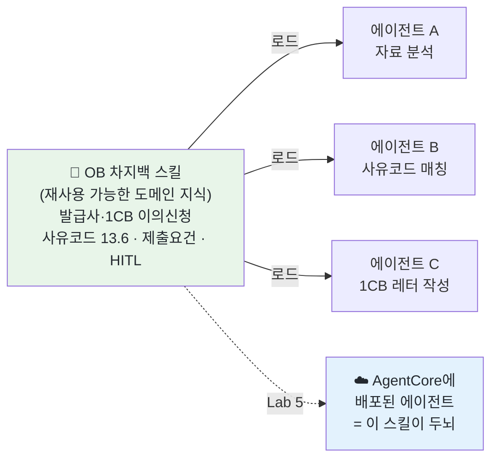
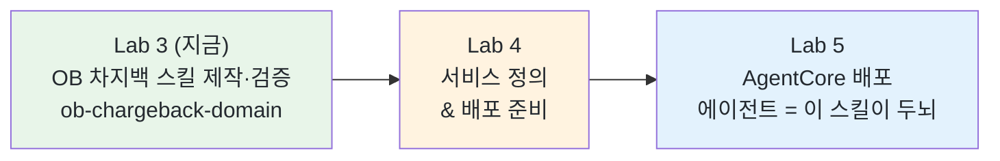

# Lab 3 · OB 차지백 스킬 직접 만들고 동작 확인하기

[← 이전: Lab 2 핵심 개념](02-concepts.md) · [🏠 목차](README.md) · [다음: Lab 4 서비스 정의 & 배포 준비 →](04-brainstorm-and-deploy.md)

이번 단계에서는 **"OB 차지백(발급사 입장의 1CB 이의신청)을 잘 이해하는 AI"를 우리 손으로 만들고, 곧바로 실제 케이스로 돌려 봅니다.** 방법은 코딩이 아니라 **스킬(Skill)을 만드는 것**입니다. 스킬은 "이 도메인은 이렇게 일한다"를 적어 둔 **재사용 가능한 도메인 지식 묶음**입니다. 한 번 만들어 두면, 그 스킬을 불러오는 **어떤 AI 에이전트든** OB 차지백을 우리 규칙대로 이해하게 됩니다. 오늘 만드는 이 스킬은 단순 연습이 아니라, **Lab 5에서 AgentCore에 배포할 에이전트의 "두뇌"** 가 됩니다.

이 랩은 두 부분입니다 — **Part A: 스킬 만들기**(skill-creator로 OB 도메인 지식을 담음) → **Part B: 동작 확인**(익명 OB 케이스 `case-anon-ob-01`으로 자료 분석 → 사유코드 → 1CB 영문 레터 초안). 각 단계는 사람이 멈춰 검토합니다(HITL).

**예상 소요시간:** 약 55분 (11:05–12:00 · 오전 두 번째 실습 랩 · SA와 화면을 함께 보며 진행)

> ℹ️ **참고:** 코딩은 필요 없습니다. 우리는 `skill-creator`라는 **"스킬 만드는 걸 도와주는 스킬"** 에게, 평소 쓰는 한국어 문장으로 *"OB 차지백을 잘 이해하는 스킬을 만들어줘"* 라고 부탁하면 됩니다. 그러면 skill-creator가 스킬의 뼈대(폴더·파일·형식)를 잡아 주고, 우리는 **내용(OB 차지백 도메인 지식)** 만 한국어로 불러 주면 됩니다.

## 시작하기 전에

다음을 먼저 확인하세요.

- [ ] Lab 0 환경 확인 완료 — `/status`에 **`Amazon Bedrock`** + **`ap-northeast-2`** 가 보임
- [ ] Lab 2(핵심 개념) 완료 — OB(발급사·1CB), 사유코드, HITL의 큰 그림을 안다
- [ ] 터미널에서 `workshop/mvp/` 폴더로 이동 후 `claude` 실행한 상태
- [ ] `skill-creator` 스킬이 설치돼 있음 (Lab 1에서 설치 — 없으면 SA에게 알리기)

## 이 단계에서 할 일

이번 단계를 마치면 다음을 직접 할 수 있습니다.

1. **스킬이 무엇인지** 비개발자 언어로 설명한다 — "한 번 적어 두면 어떤 에이전트든 불러와 쓰는 재사용 가능한 도메인 지식".
2. `skill-creator`를 **자연어로 호출**해 OB 차지백 스킬의 뼈대를 잡는다(목적·이름·내용을 묻는다).
3. **OB 도메인 지식을 한국어로 불러 주고** 스킬 본문에 반영한다 — frontmatter(`name`/`description`) + 본문 규칙.
4. 방금 만든 스킬을 **익명 OB 케이스(`case-anon-ob-01`)** 로 돌려 본다 — 자료 분석 → 사유코드 + 발급사 제출요건 → 1CB 영문 레터 초안. 각 단계마다 사람이 검토한다(HITL).

전체 흐름은 두 부분입니다: **Part A — 스킬 만들기**(① skill-creator 호출 → ② OB 도메인 지식 채우기) → **Part B — 동작 확인**(③ 자료 분석 → ④ 사유코드 + 제출요건 체크리스트 → ⑤ 1CB 영문 레터 초안). 이 중 **② 도메인 지식 채우기** 가 오늘의 핵심입니다 — 스킬의 가치는 형식이 아니라 그 안에 담긴 **정확한 OB 차지백 규칙**에서 나옵니다.

> 💡 **팁:** 막히면 혼자 5분 이상 헤매지 말고 옆 페어나 SA에게 손을 드세요. AI에게 `"방금 무슨 스킬을 어디에 만들었는지, 지금 내용이 어떤 상태인지 한국어로 알려줘"` 라고 물으면 현재 상태를 다시 잡을 수 있습니다.

### 스킬이란? — "한 번 적어 두면 누구나 쓰는 업무 매뉴얼"

스킬(Skill)은 **"이 도메인은 이렇게 일한다"를 적어 둔 문서 묶음**입니다. 사람으로 치면, 신입에게 건네는 **"우리 회사 OB 차지백은 이렇게 처리한다"는 업무 매뉴얼**과 같습니다. 한 번 잘 써 두면, 그 매뉴얼을 펼쳐 보는 **모든 직원(에이전트)** 이 같은 규칙으로 일합니다.



핵심은 **재사용**입니다. 스킬 하나를 잘 만들어 두면, OB 차지백을 다루는 **어떤 에이전트든 그 스킬을 로드하는 순간 우리 규칙대로 이해**합니다. 매번 같은 설명을 반복할 필요가 없습니다.

> ℹ️ **참고:** 스킬은 **frontmatter**(맨 위 `name`/`description`)와 **본문**으로 나뉩니다. AI는 평소엔 `description`만 슬쩍 보고 있다가, **지금 이 일에 이 스킬이 필요하다**고 판단하면 본문 전체를 펼쳐 읽습니다. 그래서 `description`을 정확히 쓰는 것이 **"언제 이 스킬이 켜질지"** 를 결정합니다.

### 왜 우리가 직접 만드나 — AI 기본 지식 vs 우리 규칙

AI에게 그냥 "VISA 13.6이 뭐야?"라고 물으면 자기 기억으로 **그럴듯하게 추측**합니다. 하지만 우리 업무에는 AI가 모르는 규칙이 있습니다 — **"우리는 발급사(Issuer)로서 카드홀더를 대리해 1CB를 개시한다", "사유코드 13.6의 발급사 제출요건은 §11.10.7.5다", "1CB 레터는 영문·1인칭·사실 중심이다", "최종 결정은 사람이 한다"**. 이런 우리만의 규칙을 스킬에 적어 두면, AI가 추측 대신 **우리 규칙을 따르게** 됩니다.

| 방식 | 비유 | OB 차지백에서 |
|------|------|-----------|
| **AI 기본 지식만** | 일반 상식으로 일하는 신입 | 13.6 제출요건 섹션·1CB 레터 톤 같은 우리 규칙을 모름 |
| **우리가 만든 스킬** | 회사 매뉴얼을 읽은 직원 | 발급사·1CB 이의신청을 우리 규칙대로 처리 |

---

# Part A — 스킬 만들기

## ① skill-creator 호출 — 스킬 만들기 시작

먼저 `skill-creator`에게 스킬을 만들어 달라고 **자연어로** 부탁합니다.

1. `workshop/mvp/`에서 `claude` 실행 상태의 입력 커서에 아래 문장을 그대로 붙여넣고 Enter. 슬래시(`/`) 없이 한국어 문장 그대로입니다.

```text
차지백 OB(발급사·1CB 이의신청)를 잘 이해하는 스킬을 만들고 싶어.
하나카드가 발급사로서 카드홀더를 대리해 첫 청구(1CB)를 개시하는 업무야.
skill-creator를 써서 스킬의 뼈대를 잡아줘.
```

**예상 결과**

> 익명·예시입니다. 실제 문구·질문 순서는 환경마다 다를 수 있습니다.

```text
skill-creator로 새 스킬을 만들겠습니다. 좋은 스킬을 만들려면
다음을 먼저 정해야 합니다.

1) 목적: 이 스킬이 AI에게 가르치려는 것은 무엇인가요?
   (예: OB 차지백 — 발급사 입장의 1CB 이의신청을 정확히 이해하고 처리하기)
2) 이름(name): 짧고 명확하게 (예: ob-chargeback-domain)
3) 언제 켜질까(description): 어떤 상황에서 이 스킬이 필요한가요?
4) 본문에 담을 내용: AI가 따라야 할 핵심 규칙·구조

위 항목을 알려주시면 .claude/skills/<이름>/SKILL.md 형태로
뼈대를 만들어 드리겠습니다.
```

`skill-creator`는 곧바로 파일을 만들지 않고, **무엇을·왜·언제·어떤 내용** 인지를 먼저 묻습니다. 스킬의 가치는 형식이 아니라 **안에 담긴 정확한 규칙**에서 나오기 때문입니다. 이 질문들에 답하는 과정이 곧 "우리 OB 차지백 업무를 한 문장씩 정리하는" 과정입니다.

> 📸 (스크린샷: skill-creator가 목적·이름·description·내용을 되묻는 화면)

**확인하세요**

- [ ] AI가 **곧바로 파일을 만들지 않고** 목적·이름·내용을 **되묻는가?** (바로 만들어 버리면 `"먼저 어떤 내용을 담을지 같이 정하자"` 로 멈추기)
- [ ] 만들 파일 위치가 **`.claude/skills/<이름>/SKILL.md`** 라고 안내됐는가?

---

## ② OB 도메인 지식 채우기 — 스킬에 OB 차지백 규칙 반영 ⭐

**오늘의 핵심 단계**입니다. 아래 OB 차지백 도메인 지식을 한국어로 불러 주고, 스킬 본문에 반영시킵니다. 이 내용이 정확해야 Lab 5의 에이전트가 제대로 일합니다.

### 스킬에 꼭 담아야 할 도메인 지식 (한국어로 불러 주기)

아래 8가지는 우리 OB 차지백 업무의 **뼈대 규칙**입니다. 스킬에 빠짐없이 담겨야 합니다. 특히 **8번 PII 익명화·마스킹 가드레일은 필수**로, 워크숍 원칙(익명 데이터만 사용)을 스킬 차원에서 강제하는 장치입니다.

| # | 담을 규칙 | 핵심 한 줄 |
|---|----------|-----------|
| 1 | **방향 = 발급사(OB) 고정** | 하나카드 = 발급사(Issuer) → 자사 카드홀더 대리 → **1CB(First Chargeback) 이의신청**이 핵심 산출물 |
| 2 | **사유코드 13.6 (핵심)** | 13.6 = Credit Not Processed(취소/환불 미이행). 환불/void·cancelled 확인됐으나 credit 미처리. credit 영수증일 기준 **15일 대기 후 개시·120일 이내** |
| 3 | **13.6 발급사 제출요건** | **§11.10.7.5** 의 필수서류: ①Credit Transaction Receipt 사본, ②void 표기 거래영수증 사본, ③credit 발생 입증 기타 기록 중 **하나**. (§11.10.2.x는 13.6이 아님 — 쓰지 않음) |
| 4 | **12.5 / 12.6 (보조)** | 12.5 Incorrect Amount(청구금액 상이, §11.9.4.5) / 12.6 Duplicate·Paid by Other Means(이중청구·타수단, §11.9.5.5). 가볍게만 |
| 5 | **1CB 영문 레터 구조·톤** | 제목 → 마스킹 계좌번호 → 거래 표(ARN·거래일·금액·가맹점) → 사유 체크리스트(13.6 = "Credit not processed") → Comment(영문 5–6줄, 1인칭·사실 중심·시간순) → 서명/ID. 화자는 **카드홀더 대리(발급사)** |
| 6 | **HITL (사람이 최종 결정)** | AI는 초안·후보·제안만. 사유코드 확정·서류 승인은 사람. 출력에 "확정 전 담당자 검토 필요" 표시 |
| 7 | **언어 규칙** | 분석·체크리스트·설명 → **한국어**. **1CB 카드홀더레터 본문만 영문** (VISA 제출용) |
| 8 | **PII 익명화·마스킹 가드레일(필수)** | 출력 시 카드번호는 `1111-1111-1111-1111`류로 마스킹, 실명은 가명으로, 미상 식별값은 `[CONFIRM]`/`[MASKED]`. 실제 PII는 절대 출력하지 않는다 |

1. 위 표의 내용을 아래처럼 한 번에 불러 줍니다. (그대로 붙여넣어도 되고, 표현을 바꿔도 됩니다.)

```text
[입력]
이 스킬에 다음 OB 차지백 도메인 지식을 본문 규칙으로 담아줘. 한국어로.

1. 방향은 발급사(OB)로 고정한다: 하나카드는 발급사(Issuer)로서 자사 카드홀더를 대리해
   첫 청구(1CB, First Chargeback) 이의신청을 개시한다. 핵심 산출물은 1CB 이의신청 서류
   (Cardholder Letter + 증빙 묶음)다.
2. 핵심 사유코드는 13.6 Credit Not Processed(취소/환불 미이행)다. 환불 또는 거래 무효
   (void/cancelled)가 확인됐으나 credit이 처리되지 않은 경우. credit 영수증 일자 기준
   15일 대기 후 개시, 120일 이내 처리.
3. 13.6 발급사 제출 필수서류의 근거는 반드시 §11.10.7.5 다(정의는 §11.10.7.1).
   필수서류는 ①Credit Transaction Receipt 사본, ②void 표기 거래영수증 사본,
   ③credit이 발생해야 함을 입증하는 기타 기록 중 하나. §11.10.2.x는 13.6이 아니므로 쓰지 않는다.
   없는 필수 증빙은 [MISSING]으로 표시한다.
4. 보조 사유코드: 12.5 Incorrect Amount(청구금액 상이, 발급사 제출요건 §11.9.4.5),
   12.6 Duplicate Processing / Paid by Other Means(이중청구·타수단 결제, §11.9.5.5).
   12.5/12.6은 가볍게만 다룬다.
5. 1CB 영문 카드홀더레터 구조: 제목("CARDHOLDER LETTER") → 마스킹된 계좌번호 →
   거래 표(ARN·거래일·금액·가맹점명) → 사유 체크리스트(13.6이면 "Credit not processed"에 체크)
   → Comment(영문 5–6줄) → 서명/ID 라인. 화자는 카드홀더를 대리하는 발급사.
   Comment 톤은 1인칭·사실 중심·감정 배제·시간순. 13.6 전형 구조 =
   ①환불/취소 대상 거래 명시 → ②가맹점이 환불/취소를 확인한 사실 → ③그럼에도 입금 안 됨
   → ④연락기록 보유 진술 → ⑤조속한 환불 요청.
6. HITL: AI는 초안·후보·제안만 만든다. 사유코드 확정과 서류 최종 승인은 반드시 사람이 한다.
   출력에는 항상 "확정 전 담당자 검토 필요"를 표시한다.
7. 언어 규칙: 분석·체크리스트·설명은 한국어로 하고, 1CB 카드홀더레터 본문만 영문으로 쓴다.
8. PII 익명화·마스킹 가드레일(필수): 모든 출력에서 개인정보를 마스킹·익명화한다.
   카드번호는 1111-1111-1111-1111류로, 실명은 가명으로 바꾸고, 미상 식별값은
   [CONFIRM]/[MASKED]로 표기한다. 실제 PII는 어떤 경우에도 출력하지 않는다.

이름(name)은 ob-chargeback-domain, description은 이 스킬이 OB 차지백(발급사·1CB 이의신청)을
이해·처리할 때 켜지도록 써줘. SKILL.md로 저장해줘.
```

**예상 결과**

> 익명·예시입니다. 실제 문구·줄 순서는 환경마다 다를 수 있습니다. `.claude/skills/ob-chargeback-domain/SKILL.md` 에 저장됩니다.

```text
.claude/skills/ob-chargeback-domain/SKILL.md 를 생성했습니다.

--- frontmatter ---
name: ob-chargeback-domain
description: OB 차지백(발급사 입장의 1CB 이의신청)을 이해·처리할 때 사용.
  방향=발급사 고정, 사유코드 13.6(§11.10.7.5) 중심, 발급사 제출요건 체크,
  1CB 영문 카드홀더레터 구조·톤, 언어규칙(분석 한국어/레터 영문), HITL·PII 가드레일을 담는다.

--- 본문 (요약) ---
# OB 차지백 도메인 이해 (발급사·1CB 이의신청)
## 1. 방향 = 발급사(OB) 고정 (하나카드=발급사, 카드홀더 대리 1CB 개시)
## 2. 사유코드 13.6 Credit Not Processed (취소/환불 미이행, 15일 대기·120일 이내)
## 3. 13.6 발급사 제출요건 = §11.10.7.5 (Credit/void 영수증 또는 입증기록 중 하나)
## 4. 보조 사유코드 12.5(§11.9.4.5) / 12.6(§11.9.5.5) — 가볍게
## 5. 1CB 영문 레터 구조 — 제목→계좌→거래표→사유체크→Comment→서명/ID
## 6. HITL — AI는 초안만, 확정·승인은 사람, "확정 전 담당자 검토 필요" 표시
## 7. 언어규칙 — 분석/체크리스트=한국어, 1CB 레터 본문만 영문
## 8. PII 익명화·마스킹 가드레일 — 카드번호 1111-…, 실명→가명, [CONFIRM]/[MASKED], 실 PII 출력 금지

저장 완료. 이 스킬은 OB 차지백 관련 작업 시 자동으로 참고됩니다.
```

스킬의 `description`은 **"언제 켜질지"** 를 결정하므로 "OB 차지백/발급사·1CB 이의신청을 처리할 때"라는 상황이 분명히 들어가야 합니다. 본문에는 위 8가지가 **규칙으로** 들어갑니다. 특히 **13.6 제출요건 근거(§11.10.7.5, 3번)** 와 **1CB 레터 구조·톤(5번)** 은 우리 업무 고유의 규칙이라, 여기 빠지면 AI가 기본 지식으로 추측해 잘못된 섹션을 인용하거나 레터 톤을 흐트러뜨립니다.

> ⚠️ **자주 틀리는 인용:** 13.6의 발급사 제출요건은 **§11.10.7.5** 입니다. AI가 §11.10.2.x(이는 13.1 Merchandise/Services Not Received 처리요건)를 끌어오면 틀린 것이므로 `"13.6 제출요건 근거는 §11.10.7.5다. 본문에서 §11.10.2.x를 쓰지 말라"` 고 고쳐 주세요.

2. **PII 익명화 가드레일을 스킬에 명시적으로 넣습니다(필수).** 위 8번이 한 번에 안 들어갔거나 약하게 들어갔으면, 아래처럼 가드레일 규칙을 따로 다시 넣어 줍니다.

```text
[입력]
ob-chargeback-domain 스킬에 익명화 가드레일 규칙을 넣어줘. 본문에 다음을 명확한 규칙으로 추가해줘:
- 모든 출력에서 개인정보(PII)는 마스킹·익명화한다.
- 카드번호는 1111-1111-1111-1111류로 마스킹한다.
- 실명은 가명으로 바꾼다.
- 미상 식별값은 날조하지 말고 [CONFIRM]/[MASKED]로 표기한다.
- 실제 PII는 어떤 경우에도 그대로 출력하지 않는다.
기존 규칙은 그대로 두고, 이 가드레일을 핵심 규칙으로 본문에 추가해줘.
```

**예상 결과**

> 익명·예시입니다. `.claude/skills/ob-chargeback-domain/SKILL.md` 본문에 마스킹 규칙이 추가됩니다.

```text
ob-chargeback-domain/SKILL.md 본문에 PII 익명화·마스킹 가드레일 규칙을 추가했습니다.
(기존 규칙은 변경하지 않았습니다.)

## PII 익명화·마스킹 가드레일 (필수)
- 모든 출력에서 PII는 마스킹·익명화한다.
- 카드번호 → 1111-1111-1111-1111류로 마스킹
- 실명 → 가명
- 미상 식별값 → [CONFIRM]/[MASKED]
- 실제 PII는 절대 그대로 출력하지 않는다.
```

> ⚠️ **주의:** 이 가드레일은 단순 권고가 아니라, 워크숍 **원칙(익명 데이터만 사용)을 스킬로 강제하는 장치**입니다. 비식별·마스킹 규칙이 본문에 명시돼야, 어떤 에이전트가 이 스킬을 로드해도 실제 PII가 출력으로 새어 나가지 않습니다. 빠졌다면 다음 단계로 넘어가지 말고 반드시 넣으세요.

> ⚠️ **주의:** 스킬은 **추상적이면 무용지물**입니다. "OB 차지백을 잘 처리한다" 같은 막연한 문장이 아니라, **"13.6 제출요건은 §11.10.7.5를 본다", "1CB 레터 본문만 영문으로 쓴다"** 처럼 **구체적이고 검증 가능한 규칙**이어야 합니다. 추상적으로 나오면 [문제 해결](#문제-해결)의 "스킬이 너무 추상적"을 참고하세요.

> 📸 (스크린샷: ob-chargeback-domain/SKILL.md의 frontmatter와 8개 규칙이 담긴 본문)

**확인하세요**

- [ ] 파일이 **`.claude/skills/ob-chargeback-domain/SKILL.md`** 에 생성됐는가?
- [ ] frontmatter에 **`name`** 과, **OB 차지백/발급사·1CB 이의신청 상황**을 가리키는 **`description`** 이 있는가?
- [ ] 본문에 **8가지 규칙이 모두** 담겼는가? (13.6 제출요건 근거·1CB 레터 구조가 특히 빠지기 쉬움)
- [ ] 규칙이 **구체적**인가? (막연한 한 줄이 아니라 "13.6 = §11.10.7.5" 처럼 검증 가능)
- [ ] **13.6 근거가 §11.10.7.5** 로 적혔는가? (§11.10.2.x가 아님)
- [ ] **언어 규칙**(분석 한국어 / 1CB 레터 영문)과 **HITL("확정 전 담당자 검토 필요")** 이 명시됐는가?
- [ ] **PII 익명화·마스킹 가드레일**이 본문에 명시됐는가? (카드번호 마스킹·실명→가명·`[CONFIRM]`/`[MASKED]`·실 PII 출력 금지)

---

# Part B — 동작 확인 (익명 OB 케이스로 돌려 보기)

방금 만든 스킬을 실제 케이스로 돌려 봅니다. 테스트 케이스는 **`sample-data/case-anon-ob-01`** — 호텔 예약 취소 후 환불 미이행(13.6 전형) 익명 더미 케이스입니다. 폴더에는 `customer-email.txt`(고객 이의제기 메일)와 `txn-summary.txt`(거래·취소 요약)가 들어 있습니다.

세 단계로 진행하고, **각 단계마다 멈춰 사람이 검토**합니다(HITL). 스킬을 직접 호출하지 않고 **그냥 OB 차지백 일만 시켜**, 스킬이 알아서 켜지는지 함께 봅니다.

## ③ 자료 분석 — 핵심사실·타임라인 뽑기

1. 새 질문을 던집니다. 스킬을 직접 호출하지 않습니다.

```text
[입력]
sample-data/case-anon-ob-01 폴더의 customer-email.txt 와 txn-summary.txt 를 읽어서
핵심 사실·타임라인·쟁점을 한국어로 정리해줘.
```

**예상 결과**

> 익명·예시입니다. 실제 값은 케이스마다 다릅니다.

```text
(ob-chargeback-domain 스킬 적용)

## 핵심 사실
- 카드홀더(가명)가 해외 호텔(ABC HOTEL)을 카드로 예약·결제 (USD 420.00, 2026-01-08).
- 무료취소 기간 내 예약 취소(2026-02-02). 호텔이 취소·환불을 채팅/메일로 확인.
- 예약 화면 거래상태가 VOID(취소)로 바뀐 캡처 보유.
- 그럼에도 카드에 환불(credit) 미입금. 2026-02-20·03-05 두 차례 추가 문의.

## 타임라인
- 2026-01-08  예약 결제 USD 420.00
- 2026-02-02  취소 + 호텔의 취소·환불 확인 (= credit 확인 일자에 해당)
- 2026-02-20  환불 미입금 1차 문의
- 2026-03-05  환불 미입금 2차 문의 (이후에도 미입금)

## 쟁점
- 환불·취소는 확정(VOID 캡처 + 호텔 확인)됐으나 credit이 미처리 → 13.6 전형 패턴으로 보임.
- 부정거래 주장 아님(본인이 예약·취소).

> 확정 전 담당자 검토 필요 (HITL): 사실·날짜·금액은 담당자가 최종 확인합니다.
```

2. **사람이 검토합니다(HITL).** 날짜·금액·가맹점이 원문과 맞는지 확인하고, 틀린 부분은 고쳐서 알려 줍니다.

> 📸 (스크린샷: 스킬이 자동 적용돼 타임라인·쟁점이 정리된 답변)

**확인하세요**

- [ ] 스킬을 **직접 호출하지 않았는데도** OB 규칙이 적용됐는가? (스킬 적용 표시 또는 규칙대로의 답변)
- [ ] 핵심 사실·타임라인·쟁점이 **한국어**로 정리됐는가?
- [ ] **VOID 확인 + 환불 미입금** 이라는 13.6 전형 정황을 잡아냈는가?
- [ ] **"확정 전 담당자 검토 필요"(HITL)** 가 표시됐는가?

---

## ④ 사유코드 + 발급사 제출 필수서류 체크리스트

1. 방금 정리한 사실로 사유코드를 확인하고 제출요건을 점검하게 합니다.

```text
[입력]
방금 정리한 사실로 VISA 사유코드를 확인하고(특히 13.6 여부),
13.6 발급사 제출 필수서류 충족 여부를 근거(§11.10.7.x)와 함께
체크리스트로 제시해줘. 없는 필수 증빙은 [MISSING]으로 표시해줘.
```

**예상 결과**

> 익명·예시입니다. 실제 값은 케이스마다 다릅니다.

```text
(ob-chargeback-domain 스킬 적용)

## 사유코드 (후보)
- 13.6 Credit Not Processed (취소/환불 미이행)
  근거: 환불/취소(VOID)가 확인됐으나 credit 미처리 → 정의 §11.10.7.1에 부합.
  시간요건: credit 확인일(2026-02-02) 기준 15일 대기 후 개시·120일 이내 — 충족 범위.

## 발급사 제출 필수서류 체크리스트 (§11.10.7.5 — 다음 중 하나)
- [✓] void 표기 거래영수증/화면 사본 — 예약 화면 VOID 캡처 보유
- [~] Credit Transaction Receipt 사본 — 미확보(가맹점이 환불 확인했으나 영수증 없음)
- [✓] credit 발생 입증 기타 기록 — 호텔의 환불 확인 채팅/메일
- [참고/보강] 환불 미입금 추적 기록 (2/20·3/5 문의) — 정황 보강

## 부족·확인 필요
- [MISSING] 정식 Credit Transaction Receipt — 있으면 첨부 권장(없어도 VOID 캡처로 요건 충족 가능)

> 확정 전 담당자 검토 필요 (HITL): 사유코드 확정은 담당자가 합니다.
```

2. **사람이 최종 결정합니다(HITL).** 사유코드(13.6)를 **확정**합니다. AI가 §11.10.2.x 같은 틀린 근거를 댔다면 `"13.6 제출요건 근거는 §11.10.7.5다. 다시 정리해줘"` 로 고쳐 줍니다.

> 📸 (스크린샷: 13.6 + §11.10.7.5 제출요건 체크리스트가 나온 답변)

**확인하세요**

- [ ] 사유코드가 **13.6 Credit Not Processed** 로 나왔는가?
- [ ] 제출요건 근거가 **§11.10.7.5(또는 §11.10.7.x)** 인가? (§11.10.2.x를 쓰지 않았는가)
- [ ] 필수서류가 **체크리스트** 형태이고, 없는 항목은 **`[MISSING]`** 으로 표시됐는가?
- [ ] **"확정 전 담당자 검토 필요"(HITL)** 가 표시됐는가?

---

## ⑤ 1CB 영문 카드홀더레터 초안

1. 확정한 사유코드로 영문 레터 초안을 만들고 파일로 저장하게 합니다.

```text
[입력]
확정한 사유코드 13.6으로 1CB 영문 Cardholder Letter 초안을 작성하고,
첨부할 증빙 목록도 함께 정리해줘. 결과는
sample-data/case-anon-ob-01/output/1cb-draft.md 에 저장해줘.
레터 본문은 영문, 그 외 설명은 한국어로. 모르는 값은 [CONFIRM]/[MASKED]로 표시해줘.
```

**예상 결과**

> 익명·예시입니다. 실제 문구는 케이스마다 다릅니다. `output/1cb-draft.md` 에 저장됩니다.

```text
(ob-chargeback-domain 스킬 적용)
sample-data/case-anon-ob-01/output/1cb-draft.md 에 저장했습니다.

--- (영문 레터 초안 발췌) ---
CARDHOLDER LETTER
I dispute my obligation to pay for the following transaction(s).

Account: 1111-********-1111
| ARN | Txn Date | Amount | Merchant |
| [CONFIRM] | 2026-01-08 | USD 420.00 | ABC HOTEL |

Dispute reason: [x] Credit not processed

Comment:
I cancelled my hotel reservation within the free-cancellation period on
2026-02-02. The hotel confirmed the cancellation and the refund by chat and
e-mail, and the booking status was shown as VOID. However, the credit has not
been posted to my card. I followed up on 2026-02-20 and 2026-03-05, and the
hotel stated the refund had been processed, but no credit was received. I have
the related messages and the VOID screen capture. I request the refund be
processed promptly.

Cardholder's Signature: [CONFIRM]
ID: [CONFIRM]

--- 첨부 증빙 목록 (한국어) ---
1. 예약 화면 VOID 캡처 (§11.10.7.5 핵심 증거)
2. 호텔의 취소·환불 확인 채팅/메일 캡처
3. 환불 미입금 추적 문의 기록 (2/20·3/5) — 보강
4. [MISSING] 정식 Credit Transaction Receipt — 있으면 첨부 권장

> 확정 전 담당자 검토 필요 (HITL): 레터·증빙은 담당자가 최종 승인 후 제출합니다.
```

2. **사람이 최종 승인합니다(HITL).** `output/1cb-draft.md` 를 열어 영문 레터의 사실·톤을 확인하고, `[CONFIRM]`/`[MASKED]` 값을 채워 승인합니다.

> 📸 (스크린샷: output/1cb-draft.md 에 저장된 영문 레터 초안 + 증빙 목록)

**확인하세요**

- [ ] 결과가 **`sample-data/case-anon-ob-01/output/1cb-draft.md`** 에 저장됐는가?
- [ ] **레터 본문은 영문**, 증빙 목록·설명은 **한국어** 인가? (언어 규칙)
- [ ] 사유 체크리스트가 **"Credit not processed"** 에 체크됐는가?
- [ ] Comment가 **1인칭·사실 중심·시간순**(취소→호텔 확인→미입금→추적→환불요청)인가?
- [ ] 카드번호 마스킹·`[CONFIRM]`/`[MASKED]` 가 지켜졌는가? (실 PII 없음)
- [ ] **"확정 전 담당자 검토 필요"(HITL)** 가 표시됐는가?

---

## ✅ 이렇게 AI가 동작합니다

방금 우리는 **스킬을 직접 호출하지 않았는데도**, OB 차지백 일을 시키자 AI가 ① 자료를 분석하고 → ② 13.6 사유코드와 §11.10.7.5 제출요건을 짚고 → ③ 1CB 영문 레터 초안까지 만들어 냈습니다. 그 답변이 "발급사·1CB", "13.6 = §11.10.7.5", "레터 본문만 영문", "확정 전 담당자 검토 필요"를 정확히 말했다면, **우리가 만든 스킬이 OB 차지백 상황을 인식해 자동으로 켜진 것**입니다.

이것이 스킬의 핵심입니다 — **한 번 정확히 만들어 두면, OB 차지백 일에서 알아서 우리 규칙대로 동작**합니다. 그리고 모든 단계에서 **최종 결정은 사람**이 합니다(HITL). AI는 빠르게 초안을 만들지만, 무엇이 맞는지는 담당자가 정합니다.

---

## ⚠️ 이 스킬이 Lab 5의 에이전트 "두뇌"가 됩니다

이 단계에서 만든 `ob-chargeback-domain` 스킬은 단순 연습물이 아닙니다.



이 스킬은 ① **Lab 4 brainstorming에 직접 주입**되어 우리가 만들 서비스(에이전트) 설계의 **기준**이 되고, ② **Lab 5에서 AgentCore 에이전트의 두뇌(페르소나)** 가 됩니다. 즉 Lab 3 → Lab 4 → Lab 5가 이 하나의 스킬로 **유기적으로 연결**됩니다.

> ✅ **핵심 연결:** 이 스킬은 ① Lab 4 brainstorming에 **직접 주입**되어 서비스 설계의 기준이 되고 ② Lab 5에서 **AgentCore 에이전트의 두뇌(페르소나)** 가 됩니다. 지금 스킬에 정확한 OB 도메인 지식을 담을수록, Lab 5에서 배포될 에이전트가 똑똑해집니다.

> ℹ️ **참고:** 스킬은 "두뇌(무엇을 아는가)", 에이전트는 "그 두뇌를 쓰는 일꾼(무엇을 하는가)"입니다. 같은 스킬을 여러 에이전트가 공유할 수 있어, **두뇌를 한 번 잘 만들면 여러 일꾼이 같은 규칙으로** 일합니다.

---

## 문제 해결

도구가 막힐 때 아래 표에서 증상을 찾아 대응하세요.

| 증상 | 원인 | 해결 |
|------|------|------|
| **스킬이 너무 추상적** | "OB 차지백을 잘 처리한다" 같은 막연한 규칙 | `"규칙을 더 구체적으로. 13.6 제출요건은 §11.10.7.5를 본다처럼 검증 가능한 문장으로 다시 써줘"` |
| **스킬이 안 불러와짐** | `description`이 모호해 상황을 못 알아챔 | `description`에 **"OB 차지백/발급사·1CB 이의신청을 처리할 때"** 라는 상황을 명시. 그래도 안 켜지면 `"ob-chargeback-domain 스킬을 적용해서 답해줘"` 로 명시 호출 |
| **틀린 근거 섹션 인용** | 13.6 제출요건을 §11.10.2.x로 잘못 댐 | `"13.6 제출요건 근거는 §11.10.7.5다. §11.10.2.x는 13.1이라 쓰지 말고 본문을 고쳐줘"` |
| **레터를 한국어로 씀** | 언어 규칙 누락 | `"1CB 카드홀더레터 본문은 영문이다. 그 외 분석·설명은 한국어. 이 규칙을 본문에 명확히 적어줘"` |
| `skill-creator`가 안 보임 | 스킬 미설치 | Lab 1의 설치를 확인 — 없으면 SA에게 손 들기 |
| 곧바로 파일부터 만듦 | 내용 합의 없이 진행 | `"먼저 어떤 규칙을 담을지 같이 정하자. 8가지 도메인 지식부터 확인해줘"` |

### AI가 자주 틀리는 것 (사람이 잡아야 함)

| AI가 자주 틀리는 것 | 어떻게 나타나나 | 사람이 잡는 법 |
|---|---|---|
| **추상적 규칙** | "OB 차지백을 잘 이해한다" 수준의 막연한 문장 | 모든 규칙을 **검증 가능한 한 줄**로 — "13.6 = §11.10.7.5" |
| **틀린 근거 섹션** | 13.6 제출요건을 §11.10.2.x로 인용 | 본문에 **13.6 = §11.10.7.5(§11.10.2.x 금지)** 가 있는지 확인 |
| **언어 규칙 누락** | 1CB 레터를 한국어로 쓰거나, 분석을 영문으로 씀 | 본문에 **분석=한국어 / 1CB 레터=영문** 규칙이 있는지 확인 |
| **HITL 표시 빠짐** | "확정 전 담당자 검토" 없이 단정 | 본문에 **HITL 규칙**과 출력 표시가 있는지 확인 |
| **실 데이터 유입** | 예시에 진짜처럼 보이는 PII | 익명 더미(예: `1111-1111-1111-1111`)·`[CONFIRM]`/`[MASKED]`만 쓰는지 확인 |
| **PII 가드레일 누락** | 출력에 마스킹 규칙이 없어 실 PII 노출 위험 | 본문에 **마스킹·익명화 가드레일**(카드번호 마스킹·실명→가명·`[CONFIRM]`/`[MASKED]`)이 명시됐는지 확인 |

> 💡 **팁(핵심 메시지):** 스킬의 가치는 **형식이 아니라 안에 담긴 규칙의 정확성**입니다. AI는 뼈대를 빠르게 잡지만, **무엇이 우리 규칙으로 맞는지는 여러분이** 결정합니다.

---

## ✅ 완료 확인

다음이 모두 충족되면 이 단계는 성공입니다.

- [ ] `skill-creator`를 **자연어로 호출**해 스킬 뼈대를 잡았다 (곧바로 파일부터 만들지 않고 목적·내용을 합의)
- [ ] `.claude/skills/ob-chargeback-domain/SKILL.md`가 생성되고, frontmatter(`name`/`description`)와 본문이 있다
- [ ] 본문에 **8가지 OB 도메인 규칙**이 모두 담겼다 (특히 13.6=§11.10.7.5·1CB 레터 구조·언어규칙·HITL·PII 가드레일)
- [ ] **`case-anon-ob-01`** 으로 ③ 자료 분석 → ④ 사유코드 + 제출요건 체크리스트 → ⑤ 1CB 영문 레터 초안까지 돌려 봤다
- [ ] 1CB 초안이 **`output/1cb-draft.md`** 에 저장됐고, 레터 본문은 영문·설명은 한국어다
- [ ] 각 단계에서 AI 출력을 **사람이 검토**하고, 틀린 부분을 고쳤다 (HITL)

핵심만 다시 짚으면:

- **스킬 = 재사용 가능한 도메인 지식.** 한 번 만들면 어떤 에이전트든 로드해 OB 차지백을 우리 규칙대로 이해한다.
- **만드는 법 = `skill-creator`를 자연어로 호출 → 8가지 OB 도메인 지식을 한국어로 불러 줌 → 본문 규칙으로 반영.** 코딩은 없다.
- **가치는 형식이 아니라 규칙의 정확성.** 방향=발급사·13.6(§11.10.7.5)·1CB 레터 구조·언어규칙·HITL·PII 가드레일이 빠지면 안 된다.
- **이 스킬은 ① Lab 4 brainstorming에 직접 주입돼 서비스 설계의 기준이 되고 ② Lab 5에서 AgentCore 에이전트의 두뇌(페르소나)** 가 된다.

> SA 노트:
>
> **진행 팁**
> - 시작에서 "스킬 = 한 번 적어 두면 누구나 쓰는 업무 매뉴얼"이라는 비유를 먼저 박으세요. 비개발자에게 "스킬"은 낯선 단어라, **재사용·매뉴얼** 비유가 가장 잘 통합니다.
> - 이 랩은 **Part A(스킬 제작)**와 **Part B(동작 확인)** 두 부분입니다. Part A의 클라이맥스는 ②입니다. **8가지 규칙을 화면에 띄워 한 줄씩 함께 읽으며** 채우세요. 특히 **13.6 제출요건 근거(§11.10.7.5)** 와 **1CB 영문 레터 구조·톤** 은 현업 고유 규칙이라 AI 기본 지식으로는 안 나옵니다.
> - ⚠️ **자주 틀리는 인용:** 13.6 발급사 제출요건은 **§11.10.7.5**입니다. AI가 §11.10.2.5(이는 13.1)를 끌어오면 반드시 잡으세요. 이게 이 도메인에서 가장 흔한 오류입니다.
> - **PII 익명화·마스킹 가드레일(8번)은 패널 필수 요구사항**입니다. "익명 데이터만 쓴다"는 원칙을 **스킬로 강제하는 장치**임을 강조하고, ②의 별도 하위 단계(가드레일 규칙 주입)를 반드시 각자 실행하게 하세요.
> - Part B에서는 일부러 스킬을 **직접 호출하지 말고** 그냥 OB 차지백 일만 시켜, "안 불렀는데도 알아서 켜진다"를 체감시키세요. 이게 재사용의 핵심 실감 포인트입니다.
> - Part B ⑤에서 1CB 초안이 **영문**으로, 분석·증빙 목록은 **한국어**로 나오는지(언어 규칙) 함께 확인하세요. 레터가 한국어로 나오면 그 자리에서 고치게 하세요.
> - **Lab 3→4→5 연결을 명시적으로** 짚으세요: 이 스킬은 ① Lab 4 brainstorming에 직접 주입돼 서비스 설계의 기준이 되고 ② Lab 5에서 AgentCore 에이전트의 두뇌(페르소나)가 됩니다.
>
> **시간 관리 (SA 기준)**
> - 전체 **55분 안**(11:05–12:00)에 끝내는 게 목표입니다. 권장 배분: 개념(스킬이란·왜 직접 만드나) 8분, Part A ① skill-creator 호출 7분 + ② 도메인 지식 채우기(8가지 + PII 가드레일) 18분, Part B ③④⑤ 동작 확인 17분, 마무리·연결 5분.
> - **②(도메인 지식)와 Part B(동작 확인)에 시간 대부분**을 쓰세요. 뼈대는 AI가 금방 잡으니 시간 낭비하지 말고, **규칙 정확성**과 **실제 케이스 검증**에 집중하세요.
> - 시간이 빠듯하면 Part B ⑤(레터 저장)는 SA 시연으로 대체하되, ③④는 반드시 각자 돌려 보고 사람 검토를 하게 하세요.
>
> **예상 질문 Q&A**
> - **Q. 코딩을 해야 하나요?** A. 아니요. `skill-creator`에게 한국어로 부탁하고, 도메인 지식을 한국어로 불러 주면 됩니다. 결과물은 사람이 읽고 고치는 문서(SKILL.md)입니다.
> - **Q. 스킬과 에이전트는 뭐가 다른가요?** A. 스킬은 "두뇌(무엇을 아는가)", 에이전트는 "그 두뇌를 쓰는 일꾼(무엇을 하는가)"입니다. 같은 스킬을 여러 에이전트가 공유할 수 있습니다.
> - **Q. 13.6 제출요건은 무슨 섹션인가요?** A. **§11.10.7.5**입니다. §11.10.2.x는 13.1(미수령)이라 13.6에 쓰면 틀립니다.
> - **Q. 왜 레터만 영문인가요?** A. 1CB 카드홀더레터는 VISA 제출용이라 영문 표준 폼입니다. 분석·체크리스트·설명은 담당자가 보는 것이라 한국어로 합니다.
> - **Q. 이 스킬을 나중에 또 쓰나요?** A. 네. Lab 5에서 AgentCore에 배포할 에이전트의 두뇌가 바로 이 스킬입니다. 그래서 지금 정확히 만드는 게 중요합니다.
> - **Q. 실제 고객 데이터를 예시로 써도 되나요?** A. 절대 안 됩니다. POC라 익명 더미(예: `1111-1111-1111-1111`)와 `[CONFIRM]`/`[MASKED]`만 씁니다 — 그 규칙도 스킬에 명시돼 있습니다.

## 다음 단계

이제 OB 차지백을 이해하는 **두뇌(스킬)** 를 우리 손으로 만들고, 실제 케이스로 동작까지 확인했습니다. Lab 4에서는 이 두뇌를 쓸 **서비스(에이전트)를 어떻게 정의할지** 브레인스토밍하고, 클라우드(AgentCore)에 **배포할 준비**를 합니다.

[← 이전: Lab 2 핵심 개념](02-concepts.md) · [🏠 목차](README.md) · [다음: Lab 4 서비스 정의 & 배포 준비 →](04-brainstorm-and-deploy.md)
