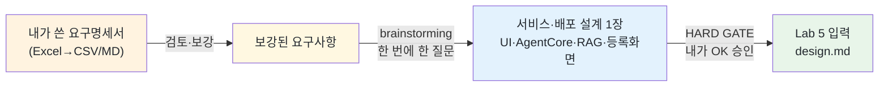

# Lab 4 · 요구사항 기반 서비스·배포 설계 — brainstorming

[← 이전: Lab 3 OB 차지백 스킬 만들기](03-build-chargeback-skill.md) · [🏠 목차](README.md) · [다음: Lab 5 프론트엔드 & AgentCore 배포 →](05-frontend-and-agentcore.md)

Lab 3에서 우리는 OB(발급사) 차지백을 이해하는 **스킬(skill)** 을 만들고, 익명 케이스로 실제로 동작하는 것까지 봤습니다. 스킬은 "1CB 이의신청을 이렇게 읽고, 이렇게 판단하라"는 AI의 업무 지식 — 말하자면 **두뇌**입니다. 그런데 두뇌만 있으면 아직 서비스가 아닙니다. 누가, 무엇을 넣어서, 어떤 화면을 거쳐, 무엇을 받아갈지가 정해져야 비로소 "서비스"가 됩니다.

이번 단계의 출발점은 백지가 아닙니다. 여러분은 **워크숍 당일 아침에 직접 작성한 요구명세서**(Excel)를 가지고 옵니다. 이번 단계에서는 (1) 그 요구명세서를 Claude Code가 읽을 수 있게 만들어 **함께 검토·보강**하고, (2) 그 명세 + Lab 3에서 만든 스킬을 입력으로 `/superpowers:brainstorming`을 돌려, 이 두뇌를 **배포 가능한 서비스**로 만드는 **설계 한 장**으로 좁힙니다. 설계 범위는 **서비스 + 배포**입니다 — UI(6단계), AgentCore 배포, RAG(Knowledge Bases) 구성, 그리고 RAG 문서를 등록하는 화면까지.

**예상 소요시간:** 약 40분 (13:00–13:40 · SA와 함께 진행)

> ℹ️ **참고:** 이번 단계에서는 **코드를 배포하지 않습니다.** 실제 프론트엔드 생성과 AgentCore 배포는 Lab 5에서 다룹니다. 여기서는 "요구사항 → 무엇을·왜 만들 것인가"를 brainstorming으로 정의하고, Lab 5에서 그대로 쓸 **서비스·배포 설계 메모**를 손에 쥐는 것까지가 목표입니다.

> ⚠️ **중요 — 스킬은 다시 만들지 않습니다:** 판단 두뇌(Lab 3 스킬)는 이미 있습니다. 이번 brainstorming은 **그 스킬을 어떤 서비스·배포로 감쌀지**만 설계합니다. AI가 "스킬을 새로 만들까요?"라고 하면 "스킬은 이미 있으니 재생성하지 마"라고 멈춰 세웁니다.

## 시작하기 전에

다음을 먼저 확인하세요.

- [ ] Lab 3를 완료해 **OB 차지백 스킬**(`ob-chargeback-domain`)이 만들어져 있고, 익명 케이스로 동작을 확인했다
- [ ] **사전에 작성한 요구명세서**(Excel) 파일을 손에 들고 있다 (워크숍 당일 아침 작성분)
- [ ] `cd workshop/mvp` 후 `claude` 세션이 떠 있다(없으면 Lab 0 참고)
- [ ] `/status`에 **Amazon Bedrock** / **`ap-northeast-2`** 가 보인다

## 이 단계에서 할 일

이번 단계를 마치면 다음을 직접 할 수 있습니다.

1. 사전 작성한 **요구명세서를 Claude Code가 읽을 형식으로 준비**하고, 랩에서 함께 **검토·보강**한다.
2. `/superpowers:brainstorming`을 실행해, 그 요구명세서 + Lab 3 스킬을 입력으로 **1CB 이의신청 서비스**를 설계한다.
3. 설계에 **① Next.js 6단계 UI ② Amazon Bedrock AgentCore 배포 ③ RAG = Bedrock Knowledge Bases(소스 = `visa-core-rules` PDF) ④ RAG 문서를 UI에서 등록(KB 인제스트)하는 화면**을 포함시킨다.
4. 결과를 **서비스·배포 설계 메모(`design.md`)** 한 장으로 확정해, Lab 5의 출발점으로 삼는다.

> 💡 **팁:** 이번 단계의 주인공은 "정답을 빨리 적는 것"이 아니라 **"내가 쓴 요구명세서를 AI와 함께 다듬으면서 설계로 옮기는 것"** 입니다. 모르면 "그건 잘 모르겠고, 우선 ~만 되면 좋겠어"라고 답해도 괜찮습니다.

---

## 1. 요구명세서 준비 — Claude Code가 읽게 만들기 ⭐

여러분이 작성한 요구명세서는 보통 **Excel(`.xlsx`/`.xlsb`)** 입니다. 그런데 Claude Code의 파일 읽기 도구는 **Excel 바이너리를 직접 파싱하지 못합니다.** 그래서 읽을 수 있는 형식으로 한 번 내보내거나 붙여넣어야 합니다. 둘 중 편한 방법을 고르세요.

> ℹ️ **참고:** 요구명세서는 **여러분이 작성한 자료**라 리포지터리에 들어가지 않습니다(gitignore 대상). 워크숍 동안만 `workshop/mvp/` 안에 두고 쓰면 됩니다.

**방법 A — CSV/Markdown으로 내보내기 (권장):**

1. Excel에서 **다른 이름으로 저장 → CSV (쉼표로 분리)** 를 선택해, `workshop/mvp/requirements.csv` 로 저장합니다. (표가 여러 시트면 핵심 시트만 내보내도 됩니다.)
2. 또는 표 영역을 복사해, 텍스트 편집기에서 `workshop/mvp/requirements.md` 로 붙여 넣어 저장합니다(Markdown 표 형태면 더 좋습니다).

**방법 B — 붙여넣기:** 파일로 저장하기 번거로우면, `claude` 세션에 표 내용을 **그대로 붙여넣어** 입력해도 됩니다(분량이 적을 때).

CSV/MD로 저장했다면, 세션에서 읽어 보게 합니다.

```text
workshop/mvp/requirements.csv (없으면 requirements.md)를 읽고,
내가 작성한 OB 차지백 1CB 이의신청 요구사항을 표로 정리해서 보여줘.
빠졌거나 모호한 항목이 있으면 질문 형태로 짚어줘.
```

**예상 결과**

> AI가 요구명세서를 표로 되짚어 주고, 비거나 모호한 칸을 짚어 줍니다(예시 — 실제 내용은 여러분이 쓴 명세에 따라 다릅니다).

```text
요구명세서를 이렇게 이해했어요. 빠지거나 모호한 부분을 ❓로 표시했습니다.

  • 업무 방향:   OB(발급사·1CB 이의신청)
  • 사용자:      차지백 처리 현업 담당자(비개발자)
  • 입력 자료:   분쟁 자료(전표·증빙·메모, PDF/JPG/eml)
  • 주요 사유코드: 13.6 (취소 불이행) — ❓ 12.5/12.6도 이번 범위인가요?
  • 산출물:      1CB 이의신청서 초안 (최종 제출은 사람)
  • 단계:        업로드 → 자료확인 → 사유코드 → 필수서류 → 작성 → 접수승인
  • ❓ RAG 근거 문서는 무엇으로 할까요? (예: VISA 규정 PDF)
```

> 👀 **확인:** AI가 짚어 준 ❓ 항목에 답하며 명세서를 **보강**하세요. 이 보강된 명세서가 다음 단계 brainstorming의 입력이 됩니다.

> 💡 **팁:** 명세서가 비어 있는 칸이 많아도 괜찮습니다. 지금 다 채우는 게 아니라, "이번 PoC에서 우선 할 것"만 분명히 하면 됩니다. 나머지는 brainstorming이 캐물어 줍니다.

> 📸 (스크린샷: requirements를 읽고 AI가 표로 되짚으며 ❓로 보강점을 짚어 준 화면)

---

## 2. 왜 요구명세서 → brainstorming 순서인가

여러분은 이미 요구명세서를 들고 왔으니 "백지 공포"는 없습니다. 하지만 명세서만으로 곧장 "만들어줘"라고 하면 두 가지 함정에 빠집니다.

- **명세의 빈칸·모호함:** 표에는 "초안 작성"이라고만 적혀 있지, 화면이 몇 단계인지·근거를 어디서 가져올지는 빠져 있기 쉽습니다.
- **서비스/배포 미정:** 두뇌(스킬)는 있는데, 그걸 **어떤 UI로, 어디에 배포하고, 어떤 RAG로 근거를 댈지**가 정해지지 않으면 Lab 5에서 헤맵니다.

`brainstorming`은 이 빈칸을 **구현 전에** 메우는 절차입니다. 핵심 규칙은 두 가지입니다.

- **한 번에 한 질문:** AI가 질문을 한꺼번에 쏟지 않고, 하나씩 물어 답을 쌓아 갑니다.
- **HARD GATE(설계 승인 전 구현 금지):** 설계가 내 손으로 "OK" 승인되기 전까지 AI는 코드를 만들지 않습니다.



> ℹ️ **참고(핵심 한 줄):** Lab 3가 "1CB 이의신청을 어떻게 판단하나"(두뇌)였다면, Lab 4은 "그 두뇌를 어떤 요구사항에 맞춰, 어떤 서비스·배포로 만들 것인가"(설계)입니다.

---

## 3. `/superpowers:brainstorming` 시작하기 ⭐

이제 보강된 요구명세서 + Lab 3 스킬을 입력으로 brainstorming을 엽니다. **스킬은 이미 있으니 재생성하지 말 것**과, 설계에 포함할 4가지(UI·AgentCore·RAG·등록 화면)를 한 번에 못 박는 게 핵심입니다.

1. `claude` 세션의 입력 커서에 아래를 그대로 입력하고 Enter.

```text
/superpowers:brainstorming
```

2. AI가 주제를 물으면, 아래를 **그대로 복사해 붙여넣습니다.** (앞 단계에서 `requirements.csv`/`.md`를 읽혔다면 "방금 읽은 요구사항"이라고만 해도 됩니다.)

```text
방금 만든 OB 차지백 스킬(workshop/mvp의 ob-chargeback-domain)과
아래 요구사항 명세(requirements.csv / 방금 읽은 표)를 바탕으로
1CB 이의신청 서비스를 설계하자.

스킬은 이미 있으니 재생성하지 말고, 그 스킬을 두뇌로 쓰는 전제로
다음 4가지를 포함해 서비스·배포를 설계해줘:

① Next.js 6단계 UI
   (업로드 → 자료확인 → 사유코드 분류 → 필수서류 확인 → 이의신청서 작성 → 접수 승인,
    각 단계마다 사람이 검토·승인하는 HITL 게이트)
② Amazon Bedrock AgentCore 배포
   (이 스킬을 단일 AgentCore Runtime 에이전트로 올리는 전제)
③ RAG = Amazon Bedrock Knowledge Bases
   (소스 = visa-core-rules PDF — VISA 분쟁 규정을 근거로 사유코드·필수서류·작성 문구 인용)
④ RAG 문서를 UI에서 등록(KB 인제스트)하는 화면
   (담당자가 규정 PDF를 올리면 Knowledge Base에 인제스트되는 화면)

지금은 설계만 하고, 실제 배포·코드 생성은 하지 마(HARD GATE).
한 번에 하나씩 물어봐.
```

**예상 결과**

> AI가 한꺼번에 묻지 않고 **한 번에 하나씩** 질문을 시작합니다(예시 — 실제 문구·순서는 다를 수 있음).

```text
좋아요. ob-chargeback-domain 스킬을 두뇌로 그대로 쓰고(재생성 X),
요구사항을 바탕으로 서비스+배포만 설계하겠습니다. HARD GATE: 승인 전 구현 X.

❓ (1/4) 6단계 중 "자료확인" 화면에서 담당자가 꼭 봐야 하는 건
   무엇인가요? (예: 원본 문서 + 핵심 사실 + 날짜순 타임라인 + 근거 출처)
```

> 💡 **팁:** 프롬프트에 **"스킬은 이미 있으니 재생성하지 마"** 를 적는 것이 핵심입니다. 이 한 줄이 빠지면 AI가 판단 로직(스킬)을 처음부터 다시 만들려 할 수 있습니다.

> 📸 (스크린샷: brainstorming이 요구사항·스킬을 받아 첫 질문 하나만 던진 화면)

---

## 4. 핵심 문답으로 서비스·배포 4요소 좁히기

AI 질문에 **하나씩** 답하면서, 설계 4요소(UI 6단계 · AgentCore · RAG · 등록 화면)를 채웁니다. 요구명세서에 이미 있는 항목은 "명세대로"라고 빠르게 확인하고, 빠진 칸만 정합니다.

1. **UI 6단계** — 각 단계가 무엇을 보여주고 어디서 사람이 승인하는지 답합니다.

```text
6단계는 명세대로야: 업로드 → 자료확인 → 사유코드 분류 → 필수서류 확인 → 작성 → 접수승인.
사유코드 선택 / 초안 승인 / 접수 승인 세 군데는 반드시 사람이 결정해(HITL).
```

2. **AgentCore 배포 단위** — 스킬을 어떤 형태로 올릴지 답합니다.

```text
스킬은 단일 AgentCore Runtime 에이전트 하나로 올려. 6단계가 그 에이전트의 단계별
인텐트를 호출하는 구조면 좋겠어. 모델은 Amazon Bedrock의 Claude Sonnet.
```

3. **RAG(Knowledge Bases)** — 근거 문서를 정합니다.

```text
RAG는 Amazon Bedrock Knowledge Bases로. 근거 소스는 visa-core-rules PDF(VISA 분쟁 규정).
사유코드 분류·필수서류·작성 단계에서 규정을 검색·인용하게 해줘.
규정에 근거가 없으면 단정하지 말고 "규정 확인 필요"로 표시.
```

4. **RAG 문서 등록 화면** — 규정 PDF를 어떻게 올리고 인제스트하는지 답합니다.

```text
담당자가 규정 PDF를 UI에서 올리면 Knowledge Base에 등록(인제스트)되는 화면도 넣어줘.
업로드 → 인제스트 진행 상태 → 완료/실패 표시까지. 6단계 마법사와는 별도 관리 화면으로.
```

**예상 결과**

> AI가 답을 모아 **서비스·배포 윤곽을 되짚어** 줍니다(예시).

```text
정리하면 이렇게 이해했어요. 맞으면 design.md로 굳힐게요.

  • 두뇌:        ob-chargeback-domain 스킬 재사용 (재생성 X)
  • UI:          Next.js 6단계 마법사 + 단계별 HITL 게이트
  • 배포:        단일 Amazon Bedrock AgentCore Runtime 에이전트 (모델: Claude Sonnet)
  • RAG:         Bedrock Knowledge Bases — 소스 visa-core-rules PDF
  • RAG 등록:    UI에서 규정 PDF 업로드 → KB 인제스트(진행/완료/실패) 관리 화면
  • 범위 밖:     자동 제출, 카드사 시스템 직접 연동, 인증/멀티유저
```

> 👀 **확인:** 되짚어 준 6줄에 4요소(UI·AgentCore·RAG·등록 화면)가 다 들어갔나요? 빠진 게 있으면 지금 한 줄로 보강하세요.

> ⚠️ **주의:** 아직 "만들어줘"라고 하지 마세요. 구현은 설계 승인(HARD GATE) 이후, Lab 5입니다.

> 📸 (스크린샷: AI가 두뇌·UI·배포·RAG·등록 화면·범위를 되짚어 준 화면)

---

## 5. 설계(서비스·배포 메모) 한 장으로 확정

윤곽이 맞으면, AI에게 **`design.md` 한 장으로 저장**해 달라고 합니다.

```text
좋아, 이대로 'design.md' 한 장으로 저장해줘.
두뇌(ob-chargeback-domain 스킬) / 사용자 / 입력 / 6단계 UI(단계별 HITL) /
배포(AgentCore Runtime, Claude Sonnet) / RAG(Knowledge Bases, 소스 visa-core-rules PDF) /
RAG 문서 등록(KB 인제스트) 화면 / 범위 밖을 모두 담아줘.
각 항목에 왜 그렇게 정했는지 한 줄 근거도 붙여줘.
```

**예상 결과**

> AI가 `design.md`(서비스·배포 설계 1장)를 만들고 요약을 보여 줍니다(예시).

```text
design.md 저장 완료. 핵심은 이렇습니다.

  # 1CB 이의신청 서비스 — 서비스·배포 설계
  - 두뇌:     ob-chargeback-domain 스킬 (Lab 3, 재생성 X)
  - 사용자:   차지백 처리 현업(비개발자)
  - UI:       Next.js 6단계 마법사
              (업로드→자료확인→사유코드→필수서류→작성→접수승인) + 단계별 HITL 게이트
  - 배포:     Amazon Bedrock AgentCore Runtime (단일 에이전트, 모델 Claude Sonnet)
  - RAG:      Amazon Bedrock Knowledge Bases — 소스 visa-core-rules PDF
              (사유코드·필수서류·작성 단계에서 규정 검색·인용, 무근거 시 "규정 확인 필요")
  - RAG 등록: 규정 PDF 업로드 → KB 인제스트(진행/완료/실패) 관리 화면
  - 범위 밖:  자동 제출, 카드사 직접 연동, 인증/멀티유저
```

> 👀 **확인:** `design.md`에 다음 **6가지**가 모두 들어갔는지 보세요 — ① 두뇌(스킬 재사용) ② 6단계 UI ③ AgentCore 배포 ④ RAG = Knowledge Bases(소스 visa-core-rules PDF) ⑤ RAG 문서 등록(KB 인제스트) 화면 ⑥ 범위 밖. 이 한 장이 Lab 5 배포의 출발점입니다.

> 📸 (스크린샷: AI가 design.md를 저장하고 6요소를 요약해 준 화면)

---

## 6. Lab 5용 배포 준비 프롬프트 모음 (복사용)

아래는 이번 Lab의 `design.md`를 바탕으로, **Lab 5에서 그대로 복사해 쓸** 프롬프트 모음입니다. 지금은 실행하지 말고, `design.md` 맨 아래 "## Lab 5용 프롬프트"에 붙여 두기만 하세요.

```text
# 1) 스킬을 AgentCore 에이전트로 만들 준비
ob-chargeback-domain 스킬(Lab 3)을 Amazon Bedrock AgentCore Runtime에 올릴
단일 에이전트로 만들 준비를 해줘. 모델은 Bedrock의 Claude Sonnet.
design.md의 6단계 설계를 그대로 따라.

# 2) RAG(Knowledge Bases) 구성 미리보기
RAG는 Amazon Bedrock Knowledge Bases로 구성해. 소스는 visa-core-rules PDF.
어떤 단계(사유코드/필수서류/작성)에서 어떻게 검색·인용하는지,
무근거 시 "규정 확인 필요" 처리까지 design.md 기준으로 정리해줘. 아직 실행은 하지 마.

# 3) RAG 문서 등록(KB 인제스트) 화면
담당자가 규정 PDF를 올리면 Knowledge Base에 인제스트되는 화면을 만들어줘.
업로드 → 인제스트 진행 상태 → 완료/실패 표시. 6단계 마법사와 별도 관리 화면으로.

# 4) Next.js 6단계 UI ↔ 에이전트 연결 지점
6단계 마법사 각 화면이 AgentCore 에이전트의 어느 인텐트와
연결되는지(요청·응답 형태), 자료 업로드·초안 받기 흐름을 한 단락으로 정리해줘.
```

> ℹ️ **참고:** 위 프롬프트는 "무엇을·왜"까지 담은 **준비**입니다. 실제로 AgentCore에 올리고, Knowledge Base를 만들고(인제스트), Next.js 화면을 붙이는 **실행**은 Lab 5의 내용입니다.

---

## 문제 해결

brainstorming이 막힐 때 아래 표에서 증상을 찾아 대응하세요.

| 증상 | 원인 | 해결 |
|------|------|------|
| AI가 요구명세서(`.xlsx`)를 **못 읽는다** | Read 도구가 Excel 바이너리를 직접 파싱 못 함 | CSV/Markdown으로 내보내거나(방법 A), 표 내용을 세션에 붙여넣으세요(방법 B) |
| AI가 **스킬을 새로 만들려 한다** | "재생성하지 마"가 안 박힘 | "스킬은 Lab 3에 이미 있어. 재생성하지 말고 두뇌로만 써"라고 멈춰 세웁니다 |
| AI가 질문을 **한꺼번에 여러 개** 쏟아낸다 | brainstorming 리듬이 흐트러짐 | "한 번에 하나씩만 물어봐"라고 한 줄로 요청합니다 |
| 설계에 **4요소 중 일부가 빠졌다** | 되짚기 단계를 건너뜀 | "6단계 UI·AgentCore 배포·RAG(Knowledge Bases)·RAG 등록 화면 4가지가 다 들어가게 다시 정리해줘" |
| AI가 **물어보지도 않고 코드부터** 만든다 | HARD GATE를 건너뜀 | "아직 구현하지 마. 설계 합의가 먼저야"라고 멈춰 세웁니다 |
| 주제가 **너무 커서** 좁혀지지 않는다 | 한 번에 다 만들려는 욕심 | "이번 PoC는 사유코드 13.6 우선, 초안 작성까지만"으로 범위를 좁힙니다 |

### 자주 헷갈리는 것

| 헷갈리는 것 | 어떻게 나타나나 | 바로잡는 법 |
|---|---|---|
| **스킬(두뇌) vs 서비스(설계)** | "Lab 3에서 다 만들었는데 왜 또?"라고 느낌 | 스킬은 **판단 지식**, 이번 Lab은 그걸 **어떤 UI·배포·RAG로 감쌀지**의 설계입니다 |
| **이번 Lab에서 배포까지 하려 함** | `agentcore` 명령을 지금 치려고 함 | 이번 Lab은 **요구사항→설계까지** — 실제 배포는 Lab 5 |
| **RAG 근거를 모델 일반지식으로** | 규정을 안 넣고 "알아서 판단" | 근거는 **visa-core-rules PDF**(Knowledge Bases). 규정에 없으면 "규정 확인 필요"로 표시 |
| **요구명세서를 AI가 채우게 둠** | 명세 빈칸을 "알아서 해줘"로 넘김 | 무엇을 우선할지(범위·사유코드)는 **현업이 결정** — AI는 좁혀 주는 역할 |

> 💡 **팁:** 막히면 "지금까지 정한 걸 한 번 정리해줘"라고 말해 보세요. AI가 현재 윤곽을 되짚어 주면, 어디까지 왔고 무엇이 비었는지가 한눈에 보입니다.

---

## ✅ 완료 확인

다음이 모두 충족되면 이 단계는 성공입니다.

- [ ] 사전 작성한 **요구명세서를 CSV/Markdown으로 준비**(또는 붙여넣기)해 AI가 읽고, 함께 **검토·보강**했다
- [ ] `/superpowers:brainstorming`을 실행하고, 첫 프롬프트에 **두뇌=Lab 3 스킬(재생성 금지)** 과 **설계 4요소**를 명시했다
- [ ] 핵심 문답으로 **① 6단계 UI ② AgentCore 배포 ③ RAG = Knowledge Bases(소스 visa-core-rules PDF) ④ RAG 문서 등록(KB 인제스트) 화면** 을 정했다
- [ ] 결과를 **`design.md`(서비스·배포 설계 1장)** 로 저장했고, 6요소가 모두 들어갔다
- [ ] **Lab 5용 배포 준비 프롬프트**가 한곳(예: `design.md` 하단)에 정리됐다

핵심만 다시 짚으면 — Lab 3가 두뇌(스킬)였다면, Lab 4은 **내가 쓴 요구명세서**를 출발점으로, 그 두뇌를 **어떤 UI(6단계)·배포(AgentCore)·RAG(Knowledge Bases + 등록 화면)** 의 서비스로 만들지 정의하는 단계입니다.

> SA 노트:
>
> **진행 팁 (SA 주도 · 백지 확산 방지)**
> - 참가자는 **요구명세서를 들고 옵니다.** 시작하자마자 "Excel은 Read가 못 읽으니 CSV/MD로 내보내거나 붙여넣자"를 먼저 시연하세요. 이 한 단계가 막히면 전체가 밀립니다.
> - **두뇌(Lab 3 스킬)는 고정**임을 강조하세요. brainstorming 첫 프롬프트에 "스킬은 이미 있으니 재생성하지 마"를 반드시 넣게 하면 AI가 판단 로직을 다시 만들지 않습니다.
> - 설계 범위는 **서비스+배포 4요소**(6단계 UI / AgentCore / RAG=Knowledge Bases / RAG 등록 화면)로 못 박으세요. 요구명세서에 이미 있는 칸은 "명세대로"로 빠르게 통과시킵니다.
> - AI가 코드부터 만들려 하면 즉시 "아직 구현하지 마(HARD GATE)"로 멈춰 세우는 걸 시연하세요.
>
> **시간 관리 (13:00–13:40 · SA 기준)**
> - 요구명세서 준비·검토 13:00–13:10, brainstorming 실행+4요소 문답 13:10–13:28, design.md 저장 13:28–13:35, Lab 5 프롬프트 정리+완료 점검 13:35–13:40.
> - 길을 잃는 페어는 "요구명세서 표를 그대로 design.md로 굳히고 4요소만 확인"으로 잘라 진도를 맞추세요. 완벽한 설계보다 **한 장을 끝내는 것**이 목표입니다.
> - 막히면 SA의 데모(미리 준비한 `requirements.csv` + 모범 `design.md`)로 대체하며 진행하세요.
>
> **예상 질문 Q&A**
> - **Q. Lab 3에서 스킬을 이미 완성했는데 왜 또 설계하나요?** A. Lab 3는 "어떻게 판단하나"(두뇌), Lab 4은 그 두뇌를 "어떤 UI·배포·RAG의 서비스로 감쌀지"(설계)입니다.
> - **Q. 요구명세서 Excel을 왜 변환하나요?** A. Claude Code의 Read 도구는 `.xlsx/.xlsb` 바이너리를 직접 못 읽습니다. CSV/Markdown으로 내보내거나 표를 붙여넣으면 읽습니다.
> - **Q. RAG 근거를 꼭 visa-core-rules PDF로 적어야 하나요?** A. 이번 PoC는 VISA 분쟁 규정을 권위 근거로 씁니다. Knowledge Bases 소스로 명시하면 Lab 5에서 그대로 인제스트·연결합니다.
> - **Q. 지금 AgentCore에 올려 보면 안 되나요?** A. 이번 Lab은 요구사항→설계까지입니다. 실제 배포·인제스트는 Lab 5에서 이 프롬프트를 그대로 써서 진행합니다.

## 다음 단계

이제 **내가 쓴 요구명세서**가 **서비스·배포 설계 한 장(`design.md`)** 이 되었습니다 — 6단계 UI, AgentCore 배포, RAG(Knowledge Bases + 등록 화면)까지. Lab 5에서는 이 설계와 프롬프트를 들고, 실제로 **Next.js 6단계 화면을 붙이고, 규정 PDF를 Knowledge Base에 등록하고, Amazon Bedrock AgentCore에 에이전트를 배포**합니다.

[← 이전: Lab 3 OB 차지백 스킬 만들기](03-build-chargeback-skill.md) · [🏠 목차](README.md) · [다음: Lab 5 프론트엔드 & AgentCore 배포 →](05-frontend-and-agentcore.md)
