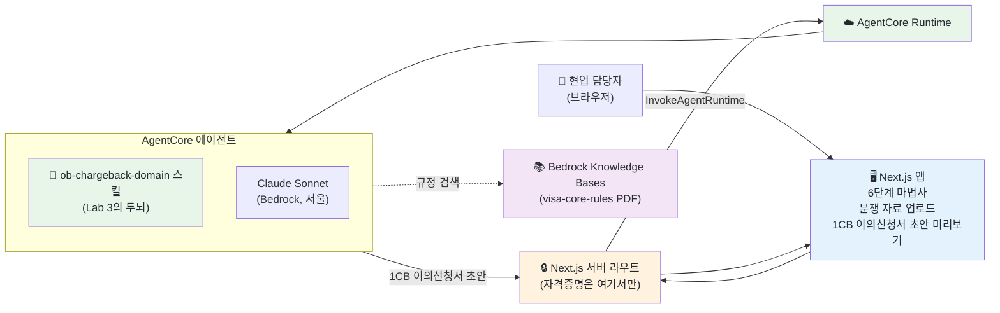
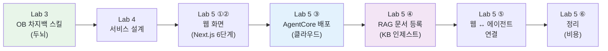

# Lab 5 · 프론트엔드(Next.js) & AgentCore 배포

[← 이전: Lab 4 서비스 정의 & 배포 준비](04-brainstorm-and-deploy.md) · [🏠 목차](README.md)

오늘의 **클라이맥스**입니다. 지금까지 우리는 차지백을 이해하는 **두뇌(Lab 3의 `ob-chargeback-domain` 스킬)** 를 만들고, 그 두뇌를 쓸 **서비스(Lab 4)** 를 설계했습니다. 이번 랩에서는 **직접 만든 스킬을 AgentCore 에이전트로 감싸 배포**하고, 그 앞에 **눈에 보이는 웹 화면**(Next.js)을 붙입니다. 내 노트북이 아니라 **클라우드(Amazon Bedrock AgentCore)** 에 실제로 올려 "설치 → 배포"까지 **끝에서 끝까지(end-to-end)** 한 번에 통과하는 게 목표입니다.

겁먹지 마세요. 코딩은 한 줄도 직접 하지 않습니다. 오늘 내내 그랬듯이 **우리는 한국어로 시키고, Claude Code가 만들고 배포합니다.** "이런 화면을 만들어줘", "이걸 Next.js 앱으로 만들어줘", "OB 차지백 스킬을 AgentCore에 배포해줘" — 설명하면 도구가 코드를 생성하고 클라우드에 올립니다.

**예상 소요시간:** 약 170분 (13:40–16:30 · 오후 마지막 랩 · SA와 화면을 함께 보며 진행)

> ℹ️ **참고 — 사전 제공물 (전제):** 이 랩은 오늘의 **최대 난도**라, 비개발자도 완주할 수 있게 환경이 미리 깔려 있습니다. 워크숍이 다음을 제공합니다.
> - **(a) Next.js 스타터 템플릿:** 참가자는 화면을 **바닥부터 만들지 않습니다.** **SA가 워크숍 당일 `workshop/mvp/web` 에 Next.js 스타터 템플릿을 배치**합니다(저장소엔 포함되지 않고 당일 제공). 참가자는 그 템플릿을 받아 **프롬프트(자연어)로 수정·연결만** 합니다. (2단계의 "Next.js 앱 만들어줘"는 곧 **"받은 템플릿을 자연어로 수정"** 한다는 뜻입니다 — 빈 화면에서 새로 생성하는 게 아닙니다.)
> - **(b) IAM 권한이 미리 세팅된 AgentCore 샌드박스 실습 계정:** 배포·호출에 필요한 권한이 이미 들어가 있어, **권한 오류(AccessDenied 등)로 막히지 않습니다.**
> - **(c) Node.js 20+ / Python 3.10+ 설치 완료(PREWORK):** 런타임은 사전 작업(PREWORK)으로 이미 설치돼 있습니다 — 당일 설치하지 않습니다.
>
> 즉, 여러분이 할 일은 **"당일 배치된 템플릿·미리 세팅된 계정을 자연어로 손보고 배포·연결하는 것"** 입니다. 처음부터 짓는 게 아닙니다.

> ℹ️ **참고:** 이 랩은 **배포 대기 시간**이 있습니다. 첫 배포는 클라우드 초기 설정(CDK 부트스트랩) 때문에 몇 분 걸립니다. 그 시간 동안 멍하니 기다리지 말고, SA 설명을 듣거나 화면 구조를 살펴보세요. 막히면 SA 계정의 데모로 대체할 수 있으니 진도를 세우지 않습니다.

## 시작하기 전에

다음을 먼저 확인하세요.

- [ ] Lab 0 환경 확인 완료 — `/status`에 **`Amazon Bedrock`** + **`ap-northeast-2`** 가 보임
- [ ] Lab 3 완료 — `.claude/skills/ob-chargeback-domain/SKILL.md`(에이전트의 두뇌)가 있음
- [ ] Lab 4 완료 — 어떤 서비스를(입력→출력) 만들지 설계(`design.md`)가 합의됨 (6단계 UI · AgentCore 배포 · RAG=Knowledge Bases · RAG 등록 화면)
- [ ] 터미널에서 `workshop/mvp/` 폴더로 이동 후 `claude` 실행한 상태
- [ ] `frontend-design`, `agentcore-creator` 스킬이 설치돼 있음 (Lab 1에서 설치 — 없으면 SA에게 알리기)

### 배포에 필요한 사전 조건 (SA가 미리 점검)

아래는 **개인이 손대는 게 아니라**, 환경이 갖춰졌는지 SA·헬프데스크가 확인하는 항목입니다. 안 돼 있으면 손을 드세요.

| 항목 | 필요한 것 | 확인 방법 |
|------|-----------|-----------|
| Node.js | **Node.js 20+** | 터미널에서 `node --version` |
| Python | **Python 3.10+** | 터미널에서 `python3 --version` |
| AWS 자격증명 | 구성 완료(서울 리전) | 터미널에서 `aws sts get-caller-identity` |
| 모델 액세스 | **Bedrock에서 Claude 모델 액세스 활성화** | Bedrock 콘솔 → Model access (헬프데스크 확인) |
| Next.js 스타터 | `workshop/mvp/web` 템플릿 | **SA가 당일 배치** (저장소 미포함 — 당일 제공) |
| RAG 규정 소스 | `visa-core-rules` PDF | **고객(현업)이 당일 제공** (저장소 미포함) |

> ⚠️ **주의(배포 전 라이브 문서로 재확인):** 아래 표시한 ⚠️ 항목(특히 **apac Sonnet inference profile ID**, **IAM 권한 문구**, **CLI 옵션명**)은 AWS가 자주 바꿉니다. 워크숍 당일 배포 직전에 **AWS 공식 문서(라이브)** 로 한 번 더 확인하세요. 이 랩의 명령은 2026년 6월 기준입니다.

## 이 단계에서 할 일

이번 단계를 마치면 다음을 직접 할 수 있습니다.

1. **프론트엔드 디자인** — `frontend-design` 스킬로 1CB 이의신청 도우미 웹 화면의 방향을 잡는다.
2. **Next.js 앱 생성** — 자연어로 그 디자인을 실제 Next.js 6단계 마법사 코드로 만들고 로컬에서 띄운다.
3. **에이전트 배포** — **직접 만든 `ob-chargeback-domain` 스킬을 `agentcore-creator`(또는 `@aws/agentcore` CLI)로 AgentCore 에이전트로 감싸** 배포한다.
4. **RAG 문서 등록(KB 인제스트)** — Amazon Bedrock Knowledge Bases를 만들고, UI의 **"RAG 문서 등록"** 화면에서 `visa-core-rules` 규정 PDF를 KB에 인제스트한다.
5. **프론트 ↔ 에이전트 연결** — Next.js **서버 라우트**에서 배포된 에이전트(+KB)를 호출하게 연결한다(자격증명은 서버에서만).
6. **정리(cleanup)** — 비용이 새지 않게 배포한 리소스를 깨끗이 내린다.

전체 흐름은 여섯 단계입니다: ① 디자인 → ② Next.js 앱 → ③ AgentCore 배포 → ④ RAG 문서 등록(KB 인제스트) → ⑤ 연결 → ⑥ 정리. 이 중 **③ AgentCore 배포** 와 **④ RAG 문서 등록**이 오늘의 핵심이고, 나머지는 그 앞뒤를 받쳐줍니다.

> 💡 **팁:** 막히면 혼자 5분 이상 헤매지 말고 옆 페어나 SA에게 손을 드세요. AI에게 `"방금 무슨 명령을 어디서 실행했고 지금 상태가 뭔지 한국어로 알려줘"` 라고 물으면 현재 위치를 다시 잡을 수 있습니다.

### 오늘 만드는 것의 전체 그림



핵심은 **자격증명이 브라우저로 절대 나가지 않는다**는 점입니다. 사용자의 브라우저는 우리 Next.js 앱(서버)에만 말을 걸고, **AWS(AgentCore) 호출은 서버 라우트가 대신** 합니다. 차지백 케이스에는 민감정보가 섞일 수 있으니, 이 "서버가 대문 역할을 한다"는 구조가 금융권의 기본입니다. 그리고 에이전트는 사유코드·필수서류·작성 단계에서 **Knowledge Bases(RAG)** 에 올린 VISA 규정을 검색해 근거로 인용합니다.

### AgentCore가 뭔가요? — "두뇌를 클라우드에 올려 늘 켜 두는 곳"

지금까지 OB 차지백 스킬(두뇌)은 **내 노트북의 `claude` 안에서만** 살아 있었습니다. 노트북을 끄면 같이 꺼지고, 나만 쓸 수 있습니다. **Amazon Bedrock AgentCore** 는 **직접 만든 그 스킬을 에이전트로 감싸 클라우드에 올려 늘 켜 두는 곳**입니다. 한 번 올리면, 웹 화면(우리 Next.js 앱)이나 다른 시스템이 언제든 호출할 수 있는 **항상 켜진 서비스**가 됩니다. 비유하면, 내 책상에서만 일하던 직원이 회사 서버에 상주하며 누구나 부를 수 있는 부서가 되는 셈입니다.

### RAG(Knowledge Bases)가 왜 필요한가요? — "규정을 에이전트의 참고서로"

스킬(두뇌)은 "어떻게 판단하나"의 업무 원칙입니다. 하지만 **사유코드별 필수서류·규정 문구** 같은 세부 근거는 방대한 **VISA 규정 PDF**에 들어 있습니다. **Amazon Bedrock Knowledge Bases** 는 그 규정 PDF를 검색 가능한 형태로 인덱싱(인제스트)해 두고, 에이전트가 단계마다 **근거를 찾아 인용**하게 해 주는 RAG 저장소입니다. 이번 랩에서는 **④ RAG 문서 등록** 단계에서 `visa-core-rules` PDF를 KB에 올립니다.

---

## 1. 프론트엔드 디자인 — `frontend-design`으로 화면 방향 잡기

먼저 **어떤 화면**을 만들지 정합니다. 코드부터 짜지 않고, `frontend-design` 스킬에게 우리 도우미의 화면을 디자인해 달라고 합니다. Lab 4 `design.md`의 **6단계 마법사**(업로드→자료확인→사유코드→필수서류→1CB 작성→접수)가 기준입니다.

1. `workshop/mvp/`에서 `claude` 실행 상태의 입력 커서에 아래를 그대로 붙여넣고 Enter. 슬래시(`/`) 없이 한국어 문장 그대로입니다.

```text
[입력]
OB 1CB 이의신청 도우미 웹 화면을 디자인해줘.
- 흐름: 업로드 → 자료확인 → 사유코드 → 필수서류 → 1CB 작성 → 접수 (6단계 마법사)
- 입력: 분쟁 자료(전표·증빙·메모)를 업로드/붙여넣기
- 출력: 1CB 이의신청서(영문) 초안 미리보기 + 사유코드별 필수서류 체크리스트
- 상단 가로 stepper + 전폭 작업영역 + 단계마다 "담당자 검토·승인"(HITL) 게이트
- 한국어 UI, 깔끔하고 업무용. 화려하지 않게.
frontend-design 스킬을 써서 레이아웃과 디자인 방향을 먼저 제안해줘. 아직 코드는 만들지 마.
```

**예상 결과**

> 익명·예시입니다. 실제 문구·제안은 환경마다 다릅니다.

```text
(frontend-design 스킬 적용)

OB 1CB 이의신청 도우미 화면 디자인 방향을 제안합니다.

레이아웃 (6단계 마법사):
  상단: 가로 stepper (①업로드 ②자료확인 ③사유코드 ④필수서류 ⑤1CB 작성 ⑥접수)
  본문: 전폭 작업영역 — 단계별 입력/검토 화면
  하단: "담당자 검토·승인"(HITL) 게이트 버튼
  ⑤ 작성 화면: 1CB 이의신청서 초안 미리보기(영문) + "확정 전 담당자 검토 필요" 배지

톤 & 타이포: 업무용 중립 톤(회색·네이비), 본문 가독성 우선, 과한 색·애니메이션 배제
상태 표시: 생성 중 로딩, 빈 상태 안내, 오류 메시지 영역

먼저 이 방향이 괜찮은지 확인해 주세요. 좋으면 Next.js 앱으로 만들겠습니다.
```

> 💡 **왜 이렇게 하나** — 화면도 "만들기 전에 먼저 정리"(Lab 4의 brainstorming과 같은 원리)입니다. 6단계 흐름(업로드→…→접수)과 단계별 HITL 게이트를 먼저 합의하면, 다음 단계에서 코드가 우리가 원한 모양으로 나옵니다. 막연히 "예쁘게 만들어줘"라고 하면 엉뚱한 화면이 나옵니다.

> 👀 **확인하세요**
> - [ ] **6단계 흐름(업로드→자료확인→사유코드→필수서류→1CB 작성→접수)** 이 디자인에 담겼는가?
> - [ ] **한국어 UI** + 업무용 톤으로 제안됐는가?
> - [ ] **단계별 "담당자 검토·승인"(HITL)** 게이트 자리가 화면에 잡혔는가?
> - [ ] AI가 **코드부터 만들지 않고** 디자인 방향을 먼저 제안했는가?

> 📸 (스크린샷: frontend-design이 6단계 마법사 레이아웃과 디자인 방향을 제안한 화면)

---

## 2. Next.js 앱 — 제공된 템플릿을 자연어로 수정

> ℹ️ **참고:** 바닥부터 만드는 게 아닙니다. **SA가 워크숍 당일 `workshop/mvp/web` 에 Next.js 스타터 템플릿을 배치**합니다(저장소엔 포함되지 않고 당일 제공). 여러분은 그 템플릿을 **자연어로 수정**해, 1단계에서 잡은 디자인(좌 입력 / 우 미리보기)에 맞춥니다. "앱을 만들어줘"라는 말은 사실 **"받은 템플릿을 우리 디자인대로 고쳐줘"** 라는 뜻입니다.

디자인 방향이 잡혔으면, **자연어로** "제공된 템플릿을 이 디자인에 맞게 고쳐줘"라고 시킵니다. Claude Code가 템플릿 코드를 수정합니다.

1. 디자인이 마음에 들면 아래를 입력합니다.

```text
[입력]
workshop/mvp/web 에 있는 제공 템플릿(Next.js 스타터)을 방금 디자인한 화면에 맞게 수정해줘.
- 6단계 마법사(업로드→자료확인→사유코드→필수서류→1CB 작성→접수), 한국어 UI
- 상단 가로 stepper + 전폭 작업영역 + 단계별 "담당자 검토·승인"(HITL) 게이트
- 지금은 화면만(에이전트 연결은 뒤 단계에서 할게). "1CB 초안 생성" 버튼은 자리만 잡아둬.
- 다 고치면 로컬에서 실행하는 방법(npm run dev)을 한국어로 알려줘.
```

> 💡 **부담되면 더 가볍게:** 6단계 마법사가 버겁다면 SA에게 알리고 **핵심 3단계**(업로드 → 사유코드/필수서류 → 1CB 작성)로 줄여도 됩니다. 기본값은 6단계지만, 핵심은 "③ AgentCore 배포"이지 화면 완성도가 아닙니다.

**예상 결과**

> 익명·예시입니다. 파일 목록·포트는 환경마다 다를 수 있습니다.

```text
제공 템플릿(workshop/mvp/web)을 디자인에 맞게 수정했습니다.

수정한 파일:
  web/app/page.tsx          ← 상단 stepper + 6단계 마법사 화면으로 변경
  web/app/layout.tsx        ← 한국어 UI 레이아웃 적용
  web/package.json          (템플릿 그대로 — 변경 없음)

로컬 실행:
  cd workshop/mvp/web
  npm install
  npm run dev
  → 브라우저에서 http://localhost:3000 열기
```

2. 안내대로 **터미널**에서 앱을 실행합니다(아래는 `claude` 세션이 아니라 터미널에서).

```bash
cd workshop/mvp/web
npm install
npm run dev
```

브라우저에서 `http://localhost:3000` 을 열면 방금 디자인한 6단계 마법사 화면이 떠야 합니다.

> 💡 **왜 이렇게 하나** — 프론트엔드는 **"사람이 보고 만지는 부분"** 입니다. 임원 시연 때 명령줄 텍스트가 아니라 **웹 화면**으로 보여 주면 훨씬 와닿습니다. 지금은 화면만 만들고(에이전트 연결은 ⑤단계), **먼저 눈에 보이는 것부터** 띄워 진행 상황을 확인하는 게 안전합니다.

> 👀 **확인하세요**
> - [ ] `workshop/mvp/web` 의 **제공 템플릿이 우리 디자인대로 수정**됐는가? (바닥부터 생성이 아니라 수정)
> - [ ] `npm run dev` 후 브라우저(`localhost:3000`)에 **6단계 마법사 화면**이 떴는가?
> - [ ] 상단 stepper·작업영역·HITL 게이트가 **한국어 UI**로 보이는가?
> - [ ] "1CB 초안 생성" 버튼이 (아직 동작은 안 해도) 자리에 있는가?

> ⚠️ **주의:** `npm install`/`npm run dev`는 `claude` 세션 **안**이 아니라 **터미널**에서 실행하는 명령입니다. 새 터미널 탭을 열어 실행하면, 실행 중인 `claude` 세션은 그대로 둘 수 있습니다.

> 📸 (스크린샷: localhost:3000에 뜬 1CB 이의신청 도우미 6단계 마법사 화면)

---

## 3. 에이전트를 AgentCore로 배포 ⭐

**오늘의 핵심 단계**입니다. **직접 만든 `ob-chargeback-domain` 스킬(두뇌)을 AgentCore 에이전트로 감싸** 클라우드에 배포합니다.

> 🧠 **에이전트의 두뇌/페르소나 = Lab 3 스킬 + Lab 4 설계:** 지금 배포하는 에이전트는 빈 LLM이 아닙니다. **두뇌·페르소나는 Lab 3에서 만든 `ob-chargeback-domain` 스킬**(OB 1CB 이의신청 규칙·발급사 유리 해석·사유코드별 필수서류·HITL)이고, **어떤 입력→출력 서비스로 쓸지는 Lab 4 설계**입니다. 변환할 때 이 스킬이 **에이전트의 시스템 프롬프트(두뇌)로 주입(inject)** 됩니다 — 그래서 클라우드 위 에이전트가 Lab 3의 OB 차지백 전문가 그대로 답합니다.

두 가지 길이 있습니다 — 둘 다 결과는 같습니다.

- **(A) `agentcore-creator` 스킬로 (자연어, 권장):** 스킬이 변환·배포를 안내합니다.
- **(B) `@aws/agentcore` CLI로 (직접 명령):** 명령을 한 줄씩 실행합니다.

> ⚠️ **SA 데모 Fallback (완주 보장):** 첫 배포(CDK 부트스트랩)가 지연되거나 개별 오류가 나면, **SA 계정의 사전 배포본(미리 배포해 둔 ChargebackObAgent)으로 데모하며 진행**합니다. 이때 참가자는 처음부터 배포할 필요 없이 **호출(invoke)·연결(⑤단계)만 따라 하면** 끝까지 완주합니다. 오늘의 목표는 "내 손으로 완벽 배포"가 아니라 **"설치→배포→연결의 흐름을 끝까지 보는 것"** 입니다.

> ℹ️ **참고:** 비개발자라면 **(A)** 가 편합니다. 자연어로 시키면 스킬이 알아서 변환하고, 막히는 부분만 사람이 확인하면 됩니다. (B)는 "안에서 무슨 일이 일어나는지"를 보고 싶을 때 참고하세요.

### (A) `agentcore-creator` 스킬로 배포 (자연어, 권장)

1. `claude` 세션에서 아래를 그대로 입력합니다. Lab 3에서 만든 스킬 경로를 그대로 줍니다.

```text
[입력]
.claude/skills/ob-chargeback-domain 스킬을 AgentCore 에이전트로 감싸서 배포해줘.
- 이 스킬(Lab 3의 OB 1CB 이의신청 규칙)을 에이전트의 시스템 프롬프트(두뇌·페르소나)로 그대로 주입해줘.
- 이름: ChargebackObAgent
- 프레임워크: Strands, 모델 제공자: Bedrock, 모델: Claude Sonnet
- 리전: 서울(ap-northeast-2), Memory는 일단 없이(none)
- 각 단계(생성→로컬테스트→배포→호출)는 실행 전에 나한테 확인받고 진행해줘.
```

> ℹ️ **참고:** 이 한 문장이 `agentcore-creator` 스킬의 **직접 변환(convert)** 경로를 켭니다. 기존 스킬 경로를 주면 설계 단계를 건너뛰고 바로 변환·배포로 갑니다. (슬래시로 `/agentcore-create convert .claude/skills/ob-chargeback-domain` 처럼 호출해도 됩니다.) 스킬은 단계마다 **사람 확인**을 받고 진행합니다.

**예상 결과**

> 익명·예시입니다. 실제 문구·줄 순서는 환경마다 다릅니다.

```text
(agentcore-creator 스킬 적용)

ob-chargeback-domain 스킬을 AgentCore 에이전트로 감쌉니다.
  변환: SKILL.md 규칙 → 에이전트 시스템 프롬프트(두뇌)
  코드: Strands Agent + Bedrock(Claude Sonnet) + AgentCore Runtime 래퍼
  생성 위치: ./ChargebackObAgent

다음 순서로 진행합니다 (각 단계 확인 후):
  1) agentcore create  — 에이전트 코드 생성
  2) agentcore dev      — 로컬 테스트
  3) agentcore deploy   — 클라우드 배포 (첫 배포는 몇 분 소요)
  4) agentcore invoke   — 배포된 에이전트 호출 테스트

먼저 1) 코드 생성을 진행할까요? (예/아니오)
```

2. 스킬 안내대로 **"예"** 를 누르며 단계별로 진행합니다. 내부적으로는 아래 (B)의 CLI 명령이 실행됩니다 — 그래서 (B)를 함께 봐 두면 무슨 일이 일어나는지 이해됩니다.

> 👀 **확인하세요(A)**
> - [ ] 스킬이 `ob-chargeback-domain` 규칙을 **에이전트의 시스템 프롬프트(두뇌)** 로 옮긴다고 안내했는가?
> - [ ] **create → dev → deploy → invoke** 순서로, 각 단계 **확인 후** 진행하는가?
> - [ ] 모델이 **Claude Sonnet(Bedrock)**, 리전이 **서울(ap-northeast-2)** 로 잡혔는가?

### (B) `@aws/agentcore` CLI로 배포 (직접 명령)

처음 다루는 사람도 따라올 수 있는 순서입니다. 아래는 **터미널**에서 실행합니다(`claude` 세션 밖).

1. CLI 설치 (한 번만)

```bash
npm install -g @aws/agentcore
```

2. 에이전트 생성 — Strands 프레임워크 + Bedrock + Memory 없음 + CodeZip 빌드(Docker 불필요)

```bash
agentcore create --name ChargebackObAgent \
  --framework Strands \
  --model-provider Bedrock \
  --memory none \
  --build CodeZip
cd ChargebackObAgent
```

> ℹ️ **참고:** `--build CodeZip` 이면 **Docker가 필요 없습니다.** 코드가 압축(zip)되어 올라갑니다. 비개발자 환경에서 가장 막힘이 적은 방식입니다.

3. 로컬 테스트 — 배포 전에 내 노트북에서 먼저 돌려 봅니다

```bash
agentcore dev
```

4. 배포 — 클라우드(AgentCore Runtime)에 올립니다. **첫 배포는 CDK 부트스트랩 때문에 몇 분 소요**됩니다(정상).

```bash
agentcore deploy
```

5. 상태 확인 → 호출 테스트 → 로그 확인

```bash
agentcore status
agentcore invoke --prompt "13.6(취소 불이행) 케이스의 사유코드 분류와 1CB 이의신청에 필요한 필수서류를 우리 규칙대로 알려줘."
agentcore logs
```

**예상 결과**

> 익명·예시입니다. 엔드포인트·ID 값은 환경마다 다릅니다.

```text
$ agentcore deploy
Bootstrapping environment (CDK)... (first time only, a few minutes)
Building (CodeZip)... done
Deploying ChargebackObAgent to AgentCore Runtime... done
Runtime endpoint: arn:aws:bedrock-agentcore:ap-northeast-2:...:runtime/ChargebackObAgent

$ agentcore invoke --prompt "13.6 ... 사유코드 분류와 필수서류 ..."
{ "result": "## 사유코드\n- 13.6은 카드홀더가 '취소했는데 환불이 이행되지 않았다'고 주장하는 건입니다.
  발급사(하나카드) 입장에서 1CB 이의신청이 기본이며, 발급사 유리 해석은 ...
  ## 필수서류\n- 취소 의사 증빙, 가맹점 환불정책, ... [규정 확인 필요]
  > 확정 전 담당자 검토 필요 (HITL) ..." }
```

호출 응답에 **사유코드 분류 · 발급사 유리 해석 · 사유코드별 필수서류 · 확정 전 담당자 검토 필요(HITL)** 가 보이면, Lab 3에서 만든 두뇌가 **클라우드 위에서** 그대로 작동하는 것입니다.

> ⚠️ **주의(배포 전 라이브 문서로 재확인):** 코드에서 모델은 Claude Sonnet을 **inference profile**로 지정합니다. 서울(`ap-northeast-2`)이 지원되므로 `apac.` 프로파일을 쓰면 되고, 문서 기본 예제 그대로면 `us-west-2`가 잡힐 수 있습니다. **정확한 apac Sonnet 프로파일 ID와 IAM 권한 문구**는 워크숍 당일 AWS 공식 문서(라이브)로 한 번 더 확인하세요.

> 💡 **왜 이렇게 하나** — `create → dev → deploy`는 "**먼저 로컬에서 되는지 확인하고(dev), 그다음 클라우드에 올린다(deploy)**"는 안전한 순서입니다. 또 `agentcore invoke`로 배포 직후 바로 호출해 보면, "올라가긴 했는데 응답이 안 온다" 같은 문제를 **연결(4단계) 전에** 잡아낼 수 있습니다.

> 👀 **확인하세요(B)**
> - [ ] `agentcore status`가 배포됨(Active/Deployed) 상태인가?
> - [ ] `agentcore invoke` 응답에 **사유코드 분류 + 발급사 유리 해석 + 필수서류 + HITL 표시**가 나왔는가?
> - [ ] (안 되면) `agentcore logs`로 원인을 봤는가? (모델 액세스·리전·자격증명 → [문제 해결](#문제-해결))

> 📸 (스크린샷: agentcore deploy 성공 + invoke 응답에 OB 차지백 규칙이 담긴 터미널)

---

## 4. RAG 문서 등록(KB 인제스트) — 규정 PDF를 에이전트의 참고서로 ⭐

에이전트(두뇌)는 올라갔지만, 아직 **세부 근거(VISA 규정)** 를 검색할 데가 없습니다. 이 단계에서 **Amazon Bedrock Knowledge Bases**를 만들고, `visa-core-rules` 규정 PDF를 **인제스트(ingest)** 합니다.

> ℹ️ **참고:** `visa-core-rules` 규정 PDF는 **저장소에 포함되지 않습니다.** **고객(현업)이 워크숍 당일 제공**하는 자료이며, SA·현업이 그 PDF(또는 S3 위치)를 준비해 둡니다. 아래 명령의 "소스: visa-core-rules PDF"는 그 당일 제공본을 가리킵니다. 인제스트는 "PDF를 검색 가능한 형태로 인덱싱해 KB에 올리는 것"입니다. 그 뒤 사유코드·필수서류·작성 단계에서 에이전트가 이 KB를 **RAG로 검색·인용**합니다.

배포 가이드에는 **UI의 "RAG 문서 등록" 화면**까지 포함합니다 — 6단계 마법사와는 **별도 관리 화면**으로, 담당자가 규정 PDF를 올리면 KB에 인제스트되고 진행/완료/실패가 보입니다.

### (A) Knowledge Base 생성 + 규정 PDF 인제스트

1. `claude` 세션에서 아래를 입력합니다. (Lab 4 `design.md`의 RAG 설계를 그대로 따릅니다.)

```text
[입력]
Amazon Bedrock Knowledge Bases를 만들어서, visa-core-rules 규정 PDF를 인제스트해줘.
- 소스: visa-core-rules PDF (VISA 분쟁 규정)
- 리전: 서울(ap-northeast-2), 임베딩은 Bedrock 기본 모델로
- 청킹: 사유코드/섹션 경계가 끊기지 않게(의미 단위) — 표·요건 목록 보존 우선
- 만든 KB ID를 ChargebackObAgent 에이전트가 검색에 쓰도록 연결해줘.
- 각 단계(KB 생성→데이터소스 등록→인제스트 실행)는 실행 전에 확인받고 진행해줘.
```

**예상 결과**

> 익명·예시입니다. KB ID·인제스트 잡 ID는 환경마다 다릅니다.

```text
Amazon Bedrock Knowledge Bases를 구성합니다.
  1) create-knowledge-base   — 빈 KB 생성 (벡터 저장소 포함)
  2) create-data-source      — S3의 visa-core-rules PDF를 데이터소스로 등록
  3) start-ingestion-job     — 인제스트 시작 (의미 단위 청킹)
  → 완료되면 KB ID를 ChargebackObAgent에 연결

먼저 1) KB 생성을 진행할까요? (예/아니오)

(인제스트 완료 후)
  Knowledge Base: visa-core-rules-kb (ID: kb-...)
  Ingestion job: COMPLETE — 문서 1건 인덱싱 완료
```

> ℹ️ **참고:** 첫 인제스트는 규정 PDF가 크면 **몇 분** 걸릴 수 있습니다. 진행 상태(`IN_PROGRESS → COMPLETE`)를 기다리세요. 그동안 SA가 RAG 개념(규정을 에이전트의 참고서로 검색)을 설명합니다.

### (B) UI에 "RAG 문서 등록" 화면 붙이기

2. 담당자가 규정 PDF를 직접 올려 KB에 인제스트하는 **관리 화면**을 만듭니다.

```text
[입력]
workshop/mvp/web 에 "RAG 문서 등록" 관리 화면을 추가해줘. (6단계 마법사와는 별도 화면)
- 담당자가 규정 PDF를 업로드하면, 서버 라우트에서 Knowledge Base 데이터소스에 넣고 인제스트를 시작해줘.
- 화면: 업로드 → 인제스트 진행 상태(IN_PROGRESS) → 완료/실패 표시.
- 인제스트 호출(AWS)은 서버 라우트에서만. 자격증명은 브라우저로 보내지 마.
- 다 되면 어떻게 테스트하는지 한국어로 알려줘.
```

**예상 결과**

> 익명·예시입니다. 파일 경로는 환경마다 다를 수 있습니다.

```text
"RAG 문서 등록" 화면을 추가했습니다.

  web/app/admin/kb/page.tsx        ← 규정 PDF 업로드 + 인제스트 상태 표시 (별도 관리 화면)
  web/app/api/kb/ingest/route.ts   ← 서버 라우트: 데이터소스 추가 + start-ingestion-job

핵심:
  - 업로드 → 인제스트 시작 → 상태 폴링(IN_PROGRESS → COMPLETE/FAILED)
  - AWS 호출(인제스트)은 서버 라우트에서만 (자격증명 브라우저 노출 X)

테스트:
  cd workshop/mvp/web && npm run dev
  → localhost:3000/admin/kb 에서 visa-core-rules PDF 업로드 → "인제스트" 클릭
  → 진행 상태가 COMPLETE 로 바뀌는지 확인
```

> 💡 **왜 이렇게 하나** — 규정은 자주 갱신됩니다. 담당자가 **새 규정 PDF를 UI에서 올려 KB에 인제스트**할 수 있어야, 코드를 고치지 않고도 에이전트의 근거를 최신으로 유지할 수 있습니다. 그래서 RAG 문서 등록을 **별도 관리 화면**으로 둡니다(업무용 6단계 마법사와 분리).

> 👀 **확인하세요**
> - [ ] **Knowledge Base가 생성**되고 `visa-core-rules` PDF 인제스트가 **COMPLETE** 됐는가?
> - [ ] UI의 **"RAG 문서 등록" 화면**(별도 관리 화면)에서 업로드 → 인제스트 → 상태 표시가 되는가?
> - [ ] 인제스트 호출이 **서버 라우트**에서 일어나는가? (브라우저에 자격증명 없음)
> - [ ] 만든 KB가 **ChargebackObAgent** 에 검색용으로 연결됐는가?

> ⚠️ **주의(라이브 문서로 재확인):** Knowledge Bases의 임베딩 모델·청킹 옵션·벡터 저장소 선택지는 AWS가 자주 바꿉니다. 정확한 옵션명·IAM 권한은 워크숍 당일 **AWS 공식 문서(라이브)** 로 한 번 더 확인하세요.

> 📸 (스크린샷: RAG 문서 등록 화면에서 규정 PDF 인제스트가 COMPLETE 된 화면)

---

## 5. 프론트 ↔ 에이전트 연결 — 서버 라우트에서 호출

이제 ②단계의 Next.js 6단계 화면이 ③단계에서 배포한 에이전트(+④의 KB)를 **실제로 호출**하게 연결합니다. 핵심 원칙: **AWS 자격증명은 서버에서만 쓰고, 브라우저로 절대 보내지 않습니다.**

1. `claude` 세션에서 아래를 입력합니다.

```text
[입력]
방금 배포한 AgentCore 에이전트(ChargebackObAgent)를 Next.js 6단계 앱에 연결해줘.
- Next.js 서버 라우트(예: app/api/draft)에서 AgentCore의 InvokeAgentRuntime 을 호출해줘.
- AWS 자격증명은 서버에서만 사용하고, 브라우저로는 절대 보내지 마.
- 호출 시 runtimeSessionId 는 33자 이상으로 만들어줘.
- "1CB 초안 생성" 버튼을 누르면 입력(분쟁 자료·확정 사유코드)을 서버 라우트로 보내고,
  에이전트 응답(1CB 이의신청서 초안)을 작성 단계 미리보기에 표시해줘.
- 다 되면 어떻게 테스트하는지 한국어로 알려줘.
```

**예상 결과**

> 익명·예시입니다. 파일 경로는 환경마다 다를 수 있습니다.

```text
Next.js 앱에 에이전트 연결을 추가했습니다.

  web/app/api/draft/route.ts   ← 서버 라우트: InvokeAgentRuntime 호출 (자격증명은 서버에서만)
  web/app/page.tsx             ← "1CB 초안 생성" 버튼 → /api/draft 호출 → 작성 단계 미리보기 표시

핵심:
  - AWS 자격증명/리전은 서버 라우트에서만 사용 (브라우저 코드에는 없음)
  - runtimeSessionId 는 33자 이상으로 생성 (요건)
  - 인증은 SigV4(또는 OAuth bearer)로 InvokeAgentRuntime 호출

테스트:
  cd workshop/mvp/web && npm run dev
  → localhost:3000 에서 분쟁 자료 붙여넣고 단계를 진행해 "1CB 초안 생성" 클릭
  → 작성 단계 미리보기에 1CB 이의신청서 초안이 표시되는지 확인
```

2. 안내대로 앱을 다시 띄우고(`npm run dev`), 브라우저에서 분쟁 자료(익명 더미)를 붙여넣고 단계를 진행한 뒤 **"1CB 초안 생성"** 을 눌러 봅니다. 작성 단계 미리보기에 1CB 이의신청서 초안이 떠야 합니다.

> 💡 **왜 이렇게 하나** — 브라우저는 누구나 들여다볼 수 있는 **공개된 영역**입니다. 거기에 AWS 자격증명을 두면 유출됩니다. 그래서 **서버 라우트가 대문 역할**을 하고, 자격증명은 서버에만 둡니다. 차지백처럼 민감정보가 오가는 업무에서는 이 구조가 필수입니다. (`runtimeSessionId`를 33자 이상으로 두는 것도 AgentCore 호출 요건입니다.)

> 👀 **확인하세요**
> - [ ] 에이전트 호출이 **서버 라우트**(`app/api/...`)에서 일어나는가? (브라우저 코드에 자격증명이 없음)
> - [ ] 웹에서 **입력 → "1CB 초안 생성" → 미리보기에 1CB 이의신청서 초안**이 표시되는가?
> - [ ] 응답에 **HITL("확정 전 담당자 검토 필요")** 가 함께 나오는가?
> - [ ] 익명 더미 데이터(예: 카드번호 `1111-1111-1111-1111`)만 썼는가? (실 PII 금지)

> 📸 (스크린샷: 웹 화면에서 입력→1CB 초안 생성→미리보기에 1CB 이의신청서 초안이 뜬 화면)

---

## 6. 정리(cleanup) — 비용이 새지 않게 내리기

배포한 리소스(에이전트 + Knowledge Base)를 그대로 두면 **클라우드 비용**이 계속 나갈 수 있습니다(비용은 사용량 기반). 워크숍이 끝나면 반드시 정리합니다.

1. **터미널**에서 에이전트 폴더로 들어가, 리소스를 비우고 정리합니다.

```bash
cd ChargebackObAgent
agentcore remove all
agentcore deploy
```

> ℹ️ **참고:** `agentcore remove all` 로 구성에서 리소스를 모두 제거한 뒤, `agentcore deploy` 를 다시 실행하면 도구가 **빈 상태를 감지해 클라우드 리소스를 정리**합니다. (즉, "비우고 → 다시 배포"가 정리 절차입니다.)

**예상 결과**

```text
$ agentcore remove all
Removed all resources from configuration.

$ agentcore deploy
Detected empty configuration. Tearing down ChargebackObAgent resources... done
All resources cleaned up.
```

2. (선택) `agentcore status` 로 정리됐는지 확인합니다.

3. **Knowledge Base 정리** — RAG로 만든 KB·벡터 저장소도 함께 내립니다.

```text
[입력]
아까 만든 Knowledge Base(visa-core-rules-kb)와 그에 딸린 벡터 저장소·데이터소스를 정리해줘.
삭제 전에 무엇을 지우는지 목록으로 보여주고 확인받아.
```

> 💡 **왜 이렇게 하나** — 클라우드는 "켜 둔 만큼" 비용이 나갑니다. 오늘 만든 건 **시연용 POC**이므로, 끝나면 에이전트와 KB를 깨끗이 내려 비용을 막습니다. 정식 운영으로 갈 때는 SA·플랫폼팀과 별도 절차를 따릅니다.

> 👀 **확인하세요**
> - [ ] `agentcore remove all` → `agentcore deploy` 로 에이전트 리소스가 **정리됐다**고 나왔는가?
> - [ ] **Knowledge Base·벡터 저장소**도 함께 삭제됐는가?
> - [ ] (선택) `agentcore status` 에 활성 리소스가 **남아 있지 않은가?**

> ⚠️ **주의:** 정리는 **각자** 하거나, SA가 한 계정에 모아 일괄 정리합니다. 어느 쪽인지 SA 안내를 따르세요 — 정리 누락은 비용 누수로 이어집니다.

---

## 문제 해결

배포가 막힐 때 아래 표에서 증상을 찾아 대응하세요.

| 증상 | 원인 | 해결 |
|------|------|------|
| **첫 `agentcore deploy`가 너무 느림** | 첫 배포는 **CDK 부트스트랩**(클라우드 초기 설정)으로 몇 분 소요 — 정상 | 기다립니다. 두 번째 배포부터는 빨라집니다. 그동안 SA 설명을 들으세요 |
| `agentcore invoke` 실패 / `AccessDenied` / 응답 없음 | 계정에 **Claude 모델 액세스 미활성** | Bedrock 콘솔에서 Anthropic 모델 액세스가 켜져 있어야 함 → **헬프데스크에 알리기**(개인이 임의로 손대지 않음) |
| 응답은 오는데 리전·모델이 이상함 | **리전/프로파일 불일치** (예: `us-west-2`의 `us.` 프로파일) | 서울(`ap-northeast-2`)이면 `apac.` Sonnet 프로파일. ⚠️ 정확한 ID·IAM 문구는 **라이브 문서로 재확인** |
| KB 인제스트가 `FAILED` / 검색 결과 없음 | 데이터소스 미연결·청킹 오류·인제스트 미완료 | "RAG 문서 등록" 화면에서 인제스트 상태가 **COMPLETE** 인지, KB가 **ChargebackObAgent**에 연결됐는지 확인 → 안 되면 헬프데스크 |
| 인증/자격증명 에러, `ExpiredToken` | AWS 자격증명(토큰) 만료/미구성 | `aws sts get-caller-identity` 확인 → SSO면 `aws sso login`, 그 외엔 SA·헬프데스크 안내대로 갱신 |
| `agentcore: command not found` | CLI 미설치 | `npm install -g @aws/agentcore` (Node.js 20+ 필요). 안 되면 SA·헬프데스크 |
| Docker 관련 오류 | 빌드 방식 오해 | `--build CodeZip` 이면 **Docker 불필요**. 생성 시 CodeZip으로 지정했는지 확인 |
| `npm run dev` 인식 안 됨 | `web/`로 안 들어감 / `npm install` 누락 | `cd workshop/mvp/web` 후 `npm install` → `npm run dev` |
| 웹에서 "1CB 초안 생성"이 빈 응답/오류 | 서버 라우트가 자격증명·세션ID 없이 호출 | 호출이 **서버 라우트**에서 일어나는지, `runtimeSessionId`가 **33자 이상**인지 확인 |

### 자주 헷갈리는 것

| 헷갈리는 것 | 어떻게 나타나나 | 바로잡는 법 |
|---|---|---|
| **`claude` 세션 vs 터미널** | `npm`/`agentcore` 명령을 `claude` 세션 안에 입력 | 이 명령들은 **터미널**에서 — 새 탭을 열어 실행 |
| **자격증명을 브라우저로 보냄** | 프론트 코드(브라우저)에서 AWS 호출 시도 | AWS 호출은 **서버 라우트**에서만. 자격증명은 서버에만 |
| **첫 배포 느림을 오류로 오해** | 부트스트랩 대기를 "멈췄다"고 판단 | 첫 배포는 원래 몇 분 — 로그를 보며 기다림 |
| **KB 인제스트를 건너뜀** | 에이전트만 올리고 규정을 안 올림 | RAG 근거 없이 답이 부실해짐 — ④단계에서 `visa-core-rules` PDF를 KB에 인제스트 |
| **정리 건너뜀** | 워크숍 끝났는데 리소스 방치 | `agentcore remove all` → `agentcore deploy` + KB 삭제로 반드시 정리(비용) |

> 💡 **팁:** 배포가 끝까지 안 되면 **혼자 붙잡지 말고** 손을 드세요. SA 계정의 **데모로 대체**하면 됩니다 — 오늘의 핵심은 "내 손으로 완벽히 배포"보다 "**설치→배포의 흐름을 끝까지 본다**"입니다.

---

## ✅ 완료 확인

다음이 모두 충족되면 이 단계는 성공입니다(일부는 SA 데모로 대체 가능).

- [ ] `frontend-design`으로 **6단계 마법사 흐름이 담긴 화면 디자인**을 잡았다
- [ ] 자연어로 **Next.js 6단계 앱**을 만들고 `npm run dev`로 로컬 화면을 띄웠다
- [ ] **직접 만든 `ob-chargeback-domain` 스킬을 AgentCore 에이전트로 감싸 배포**했다 (create→dev→deploy→invoke) ⭐
- [ ] `agentcore invoke` 응답에 **사유코드 분류 + 발급사 유리 해석 + 필수서류 + HITL**이 나왔다
- [ ] **Knowledge Base를 만들고 `visa-core-rules` PDF를 인제스트**했고, UI의 **"RAG 문서 등록" 화면**이 동작했다 ⭐
- [ ] Next.js **서버 라우트**에서 `InvokeAgentRuntime`을 호출해 **웹 화면에 1CB 이의신청서 초안**이 떴다 (자격증명은 서버에서만)
- [ ] `agentcore remove all` → `agentcore deploy` + **KB 삭제**로 **리소스를 정리**했다(비용 방지)

### 마무리 — 오늘 우리가 만든 것 (설치 → 배포, 끝에서 끝까지)

축하합니다. 코딩 한 줄 없이, **설치부터 배포까지 end-to-end**를 한 번에 통과했습니다.



핵심만 다시 짚으면 — 우리는 **자연어로 시키고 Claude Code가 만들고 배포**했습니다. **직접 만든 스킬(두뇌)을 AgentCore 에이전트로 감싸** 클라우드에 올리고, 규정 PDF를 **Knowledge Bases(RAG)** 에 등록해 근거로 쓰며, 사람은 웹 화면으로 그것을 부릅니다. 그리고 자격증명은 **서버에서만**, 최종 판단은 **사람이(HITL)**.

### 후속 — 정식 운영으로 갈 때

오늘은 **시연용 POC**입니다. 부서에서 실제로 쓰려면 다음을 플랫폼팀과 함께 갖춰야 합니다.

| 후속 항목 | 내용 |
|-----------|------|
| **MCP로 외부 연결** | 사내 접수 시스템·브랜드사 제출 시스템을 **MCP/Gateway**로 에이전트에 연결(오늘은 스킬 규칙 + KB 규정만 사용) |
| **RAG 고도화** | 승소사례 KB 추가, 규정 갱신 자동 재인제스트, 사유코드별 메타데이터 필터·검색 정확도 평가 |
| **보안·컴플라이언스** | 자격증명/세션 관리, 접근통제, 감사로그, 민감정보 처리 — 금융권 기준 정식 검토 |
| **HITL 운영 절차** | 사유코드 확정·서류 승인의 담당자 검토 워크플로를 정식 프로세스로 |
| **비용·모니터링** | 사용량 기반 비용 모니터링, CloudWatch 로그/지표, 알람 |

> SA 노트:
>
> **진행 팁**
> - 이 랩은 오늘의 **클라이맥스**입니다. "직접 만든 두뇌(스킬)가 드디어 AgentCore 에이전트로 감싸져 클라우드에 올라가고, 웹 화면으로 부른다"는 서사를 시작에 박으세요. **③ 배포 + ④ RAG 등록이 핵심** — 비개발자는 (A) 자연어 경로로 진행시키되, (B) CLI를 화면에 함께 띄워 "안에서 이런 명령이 도는 것"을 보여 주면 이해가 깊어집니다. ④에서 **"규정을 KB에 인제스트해 에이전트의 근거로 쓴다"** 를, ⑤ 연결에서 **"자격증명은 브라우저로 안 보낸다"** 를 꼭 강조하세요 — 금융권 현업에게 가장 와닿는 포인트입니다.
>
> **시간 관리 (SA 기준)**
> - 전체 **약 170분(13:40–16:30)** 이 목표입니다. 권장 배분: ① 디자인 15분, ② 템플릿 수정 30분, ③ AgentCore 배포 50분(배포 대기 포함), ④ RAG 문서 등록(KB 인제스트) 30분, ⑤ 연결 30분, ⑥ 정리·마무리 15분.
> - **복잡도 제어 전제:** 프론트는 **SA가 당일 `workshop/mvp/web`에 배치한 Next.js 스타터 템플릿을 자연어로 수정만**(저장소 미포함, 바닥부터 생성 X), `visa-core-rules` 규정 PDF는 **고객(현업)이 당일 제공**(저장소 미포함), AgentCore는 **IAM 권한이 미리 세팅된 샌드박스 계정**(권한 오류로 막힘 방지), Node 20+/Python 3.10+는 **PREWORK로 사전 설치** — 이 전제가 깨지면 시간이 폭증하니 시작 전 SA·헬프데스크(및 규정 PDF는 현업)와 점검하세요.
> - **③의 첫 `agentcore deploy`와 ④의 첫 KB 인제스트는 몇 분 걸립니다.** 그 대기 시간에 멈추지 말고 **AgentCore 개념·RAG(KB) 개념·전체 그림·후속(MCP/보안)** 을 설명하세요. 대기 = 설명 시간으로 묶으면 진도가 매끄럽습니다.
> - 첫 배포 지연·개별 오류 시 **SA 계정의 사전 배포본(에이전트 + 인제스트 끝난 KB)으로 데모**하고, 참가자는 **invoke·연결만** 따라 하게 하세요(완주 보장). 개인 배포 실패로 전체를 세우지 않습니다. 오늘 핵심은 "흐름을 끝까지 보는 것".
> - ⑥ **정리**를 빠뜨리지 마세요(비용 — 에이전트 + KB 둘 다). 각자 정리 또는 SA 일괄 정리 중 하나로 명확히 안내하세요.
>
> **예상 질문 Q&A**
> - **Q. 코딩을 해야 하나요?** A. 아니요. 디자인·앱·배포·RAG 등록·연결 모두 **자연어로 시키면 Claude Code가** 합니다. 우리는 설명하고, 결과를 사람이 검토합니다.
> - **Q. AgentCore가 뭔가요?** A. **직접 만든 에이전트(두뇌)를 감싸 클라우드에 올려 늘 켜 두는 곳**입니다. 노트북을 꺼도 웹·시스템이 언제든 호출할 수 있습니다.
> - **Q. RAG(Knowledge Bases)는 왜 필요한가요?** A. 방대한 VISA 규정 PDF를 검색 가능한 형태로 올려, 에이전트가 사유코드·필수서류·작성 단계에서 **근거를 찾아 인용**하게 합니다. 스킬(판단 원칙) + KB(규정 근거)의 조합입니다.
> - **Q. 첫 배포·인제스트가 너무 오래 걸려요.** A. 첫 배포는 CDK 부트스트랩, 첫 인제스트는 PDF 인덱싱으로 원래 몇 분 걸립니다. 두 번째부터 빨라집니다.
> - **Q. invoke가 실패해요.** A. 대개 **모델 액세스 미활성**입니다. Bedrock에서 Claude 모델 액세스가 켜져 있어야 합니다 → 헬프데스크.
> - **Q. 비용이 계속 나가나요?** A. 사용량 기반입니다. 워크숍 끝나면 `agentcore remove all` → `agentcore deploy` 와 **KB 삭제**로 정리하면 됩니다.
> - **Q. 실제로 우리 부서에서 쓰려면?** A. MCP로 사내·브랜드사 시스템을 연결하고, RAG를 고도화하며, 보안·컴플라이언스를 정식 검토해야 합니다(마무리의 후속 표 참고).

---

[← 이전: Lab 4 서비스 정의 & 배포 준비](04-brainstorm-and-deploy.md) · [🏠 목차](README.md)
